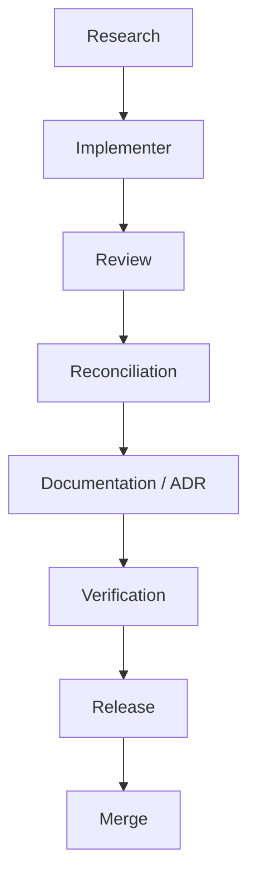

## Project

Rova (`com.aritr.rova`) — Android app for automated, hands-free **periodic background video recording**. Single-Activity Compose UI, CameraX capture, foreground service runs the segment loop, MediaMuxer concatenates segments, tiered public export by API level.

Single Gradle module (`:app`). Kotlin only.

## Build, lint, test

All commands run from repo root on Windows (PowerShell). `gradlew.bat` is the wrapper; on POSIX use `./gradlew`.

```powershell
./gradlew :app:lintDebug              # Lint + every custom check* task (preBuild gate)
./gradlew :app:testDebugUnitTest      # JVM unit tests
./gradlew :app:assembleDebug          # Build debug APK
adb install -r app/build/outputs/apk/debug/app-debug.apk
```

Run a single JVM test:

```powershell
./gradlew :app:testDebugUnitTest --tests "com.aritr.rova.service.recovery.RecoveryScannerTest"
./gradlew :app:testDebugUnitTest --tests "com.aritr.rova.service.recovery.RecoveryScannerTest.classify_userStopped_offersDiscard"
```

Run a single static-check task:

```powershell
./gradlew :app:checkScanTriggerSingleSite
```

The release build is **signed via `keystore.properties`** (already configured locally). Real-device testing is mandatory — emulators consistently fail CameraX video recording.

### Static-check gate (load-bearing)

`app/build.gradle.kts` registers **48 custom `check*` tasks** wired into `preBuild` via `pluginManager.withPlugin("com.android.application") { tasks.matching { it.name == "preBuild" }.configureEach { dependsOn(...) } }`. Each is a regex/AST scan that enforces an invariant from a specific ADR clause:

- `checkSchedulerNoGetService`, `checkStopNoGetService`, `checkRecoveryNoDeletion`, `checkRecoverySegmentRegex`, `checkScanTriggerSingleSite`, `checkRecoveryReceiverCounter`, `checkAtomicTerminalWriteForbiddenPair`, `checkExternalRootShared`, `checkAudioModeFgsTypeMatch`, `checkFGSStartGuarded`, `checkUserStoppedBeforeMerge`, `checkExportTierReadTolerant`, `checkScanFileBoundedWait`, `checkPendingFdModeIsRW`, `checkExportIsPendingGuarded`, `checkExportSetIncludePendingGuarded`, `checkExportQueryArgMatchPendingGuarded`, `checkExportPendingVisibilityOnQuery`, `checkExportCleanupPredicate`, `checkExportNoCopyToPublicMovies`, `checkExportPipelineSingleEntry`, `checkCompletedWriteOnlyFromPerformMerge`, `checkWakeLockBoundedAcquire`, `checkWakeLockHeldRefresh`, `checkWakeLockZeroGapRefresh`, `checkNoHardcodedUiStrings`, `checkLocaleConfigNoPseudolocale`, `checkA11yAnimationGated`, `checkScheduleReceiverNoFgsStart`, `checkSafTargetCommittedBeforeStream`, `checkPresetNoOrientation`, `checkNoLegacyModeStrings`, `checkSetTargetRotationBoundaryOnly`, `checkFrontBackCapabilityGated`, `checkUserCopyVocabulary`, `checkVaultExporterNoPublicPublish`, `checkRecordSurfaceNoBlur`, `checkGlassSurfaceRoleUsage`, `checkRecordChromeLockSingleSite`, `checkA11yClickableHasRole`, `checkA11yTargetSizeToken`, `checkLibraryNoManifestWrite`, `checkSemanticIconNoRawAlpha`, `checkStatusColorLocked`, `checkRovaGlyphHome`, `checkSingleColorSchemeSource`, `checkAeFpsRangeCapabilityGated`, `checkDecimationEncoderOnly`.

If a check fails it cites the ADR clause it enforces. **Do not edit a check away to make it green** — fix the source, or amend the ADR (and update the check) only with explicit owner sign-off.

**Gate implementation (config-cache-safe).** Each `check*` is a typed `com.aritr.rova.gradle.SourceCheckTask` (`@CacheableTask`, in the `build-logic/` included build) registered with a `checkId` + declared `sources` (`@InputFiles @PathSensitive(RELATIVE)`) + a `sentinel` (`@OutputFile`, written only on success → UP-TO-DATE/build-cacheable). The task reads each source into a Gradle-free `SourceFile(relPath, lines, text)`, sorts by `relPath`, and calls the pure `RovaGateRules.run(checkId, files)` registry — a `Map<String, (List<SourceFile>) -> String?>` where each rule is the **verbatim-lifted** regex/AST logic, comment-skipping, scope, and failure message, returning the exact message to throw or `null`. No `Project`/script reference is captured at execution, so `org.gradle.configuration-cache=true` is enabled. The rules + golden JVM tests live in `build-logic/src/{main,test}/kotlin/com/aritr/rova/gradle/` (`RovaGateRules_*.kt` by family). **Comment detection (PR #145 + full sweep #146):** comment-aware gates detect on `SourceFile.strippedLines` — the lazy `CommentStripper.strip(text)`, a single-pass, string/char/raw-string-literal-aware, nesting-aware, newline+length-preserving scanner that blanks `//` and `/* */` to spaces while keeping literals verbatim — then read opt-out markers and report offenders from the RAW `lines`, so a `/*…*/`-then-code line or a `/*` inside a literal can neither hide a violation nor disable a gate, while message/line offsets stay byte-stable. #145 migrated 7 gates; the full sweep migrated the remaining ~30 forbid/structural gates (trigger detection on `strippedLines`, co-presence windows + opt-out + report stay RAW — minimal recipe) and consolidated the two non-nesting whole-text strips (`RovaGlyphHome`, `RecordChromeLockSingleSite`) onto `CommentStripper.strip`. **Round-3 (#147, merged `a45cde4`, build-logic only)** migrated the remaining stricter-direction leaves onto `strippedText`/`strippedLines` (false-pass-only, owner-signed-off + codex-reconciled): `WakeLockHeldRefresh` body, `WakeLockZeroGapRefresh` `hasRefresh`, `ExportIsPendingGuarded` `hasFileGuard`, and `ExportPendingVisibilityOnQuery` (TRIGGER + all 3 require-tokens), plus a DRY `SourceFile.strippedLine(idx)` accessor (`strippedLines.getOrElse(idx){""}`) replacing 39 verbatim call sites. **Round-4 (build-logic only, completeness audit + owner-signed-off + codex-reconciled)** swept EVERY remaining raw-comment site across all 46 gates and migrated 7 stricter-only REQUIRE reads onto stripped substrate (literal `.contains`, proven RED-before/GREEN-after with new golden tests): `AudioModeFgsTypeMatch` `hasAudioModeBefore`, `FGSStartGuarded` (file scan guard → `strippedText` + 60-line catch-arm window → `strippedLines`), `ExportSetIncludePendingGuarded` + `ExportQueryArgMatchPendingGuarded` (±30 SDK-branch windows → `strippedLines`), `SafTargetCommittedBeforeStream` `commitsBefore`, `A11yAnimationGated` `hasSeam`, and `ExportCleanupPredicate` (the LAST S2 manual line-prefix filter → `strippedText`; this one is the explicit mixed-direction exception — it closes a real trailing-comment false-PASS AND flips a block-open-then-code false-FAIL to accept, an owner-approved correctness fix, NOT pure stricter-only). **Documented leaves after round-4** (still NOT on the primitive, by design): `SingleColorSchemeSource` (whole-text strip that must BLANK string/char literals — incompatible with CommentStripper, which keeps literals verbatim); `WakeLockZeroGapRefresh`'s `hasElse` sub-check and `A11yClickableHasRole`'s `roleAssign` window (both REQUIRE regexes with `\s*` — blanking a comment to spaces would let `} /*c*/ else {` / `role = /*c*/ Role.X` newly-MATCH = newly-accepts valid code = lenient, so they stay RAW); the forbid/co-presence windows `AtomicTerminalWriteForbiddenPair` / `UserStoppedBeforeMerge` / `CompletedWriteOnlyFromPerformMerge` / `SemanticIconNoRawAlpha` (a RAW window can't HIDE a real violation, so migrating only drops false-FAILs = lenient); and the XML forbid gates `LocaleConfigNoPseudolocale` / `UserCopyVocabulary` (XML, not Kotlin; forbid direction lenient anyway). When authoring a new `RovaGateRules` KDoc, never write a bare `/*`/`*/` in the doc prose — Kotlin nests block comments, so it self-nests into "Unclosed comment". **Adding a new invariant means:** ADR clause → new rule in `RovaGateRules` (+ golden test) → `tasks.register<SourceCheckTask>` in `app/build.gradle.kts` → add to the `preBuild` `dependsOn` block → add its id to `RegistryTest` `EXPECTED_IDS`. The non-negotiable rule for *changing* a gate's mechanism: it changes only HOW the gate runs, never WHAT it enforces (byte-identical message + logic; prove it still RED-fires on a real violation).

## Test policy

- **JVM unit tests only.** No Robolectric, no instrumented tests in `androidTest/` beyond bundled Compose UI test scaffolding.
- `testOptions.unitTests.isReturnDefaultValues = true` — Android framework calls return defaults under JVM. Anything that touches `android.opengl.Matrix.*` or `android.graphics.Matrix.*` is a no-op in tests; use a pure-Kotlin math seam (see `AspectFitMath.kt`).
- `JSONObject` / `JSONArray` from `android.jar` throw at runtime under JVM tests. The real `org.json:json:20231013` is on `testImplementation` so `SessionManifest` / `SessionConfig` persistence tests work.
- Pattern: extract pure-helper objects (`SegmentGateThermal`, `ThermalHysteresis`, `AspectFitMath`, `effectiveIdleTopBannerId`) so logic is unit-testable; the framework-touching wrapper class stays a thin seam.
- Baseline: **2365 tests / 0-0-0** on master (`4683d695`, measured post-merge). A new feature lands its tests in the same PR. The full suite needs `--max-workers=2` on this box.

## Architecture

### Toolchain

| | |
|--|--|
| AGP | 9.2.1 |
| Kotlin | 2.2.10 (Compose plugin only — AGP 9 supplies the JVM Kotlin plugin) |
| Gradle | 9.4.1 |
| compileSdk / targetSdk | 37 |
| minSdk | 24 |
| Java | 11 |
| CameraX | 1.5.3 |
| Media3 (ExoPlayer + ui) | **pinned 1.4.1** — 1.5.x deliberately not adopted |
| Compose BOM | 2025.01.01 |

Version catalog: `gradle/libs.versions.toml`. Dependency lines for `lifecycle-viewmodel-compose`, `material-icons-extended`, `navigation-compose`, `accompanist-permissions`, and `org.json:json` are inline in `app/build.gradle.kts` (not yet in the catalog).

### Module shape

```
app/src/main/java/com/aritr/rova/
├── RovaApp.kt                       # Application — recoveryReport: StateFlow
│                                    #               triggerRecoveryScanIfNeeded()
│                                    #               WarningCenter signal lazies
├── MainActivity.kt                  # Single Activity — sole recovery-scan trigger
├── data/                            # SessionStore (atomic manifest), SessionManifest,
│                                    # SessionConfig, RovaSettings, QualityPresets
├── service/
│   ├── RovaRecordingService.kt      # FGS — CameraX bind, segment loop
│   ├── RovaTickReceiver.kt          # Segment-boundary AlarmManager fire
│   ├── RovaStopReceiver.kt          # Loop-count-exhausted STOP fire
│   ├── singlerecord/                # Single-mode VideoCapture<Recorder> build +
│   │                                # per-segment Recording start/stop
│   │                                # (SingleVideoRecorder, mirror of dualrecord/)
│   ├── dualrecord/                  # P+L dual-encode (CameraEffect + EGL14 fan-out)
│   ├── export/                      # Tier1/2/3 exporters, ExportRecoveryRunner,
│   │                                # ExportCleanupPredicate, MediaScanWaiter
│   ├── recovery/                    # RecoveryScanner.classifyAll, RecoveryReport
│   ├── scheduler/                   # AlarmScheduler — exact alarms only
│   ├── surface/                     # Headless preview surface variants
│   ├── wakelock/                    # WakeLockPolicy — bounded acquire (ADR-0006)
│   ├── audio/                       # BeepPolicy
│   └── notification/                # NotificationCopy
├── ui/
│   ├── MainScreen.kt                # Bottom-nav scaffold
│   ├── screens/                     # RecordScreen, HistoryScreen, SettingsScreen,
│   │                                # onboarding/, player/ (Media3 surface)
│   ├── recovery/                    # RecoveryCard, RecoveryViewModel,
│   │                                # VendorGuidanceIntents (OEM auto-start)
│   ├── warnings/                    # WarningCenter — see contract below
│   ├── signals/                     # CameraPermissionSignal, StorageSignal,
│   │                                # MicrophonePermissionSignal,
│   │                                # ThermalStatusSignal (hysteresis-gated),
│   │                                # BatteryOptimizationSignal, …
│   ├── theme/                       # RovaTokens, RecordChromeTokens
│   ├── components/                  # Shared chrome (re-skin tokens)
│   └── permissions/, share/
└── utils/                           # VideoMerger (MediaMuxer concat), RovaCrashReporter,
                                     # RovaLog, MediaFileValidator
```

### Three control planes

1. **UI / ViewModel** — `RecordViewModel`, `HistoryViewModel`, `SettingsViewModel`, `RecoveryViewModel`, `PlayerViewModel`, `WarningCenterViewModel`. Compose collects `StateFlow`s only.
2. **Service** — `RovaRecordingService` is the only owner of CameraX + MediaMuxer. Segment-boundary timing is driven by exact `AlarmManager` alarms (TICK + STOP receivers), **never** by `Handler.postDelayed` or coroutine delays inside the service. The two STOP paths (user-stop vs loop-exhaust) are kept separate by `checkStopNoGetService` / `checkUserStoppedBeforeMerge`.
3. **Recovery + Export** — runs **once per cold launch** from `MainActivity.onCreate` → `RovaApp.triggerRecoveryScanIfNeeded()` → `RecoveryScanner.classifyAll` → `ExportRecoveryRunner`. The single-site rule is enforced by `checkScanTriggerSingleSite`. Manifests are read-only during scan; `checkRecoveryNoDeletion` forbids file deletion in the scan path.

### Session lifecycle and `Terminated`

`SessionManifest.terminated` is the persisted classifier input. `RecoveryScanner` cross-references on-disk segments against the manifest to pick `OFFER_DISCARD` / `AUTO_DISCARD_ELIGIBLE` / `BLOCKED` / `KILLED_BY_SYSTEM` / `KILLED_FORCE_STOP` / `COMPLETED`. **`COMPLETED` is only written by `performMerge`** — `checkCompletedWriteOnlyFromPerformMerge` and `checkAtomicTerminalWriteForbiddenPair` enforce it.

Atomic manifest writes: `SessionStore` writes to a temp file then renames. Terminal-state writes (`COMPLETED`, `USER_STOPPED`, etc.) must be one atomic call, not a pair.

**Merge admission = one validity predicate (ADR-0005 §"Merge Admission", amended 2026-07-08, PR #177 → `3f286282`).** No merge path admits a segment on a size-only `exists() && length() > 0` check — every merge admits through the same `MediaFileValidator.validateMediaFile` decode predicate, so a frameless artifact (the audio-only stub a DualShot side finalizes when its video track starves under dual-HW-encode contention) is rejected, not baked into the output as a false frozen clip. `VideoMerger.preflight` is the universal chokepoint (single-mode, DualShot per-side, recovery, Tier1/2/3 all route through it) and filters via the pure `MergeSegmentFilter.partition` (injectable predicate). DualShot filters **each side independently** on `Dispatchers.IO` — no reconciliation/truncation/padding/symmetry assumption; `maxOf()` retained; per-drop + per-side divergence logged at warning level. RF1: the predicate's probe buffer is sized from `KEY_MAX_INPUT_SIZE` (1 MB floor, `chooseInspectionBufferSize`) so a large FHD/4K keyframe can't truncate and false-drop a healthy segment (device-verified at genuine 4K, 18–22 MB segments). No new gate (protection = `MergeSegmentFilterTest` T1–T7 + `MediaFileValidatorBufferTest`, like ADR-0036/0038). `memory/project_merge_validity_predicate.md`.

### Tiered public export

`Tier1Exporter` (API 29+ MediaStore), `Tier2Exporter` (API 26–28 scoped temp + `MediaScannerConnection`), `Tier3Exporter` (API 24–25 direct path with `WRITE_EXTERNAL_STORAGE maxSdkVersion=28`). Tier 1 pending-row visibility rules — per ADR-0003 amendment and ROADMAP v6 — are enforced by `checkExportIsPendingGuarded`, `checkExportSetIncludePendingGuarded`, `checkExportQueryArgMatchPendingGuarded`, `checkExportPendingVisibilityOnQuery`, `checkPendingFdModeIsRW`. Cleanup predicate (`ExportCleanupPredicate`) is the single decision point; `checkExportPipelineSingleEntry` enforces that.

### Single-mode recording (`service/singlerecord/`)

Single-capture (non-DualShot) topology. `SingleVideoRecorder` is the collaborator that owns the CameraX `VideoCapture<Recorder>` build (incl. its build-time `setTargetRotation` — ADR-0029 §3 boundary, this package allowlisted symmetric with `dualrecord/`) and the per-segment `Recording` start/stop, mirroring `service/dualrecord/DualVideoRecorder`. The service binds `recorder.videoCapture` in `setupSingleCamera` and drives one `recorder.start(...)` per segment from `recordSegment`; the active handle is `currentSingleRecording: SingleRecording?`. The segment loop, watchdog, finalize-coordination deferreds, persistence, `performMerge`, terminal writes, wakelock, and recovery stay in the service (exactly as the dual path keeps `recordSegmentDual`/`performMergeDual`). CameraX `VideoRecordEvent` is passed straight through to the service callback (no event remap); the `withAudioEnabled()` `SecurityException` propagates → `PERMISSION_REVOKED`. Pure JVM test on `SingleQualitySelector` (D-deviation — CameraX `Quality` only at the recorder edge). **Invariant (do not "fix"):** `SingleVideoRecorder.start()` overwrites `active` WITHOUT a `check(active==null)` guard — unlike `DualVideoRecorder` which clears its handle on stop via `onStopped`; single REUSES one recorder across all segments and never clears `active`, so a guard would false-fail segment 2. Extracted from inline-in-service in PR #159 (2026-06-30, zero behavior change, device-verified RZCYA1VBQ2H) — closes the one structural target named by the service-split audit (`memory/project_service_decomp_audit.md`).

### DualShot (P+L mode)

Native 4:3 source + matrix-driven 27/64 side-crops (ADR-0009). `service/dualrecord/` does EGL14/GLES20 fan-out from a single `CameraEffect(target=PREVIEW)` into a single broadcast `AudioRecord` plus two `MediaMuxer` muxes. Pure JVM tests on `AspectFitMath`, `BitrateTable`, `DualMuxerStateMachine`, `RotationCalculator`, `SegmentPathBuilder`, `AudioFanOutPlanner`. Pause/resume is **deferred**. Mode picker tabs: Portrait / Landscape / P+L.

### WarningCenter

`docs/WarningCenterContract.md` is authoritative. Precedence is a **single flat order over 21 `WarningId` values** (`WarningId` enum declaration order — not category-based; the contract's flat table lists 17 *precedence-resolver rows* and §4 counts 18 *logical states* — three correct axes, reconciled in `docs/design/warnings-recovery.html` APPX-H). Only `CAMERA_PERMISSION_DENIED` and `STORAGE_INSUFFICIENT` gate Start; `EXACT_ALARM_DENIED` is a flat non-gating banner. Surfacing model is `WarningSheet` / `WarningChip` (per-tier modal sheet collapsing to a chip), not an inline strip (ADR-0007 + 0013). `WarningCenterViewModel` output is `StateFlow<WarningId?>`. The "Idle echo promotion" pattern (`effectiveIdleTopBannerId`) lives in the routing layer, not precedence — see `memory/feedback_idle_echo_promotion.md`.

**Trust System V1 — Compose transcription IN PROGRESS.** Warnings + Recovery are one surface family. Their canonical *visual* source is the frozen `docs/design/warnings-recovery.html` v1.0 (DESIGN FROZEN 2026-07-09, `09a0cba7`) — **not** ADR-0013, whose visual/token layer that freeze superseded (ADR-0013 amendment 2026-07-10; all its behavioral clauses stand). Compose transcribes the HTML and never diverges; a visual or interaction change is made in the HTML and re-approved first. Implementation contract: `docs/COMPOSE-TRUST-SYSTEM-V1-PARITY-PLAN.md` (milestones M0–M11, one PR each). **M0 ✅ (#178 → `9220e342`)** ADR amendment + the 17→21 `WarningId` count fix. **M1 ✅ (#179 → `c46b5f8b`)** additive token foundation in `RovaWarningsV3` (`pinSurface` `#0B0D14`, `pinContainerAlpha` .94, the `mediaInk`/`Dim`/`Body` trio, `mediaEdgeTop`, locked `severityCtaInk` `#1A1A1A`, derived `surfaceHi(palette)` = mix(white 8%, `surfaceBase`) with Daylight → White) + `RovaMotion` ladder (`containerMs` 300, `exitMs` 220, `easeStandard` cubic-bezier(.2,.8,.2,1)) — **zero production consumers by design; M2 is the first.** Gate count unchanged at 48. **M2 ✅ (#180 → `3ca08918`)** pure `ResolveInk` + the 2808-assertion JVM contrast sweep (`TrustContrastSweepTest`, the CI gate for M4–M11); `DialogActionColors.deepen` widened `private`→`internal`. **M3 ✅ (#181 → `8083b675`)** pure `RelativeTimeLabels` (APPX-G recency ladder, elapsed-duration → timezone/DST-invariant by construction, method-harvested from `LibraryDateLabels`) + a pure `RecoveryClock` seam on `RecoveryUiStateMapper` minting an immutable per-card recency label (no ticker/tick/poll/Flow; `strings.xml` plurals deferred to their M8 consumer). Both still **zero UI consumers by design** (M8 renders recency; M4 is the first `ResolveInk` consumer). Gate count still 48; suite 2348/0-0-0. **M4 ✅ (#182 → `d92bc800`)** SnoozeChip parity — the **first UI consumer of `ResolveInk` + the M1 pinned tokens**. `WarningSnoozeChip` transcribes the frozen `.snooze` (:321–:337): fill `Color.Black@.55` (the spec's one AA failure, 3.61:1) → `pinSurface@pinContainerAlpha`; label `.78` → `mediaInk` .94; glyph two-layer `SemanticIcon` → monochrome `Icon(tint = mediaInkDim)` (`semanticicon-opt-out` marked); dot → `ResolveInk`-resolved `dot-ink` (LIGHTEN + `MIX_MARK` = raw locked hue, **byte-identical** to the pre-freeze dot); 48dp hit target = outer `minimumInteractiveComponentSize()` over a 34dp `heightIn(min)` pill (never a taller pill); severity border α0.25 + hard-block-only pulse **gate** survive verbatim. New named geometry tokens (`snoozeChipPillHeight`/`PaddingH`/`Gap`) land with their first consumer (+`WarningSnoozeChipInkTest` ×2, +3 geometry pins). Device-verified RZCYA1VBQ2H (hard-block red chip · soft amber chip over live viewfinder · reduced-motion dot-hold · sheet→chip dismissal). Gate count still 48; suite **2353/0-0-0**. **⚠️ Tracked debt (M4 As-shipped note) — CLOSED in M5:** the M4 snooze dot *pulse motion* diverged from §05 (HTML `1.6s ease-std, 50%{opacity:.45}` vs shipped `.60/1.5s tween/FastOutSlowIn`); M5 retranscribed it (keyframes min `.45` at period/2, `1600ms`, `RovaMotion.easeStandard`; hard-block-only + reduce-motion gate unchanged). **M5 ✅ (#183 → `7a444ce1`)** TopBanner parity — **first `ResolveInk` consumer on the banner INK_SITE**. `WarningTopBannerV3` transcribes frozen §05: container `.88`→`pinSurface@pinContainerAlpha` (.94); title `.88`→`mediaInk`; sub→`mediaInkDim` (.48); icon-box glyph→resolved `dot-ink` (`TARGET_MARK`+`MIX_MARK`, raw locked hue), Stop-pill label `severityColor@.95` (failed SC 1.4.3, 3.44–4.38:1)→resolved `lbl-ink` (`TARGET_TEXT`+`MIX_LABEL`); LIGHTEN branch guaranteed all severities, clearance by `TrustContrastSweepTest`. The **non-functional CountdownRing is deleted** (Q1/APPX-F :1054 — depicted a countdown the system never ran) with its 3 tokens; the trailing slot is now the always-present **Stop** pill for every banner id. `AutoAction` (a static `secondsRemaining=30` placeholder that never ticked) deleted from `WarningSheetContent`; THERMAL_SHUTDOWN/EMERGENCY carry their own sub. The Stop pill's 48dp touch target is an **invisible expansion** — the pure `TouchTargetExpansion` + `Modifier.invisibleTouchTarget` report the pill's NATURAL size to the banner Row (banner NOT grown — the Investigation-2 fix) while measuring the clickable child at 48dp; `minimumInteractiveComponentSize` is deliberately NOT used here (it reserves layout and inflates the banner, unlike the standalone snooze chip which can). No new gate (protection = pure geometry + token JVM tests, per ADR-0036/0038). Device-verified RZCYA1VBQ2H (atomic session): banner 60dp not inflated, visible pill natural ~23dp, a tap 6.5dp above the visible pill (inside the 48dp region, outside the pill) fires Stop → **pointer input is not clipped to reported layout bounds** (a new "· 1s" recording confirmed the explicit early stop). Non-blocking, recorded not expanded: TalkBack reasoned from unchanged semantics (not exercised on-device), rotation not exercised in the atomic pass, test recordings left on the device. Gate count still 48; suite **2353/0-0-0**. **M6 ✅ (#184 → `1a77f045`)** WarningSheet parity — opaque `pinSurface` sheet; **hard-block sheets render no drag handle** (dismissible keep stock `BottomSheetDefaults.DragHandle()`); title `mediaInk` 15sp/600, body `mediaInkBody` 12.5sp; sevchip r-sm 10 @ .20 with resolved dot (MARK, byte-identical) + label (LABEL); why-row migrated to neutral media-ink (frozen `--ink-high`, NOT severity); primary CTA severity-fill + `severityCtaInk`; "Not now" ghost preserved on all three hard-block ids; CANT_MERGE tertiary `cta-dest` (wrap-content, `hard@.30` border, mix .62 ink); overflow 28dp visual / 48dp hit. Retired dead `sheetHandle*` + `sheetTitle/BodySize`; `sheetCtaHeight` 46→48, `sevChipRadius` 10, `whyRowCornerRadius` 11→10, `secondaryCtaStrokeAlpha` .05→.12. **Reconciliation (falsification pass):** both pinned LABEL `ResolveInk.of` sites now feed the opaque `mediaInk.compositeOver(pinSurface)` as `top` — ResolveInk reads `top`'s RGB only (ignores alpha), so raw `mediaInk` fed pure white and drifted the resolved label ~15/255 lighter than the frozen `--lbl-ink`; fixed in `WarningSheetV3` (sevchip label) **and** `WarningTopBannerV3` (M5 Stop-pill label) together for systemic consistency; MARK sites untouched (MIX_MARK ignores top). No new gate (protection = `TrustContrastSweepTest` + token/ink pins). Two independent GO reviews; **device verification deferred to the M6 device pass.** Gate count still 48; suite **2354/0-0-0**. **M7 ✅ (#185 → `8440c7b7`)** Themed hosts parity — the two **palette-following** surfaces (History strip + Settings chip), the first `ResolveInk` consumers whose backings come from the live `MaterialTheme.colorScheme` (not the pinned tokens M4–M6 used). New pure `ThemedHostInk` (house pure-helper seam) feeds `ResolveInk` the exact `stripchip`/`set` INK_SITE backings `TrustInkSites`/`TrustContrastSweepTest` already model, so shipped == swept. Strip (`.strip`): card r-md 14 (was 8), fill `color-mix(sev 8%, surface)` (`tint`, was fixed sev@.10), border sev .25 (was .30); the bordered badge → a filled `.sevchip.on-tint` (sev@.20, r-sm 10) with resolved 5dp dot (MARK, raw-hue passthrough on dark) + label (LABEL); a **body** line added, routed through `quietTextColor`; 48dp X dismiss unchanged. Settings chip (`.setchip`): r-sm 10 (was 6), min-height 48, same tint fill + border; badge → **leading 7dp resolved dot** (`set` MARK) + **trailing "Fix"** in resolved accent-as-text (`MIX_ACCENT`; hue = **raw** palette accent via `cs.inversePrimary` == `RovaPalette.accent`, never the deepened CTA `primary`); non-dismissible unchanged. **Root-cause finding:** the obvious `rovaQuietText` wrapper does NOT strip `onSurfaceVariant`'s alpha, so on a light scheme it paints `textDim@.6` → **~4.25:1 on Daylight (fails SC 1.4.3)** — exactly the palette-blind island §06 removes; `ThemedHostInk.themedBody` strips the alpha and re-supplies it as `dimAlpha` (mirrors `TrustInkSites.quietOver`): solid on light (~14:1), dimmed on dark. `+ThemedHostInkTest` (Daylight deepen · dark MARK passthrough · the quiet-body trap: asserts naive-dimmed `< 4.5` AND solid-clears) `+warning_settings_fix_action` string (`checkNoHardcodedUiStrings`). No new gate (protection = pure helper JVM tests + the M2 sweep, per ADR-0036/0038). Two independent GO reviews (fresh-context falsification, pre- and post-commit). **As-shipped notes (recorded, not defects):** the frozen `.setchip` carries severity by dot **colour** alone — the severity WORD survives only in the folded a11y `contentDescription` (a faithful §06 transcription; any concern routes through the HTML first, not Compose); typographic approximations consistent with M4–M6 ("Fix" `labelLarge`, sevchip label without the `.13em` tracking); strip trailing `end=4.dp` compensated by the `IconButton` inset (device-screenshot item for the post-M7 pixel-parity checkpoint). Gate count still 48; suite **2360/0-0-0**. **M8 ✅ (#186 → `4683d695`)** RecoveryCard parity — the **third themed host** and the first **render** consumer of M3's `RelativeTimeLabel` (the mapper already minted it; M8 renders it). The Library recovery card stops being a pinned `#0B0D14@.94` near-black island and becomes the elevated **`surfaceHi`** token + themed `--edge` border (`colorScheme.outlineVariant`) — it now FOLLOWS the palette (§06). r-lg **20→18** (`recoveryCardCornerRadius`), padding **16/18→16/16**, 28dp top glow kept. **TrustRow anatomy:** a single leading **7dp severity dot** (resolved `dot-ink`) — the ADR-0031 P1a-slice3 SemanticIcon emblem **and** the sev-chip are REMOVED (frozen `.recov` trustrow carries only a dot, HTML `:362`/`:1625`; the involuntary-stop concept survives in the eyebrow tag + dot hue + card glow). Pulse rides that dot for `KILLED_BY_SYSTEM` only, retranscribed to the shared `@keyframes pulse` (`:363` == the snooze `:336` keyframe: min `.45` @ period/2, `1600ms`, `easeStandard`, reduce-motion held). **Eyebrow** = `TAG · recency` (uppercase, one `AnnotatedString` node, recency span tabular-nums 500); `recencyText()` resolves all 6 APPX-G rungs incl. DATE (`DateUtils` on `atMillis`). **CTA re-roling:** primary Merge/Retry = `cta-accent` (`colorScheme.primary`/`onPrimary`, DialogActionColors-resolved — first themed `cta-accent` consumer), Keep = ghost (`onSurface@.07` fill + `.12` border + `themedBody` ink), Discard = **`cta-dest` outline** (transparent, `hard@.30` border, `mix(hard 62%, onSurface)` ink, **wrap-content — NEVER full-width**, terminal, own row — §01's law, replacing the pre-freeze solid-red full-width fill). Progress strip drawn **only while merging** (idle it restated an on-screen count); header row + "CLIPS RECOVERED"/"MERGING" labels removed; chip reads **filled/total** via pure `recoveryProgressFilledCells` = `floor(clamp(progress)×total)`, fixing the pre-freeze `N/N` (old `:408` passed the count twice); cells `--fill-1`(onSurface@.05)/`--accent-fill`(primary); ProcessingGlyph retained (§11 motion inventory `:864`) leading the strip. Artifacts summary list now rendered (was omitted). Colour math routes through new pure `ThemedHostInk.forRecovery` (the `recov` INK_SITE: `dot`=`ResolveInk.of(sev, surfaceHi, MARK, top=onSurface∘surfaceHi, MIX_MARK)` + `body`=`themedBody`) — the EXACT backings `TrustInkSites`/`TrustContrastSweepTest` already model, so shipped == swept; a `surfaceHi(surfaceBase, isLight)` overload lets the composable derive the backing from `colorScheme.surface` byte-identically (no palette CompositionLocal). **Copy:** 3 EN eyebrow tags aligned to frozen §07 `KINDS` verbatim ("Stopped by the system"/"Force stopped"/"Stopped by you"; es already matched); new `recency_*` strings + plurals in `values/` **and** `values-es/` (`SpanishCatalogParityTest` + plural-parity green — the M7 regression NOT repeated). `RecoveryUiState`/mapper/ViewModel/schema **untouched**. `+5 recoveryProgressFilledCells` tests (floor/clamp/zero/half/full, **RED-proven** against the old `N/N` bug); `RovaWarningsV3Test` radius pin 20→18. No new gate (protection = pure helper JVM tests + the M2 sweep, per ADR-0036/0038). Two independent GO reviews (fresh-context falsification, pre- and post-commit); reconciled one Recommended finding (dropped a computed-but-dead `RecoveryInk.vendor` ink). Gate count still 48; suite **2365/0-0-0**. **As-shipped / deferred (recorded, not defects):** the frozen `.vendor` borderless `acc-ink` text-link + external-glyph styling is deferred — only its POSITION (between the accent/ghost row and Discard) is transcribed; the slot stays caller-owned (`LibraryScreen` + a new glyph are outside M8's file set) → BACKLOG. The §07 single merged a11y node is a device-pass item (each Text is its own node; the load-bearing progress live region IS merged). ProcessingGlyph placement (leading the strip) is a pixel-parity item (frozen static specimen omits it). **Device verification (6 kinds, Daylight+Aurora, merge start→progress→complete, reduce-motion, TalkBack, N/N on-device) remains the separate mandatory pre-release gate.** **Next: M9** (merge-failure closed reason set — Q6 4-cause set, `MergeFailureReason.kt` pure classifier + failbox restyle; the failbox is M8's one deferred fail-frame element). Known frozen-spec documentation defects, recorded not patched (a frozen spec is amended only through a new HTML iteration): APPX-H's "only false claim" miscount, and the dead `--surface-hi:#242737` bootstrap literal at `:35` which `applyTheme` overwrites before any specimen renders — Compose transcribes the derived `#272934`. `memory/project_trust_system_compose_transcription.md`.

### Architecture Decision Records

Source of truth for behavioral invariants. **38 ADRs** in `docs/adr/` (0001–0038, with the 0010 slot used for two siblings about canonical UV frame and crop divergence; 0004 historically skipped). Touching anything that an ADR mentions means: amend the ADR clause first, regenerate or extend the matching `check*` task, then change the code. ADRs cover: exact alarms, headless surface, tiered storage, recovery scan, lifecycle robustness, warning sheets, dual-recording, DualShot 4:3 source, edge-to-edge record-home, gradient scrim dock, Phase 4 warning re-skin v3, snooze persistence, storage-full autostopped echo, thermal autostop, recovery merge architecture, recovery merge retry classifier preflight, asymmetric thermal hysteresis, (0020, **Proposed**) WCAG 2.2 AA by default, camera-warm-across-nav, user-facing strings in resources, localization + locale picker, SAF export destination, private vault, preset config-bundle (orientation-orthogonal), daily recording window, Liquid Glass design system (0028 — theme engine slice 1 LIVE: `PaletteColorScheme.from` drives MaterialTheme app-wide; 46th gate `checkSingleColorSchemeSource`), (0029) capture-topology × orientation-policy, (0030) Library/History information architecture (**amended 2026-07-02** Direction A session-list, then **2026-07-04 Adaptive Bento Timeline — LIVE in production**, PR #172; see the Library-redesign status sentence at the end of this section), and (0031, **Accepted**; P0 + P1a slices 1–3 + **P2 Track A** + **UI-Phase-2 PR-1…PR-6 + icon 5b-1…5b-5 + 5b-4 (#136)** LIVE — System D glyphs rendering + branded merge animation + board-exact Record FAB lifecycle + glyphs wired into Warnings/Settings/record-chrome/Onboarding + RecoveryCard + Library status badges; **ADR-0031 CLOSED**) in-app icon & glyph system — `SemanticIcon` tint seam + locked status colors + `RovaIcons` collision map + two-layer `RovaGlyph` home + `MergeMotion`/`ProcessingGlyph` merge spinner (`checkSemanticIconNoRawAlpha`, `checkStatusColorLocked`, `checkRovaGlyphHome`). The Record FAB now renders the board's 5 lifecycle states (`rec_disc`/`rec_morph`/`rec_ring`/`waiting`/`proc_arc`) via the pure `RecordFabVisualSpec` (visual ⟂ action), with `IconRole.OnAccent` = the `DialogActionColors`-AA on-accent tint for the filled disc (light accents stay ≥4.5:1 on the always-white pinned route). The app-wide premium dialog system (`RovaAlertDialog` + `DialogActionColors`, all dialogs glass-branded) rides on the same seam. Gate count after UI Phase 2: **46** (UI Phase 2 added no `check*`); bumped to **47** by ADR-0034 (`checkAeFpsRangeCapabilityGated`), then **48** by ADR-0035 (`checkDecimationEncoderOnly`). UI-Phase-2 status: PR-1 #122 · PR-2 #123 · PR-3 icon foundation #124 · PR-4 Library+Vault #125 · PR-5 Player #126 · **PR-6 player-nav #127** (interactive timeline: tap/drag seek + clip ticks + clip-jump + seekbar a11y + reduced-motion glide; resume DEFERRED) · **icon 5b-1 glyph-foundation #128** (`Play` d-string + `Interrupted→escalating`; `FlipCam`/`FlashBolt`; **24 new System-D glyphs** in board v3 SSOT; `RovaIcons` 27 concept + 2 status entries) — ALL MERGED (master `55dd894`). **icon 5b-2 Warnings #130 · 5b-3 Settings #131 · 5b-5 record-chrome #132** (route warning/settings glyphs via `WarningIconSpec`/`SemanticIcon`; FlipCam rotation-arrows flip glyph + nav Library/Settings glass-circles + History card glyph-size bump + flash OFF/AUTO theme-accent) — MERGED (master `c493538`, 2026-06-22). NEXT (icon system done): **player resume-persistence** (spec written `docs/superpowers/specs/2026-06-22-player-resume-identity-seam-design.md` — sessionId-canonical identity seam shared by Library + Player; player URI ≠ Library `stableKey`=`file.absolutePath` on TIER1, `prune` drops orphans) → **PR-6b** wall-clock playhead (manifest schema bump) → **PR-7** speed · double-tap · auto-hide. **Differentiated recording cues SHIPPED** (#133 → master `ff783fa`, 2026-06-23): first-segment long `rova_cue_start` / short `rova_beep` reminder / no end cue via `beepStart(isFirstSegment)` + codex CancellationException-rethrow; `memory/project_differentiated_cues.md`. Repo also gained a read-only `scripts/preflight.{ps1,sh}` git-hygiene scan (#134 → `aae66e7`; House convention). Plans: `docs/UI_PHASE2_ICON_THEME_AUDIT.md` §7; player roadmap in `docs/BACKLOG.md` "Video / Player / Editing". Newer ADRs beyond the 0031 block: **(0032)** wall-clock playhead (PR-6b), **(0033)** sub-minute (30s) interval, and **(0034, Accepted)** DualShot AE frame-rate floor — capability-gated `[24,30]` (asymmetric; brightness-preferring fallback that prefers a true ceiling-spanning range, else the lowest pinned fps ≥ floor) lifting the dim-light auto-exposure ceiling (**Limiter 1** of the 2026-06-29 fps-cadence diagnosis). Pure `AeFpsRangePolicy` (D-deviation; `android.util.Range` only at the service edge) + `applyAeFpsFloor` in `setupDualCamera` (intersects available ranges across matched back cameras — `DEFAULT_BACK_CAMERA` resolves to several physical cams; fail-open). 47th gate `checkAeFpsRangeCapabilityGated`. Shipped #155 (master `4325808`), **device-verified** on RZCYA1VBQ2H: dim DualShot cadence held at **24fps** (effective `aeTargetFpsRange=[24,24]`) vs the pre-fix ~16.7fps collapse; the `Preview.Builder` Camera2Interop option propagates through the `CameraEffect` fan-out. **Encoder Limiter 2 — DIAGNOSED & CLOSED, no fix (shipped #157 → master `b1f7850`, 2026-06-30).** Micro-diagnosis (service-split + drain-path + single-side discriminator, all on RZCYA1VBQ2H, codex-reconciled) proved the ~45ms encoder service (~22fps merged output) is **inherent structural dual-HW-encode contention** on this Exynos: a single 540×960 encode sustains 24fps (~37ms `glFinish`), two concurrent encodes add ~5ms/frame → ~22fps + ~10% mailbox drops. `glFinish` is the wall but is a downstream sync stall (codec producer-queue or EGL-context serialization), **not** GPU fill (a quad is microseconds) and **not** muxer write (`onSample`=0.5ms, ruled out). No cheap lever: `KEY_OPERATING_RATE=120`/`KEY_PRIORITY=0` = null. Every remaining fix is structural (stagger/shared-encode, or lower per-side res — a regression vs shipped Quality presets) inside the load-bearing `glFinish`/FBO/fence stack (#25–#35), for only ~2fps — **not worth the risk**; ~22fps accepted for a hands-free background recorder. The **DEBUG fps-cadence probe is REMOVED** this slice (`CadenceProbe`/`CadenceStats`/`EglRouter`+`EglEncoder` taps/`FrameMailbox.overwriteCount` + tests reverted; the Camera2Interop AE-metadata log in `RovaRecordingService` is KEPT — it verifies the shipped Limiter-1 floor). Full close verdict: `docs/superpowers/specs/2026-06-29-dualshot-fps-cadence-findings.md` ("Limiter-2 RESOLUTION"). Handoff `docs/superpowers/handoffs/2026-06-29-NEXT-dualshot-encoder-limiter2.md` is now historical. **δ0 CameraX 1.4.2→1.5.3 bump SHIPPED** (#161 → master `a0e0ff3`, 2026-07-01): single catalog line, ffprobe baseline-vs-bumped CLEAN, device-verified via the ADR-0035 soak. **(0035, Accepted)** DualShot **thermal-adaptive encode decimation** — at `ThermalStatus.SEVERE` (one rung below the `CRITICAL` autostop, ADR-0016 ladder) DualShot encodes only every 2nd frame (factor 2 = ~half fps) so the two HW encoders run cooler and the device reaches `CRITICAL` **later** — sessions last longer before the hard stop. Pure `ThermalDecimationPolicy` (`decimationFactor`/`shouldSubmit`, no own hysteresis — reads the already-hysteresis'd `thermalStatusSignal.state.value`, ADR-0019); `@Volatile EglRouter.encodeDecimationFactor` gates the **encoder-feed block only** (preview stays full-rate — load-bearing); `RovaRecordingService.checkSegmentGates` sets it per segment via `DualVideoRecorder`→`DualSurfaceProcessor`→`EglRouter`. `factor==1` byte-identical (cool / non-DualShot); resolution unchanged, merge-safe (variable fps, constant dims); AE floor (ADR-0034) untouched. 48th gate `checkDecimationEncoderOnly` (region-scoped EglRouter scan forbidding decimation refs in the preview loop). Shipped #162 (master `d4222c2`, 2026-07-01), **device-verified** on RZCYA1VBQ2H via `adb shell cmd thermalservice override-status`: cool 22fps → SEVERE **~11-12fps** (halved, PTS-monotonic/merge-safe) → revert 21fps, preview smoother. `memory/project_dualshot_thermal_decimation.md`. This gives Limiter-2's heat a **relief lever** (fewer encoded frames = less contention when hot) even though the raw ~22fps ceiling stays accepted. Device-verify surfaced 3 **pre-existing** issues (filed `docs/BACKLOG.md`, all orthogonal — reproduce at factor 1): DualShot P/L divergence + landscape freeze under sustained heat (Limiter-2 contention, P2), player→library nav jitter (Compose HWUI, a11y, P2), `ThermalStatusSignal` edge-triggered fall-dwell sticking on a quiet plateau until `ON_RESUME` (P3). **Library session-list redesign (ADR-0030 amendment, Direction A "Anchored Timeline") — PR-A foundation #166 + PR-B presentation #168 MERGED (master `684048bb`, 2026-07-03).** Owner-locked design: kill grid + hero, single `LazyColumn` session list, sticky compact day headers, latest row = restrained in-timeline accent (Newest sort only, **NO autoplay anywhere** — trust rule for background-recorded video), DualShot = one row per session with two explicit ≥48dp side actions, `libraryDensity` pref (COMFORTABLE/COMPACT). PR-A = pure layer, zero visual change: `LibraryDateLabels` (KIND enum, DST-safe), `LibraryDensityDimens`, `LibraryRow.sessionKey/side/sides` pass-through (canonical `RecordingIdentity.sessionKey` — no sidecar migration needed, #137 seam already session-canonical), `LibrarySessionAggregator` (**UNWIRED**; size=sum, duration/clips=MAX across concurrent sides, base=latest-dated member), `LatestRowPolicy`. Spec `docs/superpowers/specs/2026-07-02-library-session-list-design.md` · plan `docs/superpowers/plans/2026-07-02-library-session-list-pr-a-foundation.md` · `memory/project_library_session_list.md`. **PR-B (#168, device-verified full checklist on RZCYA1VBQ2H)**: single-list swap LIVE — aggregation/`LatestRowPolicy`/density wired into one `LazyColumn`; grid/hero/autoplay + `libraryViewMode`/`libraryCardPreview` prefs DELETED; sidecar lazy-merge (read-path portrait-first fold) + session-write migrate-then-transform (portrait-first order — final-review fix `224b1fc6`, RED/GREEN-proven on hardware); suite 2193/0-0-0, 48 gates GREEN. codex last-pass finding (per-item `discardSession` orphans surviving side on partial DualShot batch-delete failure) = pre-existing → BACKLOG P2. **PR-C chrome MERGED #170** (merge `b5813535`, 2026-07-04; suite 2201/0-0-0, 48 gates GREEN, device-verified 7/7 on RZCYA1VBQ2H): sticky day headers on day-epoch keys, midnight ON_RESUME re-stamp, scrubber bubble intrinsic-width fix + 16dp thumb, top-bar density toggle. **Bento Timeline — MERGED TO PRODUCTION, PR #172 (merge `b96614894`, 2026-07-05).** The Library's current production presentation is **thumbnail-first, Concept A "Adaptive Bento Timeline"** (ADR-0030 amendment 2026-07-04, canonical frozen spec `docs/design/library-bento.html` v3.2.1). Built HTML-first (11-task SDD transcribing the frozen spec) → final-polish pass → three code reviews (two peer + one adversarial staff) → device-verified RZCYA1VBQ2H → merged. Ships in `Rova-0.10.0` (versionCode 5). Retired the entire pre-bento list/grid/hero Library: single vertical scroll of day sections, each a 6-column bento grid with recency-graduated density (featured ≤1d / standard 2–6 / archive ≥7); tap-plays diptych tiles (Portrait always left); ground-wash sticky day headers; date-scrub rail; quiet Vault door; NO autoplay. New pure/test units: `BentoRowPlanner`, `BentoListIndex`, `BentoWashPolicy`, `LibraryDateLabels`, `LibraryColors` v2. `libraryDensity`/`libraryViewMode`/`libraryCardPreview` prefs + LibraryListRow/LibrarySortSheet/LibraryDensityDimens all deleted. Follow-ups → BACKLOG (separate PRs): selection→`rememberSaveable` (P3); app-wide `ReducedMotion`+TalkBack gate; drop `BentoListIndex` hash-digest key; scrubber `firstVisibleItemIndex`→`derivedStateOf`; DualShot partial-batch `discardSession` orphan (P2). `memory/project_library_bento_redesign.md`. **Playback-progress hairline SHIPPED (PR #173, 2026-07-06; spec v3.3+v3.3.1 — the canonical `library-bento.html` is now v3.3.1 FROZEN; ADR-0030 amendment 2026-07-06):** 2dp resume-point indicator on bento tiles (NOT watch history — renders iff `ResumePolicy` would resume; truthful unclamped width; DualShot per-pane EXACT side slots, never the legacy ""-fallback — the Player keeps `positionFor`; hidden in selection; fraction spoken on the Play label, v3.3.1 floors it at 1% so it never says "0%"). Pure `PlaybackProgress` helper + `LibraryColorSpec.mediaProgress` token (own ≥3:1 contract vs bottom-scrim composite ×12 palettes, `TokenContrastTest`). Same PR: **store-owned sidecar invalidation** — `LibraryMetadataStore.revision: StateFlow<Int>` bumps inside the lock after every successful `writeAtomic` (throw ⇒ no bump); `HistoryViewModel.libraryUiState` combines on it, retiring the private per-writer bump counter that `RovaApp.writeResumePosition` (fires from `PlayerViewModel.onCleared` AFTER the Library re-subscribes) structurally couldn't reach — pre-fix the hairline stayed stale until process restart. Plus the frozen-spec vertical-rhythm parity fix (10dp row / 24dp day gaps, endcap 26/44 — kept as its own commit). Repro-path device-verified RZCYA1VBQ2H (immediate on back, updates, clears on completion, cold-consistent). `memory/project_library_playback_hairline.md`. **(0036, Accepted 2026-07-06 — MERGED PR #174, master `560fb9b1`) Deletion transactionality — manifest-discard-last:** the Library delete + retention pipelines run a two-step transaction (all artifact deletes first, then `discardSession` once per session the pure `SessionDiscardPlanner` marks eligible — every batch outcome succeeded AND the batch covers all listed artifacts of the session; invariants I1–I5, ghost-manifest acceptable / orphan-file never). Fixes the DualShot partial-batch orphan (BACKLOG P2) and the worse, previously-unfiled `MULTI_SEGMENT_KEPT` sibling collateral loss. `HistoryDeleter` = batch orchestrator; `RecordingRetentionCleaner` = pure surplus selector; subset deletes now KEEP the manifest (owner-approved). Dedicated gate (`checkDiscardSessionGated`) deferred — pure-planner + pipeline tests are the protection. Suite 2241/0-0-0, 48 gates; device-verified RZCYA1VBQ2H (5/6 + retention JVM-covered). Device-verify surfaced one **pre-existing** orthogonal gap → BACKLOG P2: `MULTI_SEGMENT_KEPT` kept-raw rows are visible but unplayable (`PlayerUriResolver` rejects `exportState != FINALIZED`). `memory/project_discard_session_transactionality.md`; process retro `docs/superpowers/retrospectives/2026-07-06-deletion-transactionality.md`. That gap is now closed: **(0037, Accepted 2026-07-07 — MERGED PR #175, master `afc43518`) Playback identity contract — kept-raw playback:** `PlaybackIdentity = (sessionId, side?, segmentIndex?)` with mutually exclusive coordinates (`segmentIndex` indexes the FULL interleaved `manifest.segments` array); the **Library is the sole minter** and identities are **"transported, never reconstructed"** — the nav route (`player/{sessionId}?side=&secure=&seg=`) carries them verbatim (present-but-malformed `seg` → `-1` → V5 reject, fail-closed; codex hardening). `PlayerUriResolver` owns validity via the **V1–V5 matrix** (V1 merged path byte-identical; V2 kept-raw segment resolves via the `keptsegment://` sentinel + `sessionDir` join + FileProvider, mirroring ADR-0025's `vaultfile://`; V4/V4b/V5 fail closed). Resume: `RecordingIdentity.slotFor(side, segmentIndex)` is the sole `#seg<N>` slot composer — `positionFor` is EXACT-match (no legacy `""`-slot bleed), and the pure `LibraryMetadataEntry.hairlineResumeMs` gives the bento hairline the same per-segment read. Pins: segments-array no-rewrite on subset delete (RED-proven) + DualShot interleaved fanout→resolve journey. Suite 2258/0-0-0; opus whole-branch READY + codex gpt-5.4-mini APPROVE; device-verified RZCYA1VBQ2H (single + DualShot kept-raw playback, per-clip resume with sidecar proof, FINALIZED regression, ADR-0036 subset-delete interop; re-merge flow untouched by design). ADR-0037 is the **canonical playback identity contract** — any surface that opens the Player mints a `PlaybackIdentity` through the Library layer and transports it whole. `memory/project_multi_segment_kept_playback.md`; retro `docs/superpowers/retrospectives/2026-07-07-multi-segment-kept-playback.md`. **(0038, Accepted 2026-07-08 — MERGED PR #176, merge `65d25338`) PlayerEngine lifecycle ownership:** app-scoped `PlayerEngine` + pure `PlayerEngineLedger` decouple `ExoPlayer` lifetime from `NavBackStackEntry` scope. Standing invariant (owner-mandated): **the holder owns lifecycle ONLY** (acquisition, ownership tokens, detach, parking hygiene, destruction over `DESTROYED→ACTIVE⇄PARKED`); `PlayerViewModel` keeps ALL playback behavior (media item, prepare, listeners, seek, resume, speed, scrub) — playback logic must never migrate into the holder. **Device-driven mechanism (RZCYA1VBQ2H):** instance-reuse was FALSIFIED on device (Exynos `MediaCodec.setOutputSurface` wedges the reused codec to black under rapid renav, 3/3 pixel-verified) → ships **fresh player per lease** on a warm shared playback `HandlerThread` (`setPlaybackLooper`+`setLooper(main)`), `park()` = ~2ms hygiene then `release()` **deferred 400ms** on the main Handler (past the pop transition; release must stay on the application thread — no `releaseAsync` at Media3 1.4.1). Stale-owner safety: `acquire()` takes over a still-attached owner (snapshot handed back once) and every player-mutating VM call is lease-guarded via `ownedPlayer()`=`isOwner(token)` (Compose Nav does not order outgoing `onCleared` vs incoming init). Deferred-release safety is airtight by **instance-identity capture** (the runnable releases its captured retired instance, never the field/new lease) + main-thread confinement + `removeCallbacks`-before-flush (independent falsification GO). NO behavioral change; measured back-nav teardown 31→2ms median. **No new gate** (stays **48**; protection = pure ledger JVM tests + `ownedPlayer()` lease-guard tests, like ADR-0036). `memory/project_player_lifecycle_perf.md`; retro `docs/superpowers/retrospectives/2026-07-08-player-lifecycle-perf.md`.

### Accessibility (WCAG 2.2 AA)

`docs/accessibility/` is the home for accessibility work. The 2026-05-29 static audit (`2026-05-29-wcag-2.2-aa-audit.md` + `remediation-backlog.md`) found 161 findings across all 12 UI surfaces, root-caused to low-alpha text tokens, missing Compose `semantics`, no reduced-motion gating, and undersized touch targets. **ADR-0020 sets "WCAG 2.2 AA by default" as a standing requirement for all new/changed UI** and sketches a future `checkA11y*` static-gate suite (3 of its 4 sketched gates now built — `checkA11yAnimationGated`, `checkA11yClickableHasRole`, `checkA11yTargetSizeToken`; the 4th, `checkA11yNoLowAlphaTextToken`, was **superseded by `TokenContrastTest`** — contrast is background-dependent so a static alpha-floor gate would false-fail AA-passing tokens) following the same invariant→`check*`→`preBuild` convention as the other gates. The broader source remediation is a later, separate cycle — the original audit touched zero Kotlin.

### Roadmaps — non-overlapping scope

- `ROADMAP_v6.md` — reliability backbone (scheduling, service model, surface lifecycle, STOP path, force-kill detection, drift policy, wakelock discipline, tiered export, pending-row visibility). **v6 is the authoritative reliability roadmap**; v2–v5 are historical.
- `NEW_UI_BACKEND_REPLAN.md` — UI redesign track (mockup-driven, references `mockups/new_uiux/`).
- `UI_ROADMAP.md` — older UI plan, partially superseded by the new direction.

Mockup PNGs / HTML under `mockups/` are **gitignored**. Specs that depend on measurements must inline the values (see `RecordChromeTokens.kt` — the in-source token contract). **Adopted living HTML specs graduate out of `mockups/` into versioned `docs/design/`** — see "Design workflow (HTML-first)".

## House conventions

- **Pure-helper extraction pattern** — anything framework-touching gets a pure-Kotlin sibling so it can be unit-tested under `isReturnDefaultValues = true`. Examples: `AspectFitMath`, `ThermalHysteresis`, `SegmentGateThermal`, `effectiveIdleTopBannerId`, `PlayerUriResolver`, `SegmentedTimelineMath`, `RecordHudFormatters`.
- **Seam pattern** — UI ViewModels collect a `StateFlow` produced by a signal (`*Signal.kt` under `ui/signals/`). Signals are constructed in `RovaApp` as lazy props and injected. Don't reach into Android system services from a ViewModel.
- **Invariant KDoc** — when a fix is driven by a code review, tag the KDoc on the helper with the review round that caught it (see `memory/feedback_invariant_kdoc_style.md`).
- **No `Modifier.blur` on the record surface** (NO-GO #3 in WarningCenterContract).
- **Recovery scan triggers only from `MainActivity.onCreate`.** Never from `Service.onCreate`, never from a `BroadcastReceiver`.
- Untracked `gradle_*.log` files in repo root are **ephemeral verification artifacts** — leave them, don't commit them, the working tree is intentionally noisy.
- **Task pre-flight** — at the start of each task run `pwsh scripts/preflight.ps1` (POSIX: `bash scripts/preflight.sh`). It is **read-only** (reports branch/dirty-tree/sync-vs-origin/stale-branches/worktrees, whitelists the `gradle_*.log` noise, never mutates) and prints suggested fix commands for you to run manually. Resolve every `[FLAG]` before branching for new work.

## Design workflow (HTML-first)

Owner-mandated for **every UI feature** (2026-07-04, ratified as the standard process 2026-07-05): **never implement UI from memory.** This is the official, non-optional UI development pipeline.

**Canonical pipeline:**

```
Problem
  → Research
  → Competitive analysis
  → Interactive HTML prototype
  → Internal critique
  → User feedback
  → Design refinement
  → DESIGN FREEZE
  → Compose implementation
  → Pixel-parity verification
  → Device verification
  → Adversarial review
  → Merge
```

**The HTML specification is the canonical source of truth for all UI implementation.** Compose transcribes it; it never diverges from it.

### DESIGN FREEZE

Once a design enters Design Freeze:

- **No** visual redesign.
- **No** interaction redesign.
- **No** feature additions.
- Only these changes are permitted after freeze:
  - bug fixes
  - accessibility improvements
  - performance improvements
  - implementation parity (making Compose match the frozen HTML)
  - theme compatibility

If a UX or visual change is desired after Design Freeze, **the HTML specification must be updated first and re-approved** before the Compose implementation changes. There are no exceptions — an in-code "quick fix" to visuals or interaction is a process violation; route it through the HTML.

- Every design change happens in the HTML first; Compose follows only after the HTML is approved. **No independent design decisions during implementation** — if Compose work reveals a problem or ambiguity, fix it in the HTML, get it re-approved, then transcribe. Drift found at pixel-match review routes back to the HTML the same way.
- **Living HTML specs are versioned** under `docs/design/` (currently `docs/design/library-bento.html` — Concept A "Adaptive Bento Timeline", adopted 2026-07-04). Throwaway explorations stay in gitignored `mockups/`; an adopted concept graduates into `docs/design/` and is treated as the Figma-equivalent source of truth.
- HTML prototypes use the **real palette/token values from `RovaPalette.kt` / `RovaTokens.kt`** (not approximations), and honor standing product rules (NO autoplay, ADR-0020 AA, reduced-motion gating) so the prototype can't approve something the app must refuse.
- At **Freeze design**, exact values (dp/sp grids, colors, radii, motion durations/easings) are inlined into the implementation spec (existing mockups convention), and any behavioral invariants get their ADR amendment before code.
- **Pixel-match review** compares device screenshots against the frozen HTML before merge; mismatches are findings.

## Independent Review Workflow

Independent review is **mandatory** before merge. The reviewing implementation may change over time — the workflow describes **roles, not tools**, and must never depend on any particular model or vendor. Whoever (or whatever) fills the Review Agent role, the contract below holds.

**Canonical pipeline:**



- The **Implementer Agent** owns design and implementation (and its tests + docs).
- The **Review Agent** independently validates the implementation. It is never the same agent (or context) that produced the change.
- **Reconciliation** resolves findings: every **Required Fix** is fixed, or the disagreement is explicitly surfaced to the owner ("review flagged X; went with Y because Z"). The Implementer reconciles; the Review Agent does not fix.
- **Documentation/ADR updates** capture any architectural decision the cycle produced — ADR clause amended, matching `check*` gate extended, before code lands (per the existing ADR workflow above).
- **Merge occurs only after review and reconciliation** (and, for behavior-touching work, device verification per existing conventions).

The Review Agent contract:

- Remains **independent** from implementation — fresh context, no shared draft state.
- **Distrusts implementation summaries until evidenced** — validates actual repo state (reads files, diffs, test output; never trusts a summary), requests evidence whenever needed, and challenges assumptions.
- Classifies each finding as **Required Fix** / **Recommended Improvement** / **Observation**.
- Produces exactly one verdict: **GO** / **GO WITH FIXES** / **NO-GO**.

## Agent Roles

- **Implementer Agent** — design, implementation, documentation, testing, reconciliation of review findings. **Never self-approves.**
- **Review Agent** — independently validates the implementation: architecture, correctness, maintainability, tests. Prefers repository evidence over implementation summaries. Produces findings (Required Fix / Recommended Improvement / Observation) and one verdict (GO / GO WITH FIXES / NO-GO). *The Review Agent attempts to falsify the implementation rather than confirm it.*
- **Research Agent** — internal repository investigation first; external research when appropriate. Labels every claim: **VERIFIED** / **RECOMMENDATION** / **ASSUMPTION** / **FUTURE** / **DISPUTED**. The last three keep architectural branches open without relying on web research alone — an ASSUMPTION or DISPUTED branch is a legitimate design input as long as it stays labeled.
- **Release Agent** — release readiness: repository audit, documentation consistency, ADR status, backlog status, version verification, changelog, git state, packaging verification, and known-limitations-vs-blockers triage.

Roles are responsibilities, not fixed processes — one session may wear several hats sequentially, but the Review Agent role must always be filled by an independent context.

## Existing tooling guidance (global)

Two standing mechanisms apply here — the first is defined by the in-repo "Independent Review Workflow" above (mirrored by the peer-review contract in the user's global `CLAUDE.md`), the second is inherited from the global config:

- **Independent review agent** — dispatch an independent review agent (see "Independent Review Workflow" above) for code changes >5 lines, architecture/design decisions, security-sensitive recommendations, migration plans, performance claims. Skip for conversational replies, status updates, trivial edits. See `memory/feedback_review_agent_consult_policy.md` — consult on contested architecture / novel patterns; not for clear-precedent routine choices.
- **CodeGraph** is initialized (`.codegraph/` present). **Never** call `codegraph_explore` or `codegraph_context` from the main session — spawn an Explore agent instead. Direct main-session use is limited to `codegraph_search`, `codegraph_callers`, `codegraph_callees`, `codegraph_impact`, `codegraph_node` (targeted lookups before edits, not exploration).
