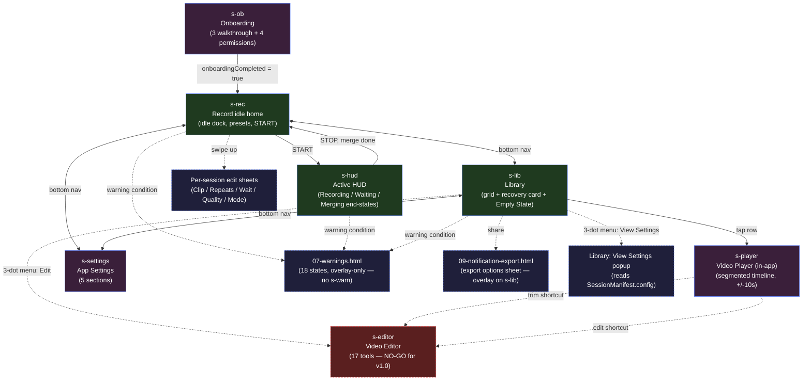
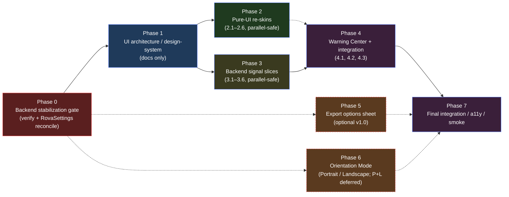

# NEW_UI_BACKEND_REPLAN

> **Type:** Planning + reconciliation report. Untracked. No production code touched. No commits.
> **Date:** 2026-05-07
> **Inputs reviewed:** `mockups/new_uiux/` (11 HTML files, ~10 250 lines), `mockups/new_uiux/UI_SCREENSHOTS/`, interactive prototype (`10-interactive-prototype.html`), current Android source under `app/src/main/java/com/aritr/rova/`, `UI_ROADMAP.md`, `ROADMAP_v6.md`, `docs/adr/0001`–`docs/adr/0006`, `slice13_verify*.log`, `slice14_verify.log`, `app/build.gradle.kts` static-check task list, `app/src/test/java/com/aritr/rova/service/recovery/RecoveryScannerTest.kt`.

---

## 1. Current State Snapshot

### 1.1 Git position

| Field | Value |
|---|---|
| Branch | `master` |
| HEAD | `4b32b0c polish(ui): simplify history library surface` |
| vs `origin/master` | **0 ahead, 0 behind** (after `git fetch origin master`) |
| Untracked drift (preserved — explicit policy: no `git clean`, no commits, no push) | Pre-existing 16 entries: `.claude/`, `.codegraph/`, `.github/`, `ROADMAP.md`, `ROADMAP_REVIEW.md`, `ROADMAP_v2.md`, `ROADMAP_v3.md`, `ROADMAP_v4.md`, `ROADMAP_v5.md`, `UI_ROADMAP.md`, `mockups/`, `screenshots/`, `slice12_verify.log`, `slice13_verify.log`, `slice13_verify2.log`, `slice14_verify.log`. New entries from this planning pass (also untracked, also preserved): `NEW_UI_BACKEND_REPLAN.md` (this file) and `.playwright-mcp/` (Playwright snapshot artefacts from the prototype inspection step in the appendix). **18 entries total — confirmed via `git status --porcelain | grep -c '^??'`.** |

### 1.2 What UI slices are already in app code

`UI_ROADMAP.md` defines six slices. Git history shows the first four landed and a fifth was *not* started.

| Slice | Status | Evidence (commit) |
|---|---|---|
| 1 — Shared UI Foundation (`PlanSummary`, `TappablePlanCell`, `EditSheetShell`, `QuickSetChipRow`, `LargeValueStepper`, `FixedContinuousSelector`, `QualityOptionSelector`, `UiCopy`) | shipped | `baff9a5 feat(ui): add redesign foundation components` |
| 2 — Record Idle Setup | shipped | `32c510a feat(ui): wire record idle redesign` |
| 3 — Record Active HUD | shipped | `69c3052 feat(ui): add active recording HUD` (introduces `RecordStatusStrip.kt`, `SessionTimer.kt`, `ClipProgressBand.kt`, `WaitingCountdown.kt`, `RecordHudFormatters.kt`, `RecordHudState.kt`) |
| 4 — History / Library Polish | shipped | `4b32b0c polish(ui): simplify history library surface`, plus the chain `e8ec58a`, `a28dc31`, `cf2e04f` |
| 5 — Settings Polish | **NOT started** | no SettingsScreen rewrite present; `SettingsHeroCard` still in tree |
| 6 — Final Integration / A11y / Smoke | **NOT started** | no `AccessibilitySmokeTest.kt` under `androidTest/` |

The "Slice 11 / 12 / 13 / 14" naming in `slice12_verify.log` … `slice14_verify.log` corresponds to a **previous** numbering (the log content refers to `Slice 13 compile` matching `3387041 fix(history): unblock Slice 13 compile`). Those logs are pre-`UI_ROADMAP.md` rebaseline artifacts. Treat them as historical.

### 1.3 Old vs new mockup directions — UI_ROADMAP is now stale

`UI_ROADMAP.md §1.2` explicitly anchors to **five** mockups under `mockups/uiux-redesign/`:

```
record-idle-setup.html · record-edit-sheets.html · record-active-hud.html ·
history-with-recovery.html · settings.html
```

The new direction lives at `mockups/new_uiux/` and contains **eleven** HTML files plus a navigable prototype. The three already-shipped UI slices (Slices 2 / 3 / 4) implemented the *old* direction. The new direction substantially expands and in places contradicts what shipped:

| Aspect | Old direction (UI_ROADMAP) | New direction (`mockups/new_uiux/`) |
|---|---|---|
| Camera home | Idle dock with 4-cell stepper (Duration / Interval / Loops / Quality) + presets | 5-cell card (Clip / Repeats / Wait / Quality / **Mode**) — **Mode = Portrait / Landscape / P+L** is a brand-new orientation concept not in ROADMAP_v6 |
| Settings sheet (per-session) | M3 modal sheets, one per cell | Bottom sheet over camera peek, mode tabs (Portrait / Landscape / Both), unified stepper grid |
| Library | Plain heading + count/size + retention pill + softened recovery card | Same general direction, plus a **3-dot row menu** with `Open / Edit / View Settings`, a **View Settings popup** (recording config of an old session), and an **Empty State** card |
| App Settings | Five sections (Recording behavior / Alerts / Storage / Reliability / About), no hero | Conceptually similar, but adds an interactive shape (toggles + picker rows + battery dialog + folder-name dialog with live preview) |
| Recovery card | Softened History card | Same — but new `07-warnings.html` reframes recovery as one of 5 warning categories |
| **Onboarding flow** | not in roadmap | **NEW**: 3-slide walkthrough + 4 permission screens (Camera required, Mic optional, Notifications recommended, Exact Alarm required) |
| **Active HUD** | Status strip + 64 sp timer + ClipProgress / WaitingCountdown + 72 dp Stop | Aligns with shipped Slice 3, with overlay in `minimal-overlay-redesign.html` adding **Merging 3/6, 5/6, Merge Complete** end-states not currently UI-rendered |
| **Video player** | not in roadmap | **NEW**: in-app player with segmented clip timeline (`Clip 3 of 10`), trim shortcut + edit shortcut, portrait + landscape variants |
| **Video editor** | not in roadmap | **NEW**: 17-tool editor — Trim / Split / Merge / Reverse / Speed / Volume / Audio / Filters / Adjust / Colour / Captions / Stickers / Text / Crop / Rotate / Add Clips. CapCut-style. Massive scope. |
| **Notification + Export** | not in roadmap | **NEW**: 4 notification states (clip active / gap / merging / complete) + 3 export states (options sheet / saving / inline success) |
| **Warning surface** | implicit (BatteryOptimizationBanner, recovery card) | **NEW**: 18 states across Permissions / Storage / Battery / Recovery / Hardware-Export |

**Conclusion.** `UI_ROADMAP.md` should be treated as superseded for any work past Slice 4. `mockups/new_uiux/` is the new source of truth for screen direction; the old roadmap's Slice 5 (Settings Polish) and Slice 6 (Final Integration / A11y) targets should be folded into a re-derived roadmap.

### 1.4 Backend phase status (what this report verified by reading source)

The user's brief framed Phase 1.5 as still in a review-gated cycle with the ADR 0005 row 5 fix unresolved. **Repo evidence contradicts that framing.** Phase 1.5 (and the ADR 0006 cross-phase amendment that affects 1.5) is implemented in code with named test coverage and is part of the build that produced `slice13_verify2.log` / `slice14_verify.log` `BUILD SUCCESSFUL`.

| Backend item | Source-of-truth file | Implementation evidence | Test evidence |
|---|---|---|---|
| **ADR 0005 row 5** — `T == null && stopRequested == true && empty session → markTerminated(USER_STOPPED, StopReason.USER)` | `app/src/main/java/com/aritr/rova/service/recovery/RecoveryScanner.kt:306-308` | `manifest.stopRequested -> sessionStore.markTerminated(sessionId, Terminated.USER_STOPPED, StopReason.USER); TerminalAction.WROTE_USER_STOPPED` — exact wording from ADR 0006 §"Migration table" | `RecoveryScannerTest.kt:151 \`T null with stopRequested and empty session writes USER_STOPPED\`` (KDoc explicitly cites ADR 0005 Row 5 + memory key `project_phase15_recovery_carryover`) and `\`RecoveryScanner USER_STOPPED stopRequested branch carries StopReason USER\`` |
| **ADR 0005 row 7** — `T == null && stopRequested == false && empty → markTerminated(KILLED_FORCE_STOP, NONE)` | `RecoveryScanner.kt:310-313` | present | `RecoveryScannerTest.kt \`T null no stopRequested and empty session writes KILLED_FORCE_STOP\`` |
| **ADR 0006 cross-phase invariant** — `terminated == null && exportState ∈ {MUXING, COPYING, FINALIZED} → SKIPPED_EXPORT_PENDING` (defer to Phase 1.7) | `RecoveryScanner.kt:99-106` + companion `EXPORT_IN_FLIGHT_OR_FINALIZED` set at line 377 | present | five tests: MUXING, COPYING, FINALIZED yield `SKIPPED_EXPORT_PENDING`; FAILED is **not** skipped; `Terminal session with exportState MUXING is ALREADY_TERMINAL not SKIPPED_EXPORT_PENDING` |
| **ADR 0006 atomic terminal-write API** — 3-arg `markTerminated(sessionId, terminated, stopReason)` | `SessionStore.kt` (signature; tests reference `store.markTerminated(sid, Terminated.USER_STOPPED, StopReason.PERMISSION_REVOKED)`) | present | `\`markTerminated writes stopReason atomically with terminated\``, `\`markTerminated first-writer-wins preserves winner stopReason\``, `\`markTerminated Failed is returned after retry exhaustion\``, `\`markTerminated Failed for unknown sessionId\`` |
| **ADR 0005 single-site scan trigger** — `RovaApp.triggerRecoveryScanIfNeeded()` only invoked from `MainActivity.onCreate` | `RovaApp.kt:145` (function), `MainActivity.kt:22` (call site), static check `checkScanTriggerSingleSite` registered in `app/build.gradle.kts:300` | wired | static check enforces |
| **ADR 0006 B16 forbidden pair** — `markTerminated(USER_STOPPED, NONE)` forbidden | static check `checkAtomicTerminalWriteForbiddenPair` at `app/build.gradle.kts:439-490` | wired | check passes in `slice13_verify2.log` build |
| **Phase 1.4 lifecycle invariants** — eager `USER_STOPPED` write before merge, `COMPLETED` only post-merge | static check `checkUserStoppedBeforeMerge` at `app/build.gradle.kts:662-720` | wired | check passes |
| **Phase 1.7 pending-visibility (ROADMAP_v6 only delta vs v5)** — Tier 1 sweep uses `setIncludePending` (API 29) / `QUERY_ARG_MATCH_PENDING` (API 30+) | static checks `checkExportSetIncludePendingGuarded` and `checkExportQueryArgMatchPendingGuarded` at `app/build.gradle.kts:950, 1000` | wired | checks pass |

In addition, `RovaApp.buildExportRecoveryRunner()` (`RovaApp.kt:240-319`) wires `ExportRecoveryRunner.run()` (Phase 1.7) ahead of Phase 1.5 classification — `RovaApp.kt:193 val exportReport = buildExportRecoveryRunner().run()` runs first, then line 201 `val scanner = RecoveryScanner(sessionStore); val classifications = scanner.classifyAll(scanStart)` runs Phase 1.5 over the residue. The B14 ordering hazard (1.5 racing 1.7 on row 13c) is therefore handled by ordering at the trigger site, not just the in-classifier guard — both layers are present.

**Net.** I cannot find an unresolved Phase 1.5 carry-over in the source. The repo state matches "Phase 1.5 closed" at the committed level. What may still be open is a **memory or review-cycle ledger** that hasn't been updated to reflect the close. That distinction matters for sequencing — see §4.

---

## 2. New UI Inventory

Each row maps a `mockups/new_uiux/` screen to its current Android equivalent (if any) and classifies the work needed to bring the production app to the new design. Numbering follows the file naming.

| # | Screen / file | Main interactions | Existing Android equivalent | Backend / data dependencies | Classification |
|---|---|---|---|---|---|
| 1 | `01-record-home.html` (Record idle home) | Cell-driven config (Clip / Repeats / Wait / Quality / **Mode**), mode tabs (Drill / Vlog / Custom) at top, presets row, START button anchored in dock, recovery echo card | `ui/screens/RecordScreen.kt` + `ui/screens/RecordIdleDock.kt` (Slice 2 shipped) | All but **Mode** map to existing `RovaSettings` keys (the 10 keys enumerated in §3.7). **Mode** (Portrait / Landscape / P+L) is the only genuinely new field — there is no orientation key in `RovaSettings` and no `orientationMode` in `SessionConfig`. Drill / Vlog / Custom mode tabs sit on top of `customPresetsJson` (user-saved JSON only today); the named "Drill" and "Vlog" presets need a seed source. | Refactor of existing component (Slice 2 already covers most of it) **+ new backend contract for orientation Mode** (deferrable) |
| 2 | `02-settings-sheet.html` (per-session sheet) | Stepper for Clip / Wait / Loops, chip group for Quality, mode tabs, save CTA | Slice 1 / 2 sheet shells (`EditSheetShell`, `LargeValueStepper`, `QualityOptionSelector`, `FixedContinuousSelector`, `QuickSetChipRow`) plus `RecordEditSheets.kt` (12 KB) | None new (writes through existing `RovaSettings` keys) — except orientation tab which is the same Mode question as #1 | Refactor — re-skin shipped sheet with new layout (no new persistence) |
| 3 | `03-history-library.html` (Library) | Grid of cards (real thumbnails today), 3-dot menu → Open / Edit / View Settings, Empty State, Recovery card variant | `ui/screens/HistoryScreen.kt` (30 KB), `HistoryViewModel`, `HistoryArtifactMapper`, `HistoryDeleter`, `HistoryMetadataLoader`, `HistoryRowFormatters`, `RecoveryCard` | "View Settings" requires reading the historical `SessionConfig` from `SessionManifest` for that session — already persisted (sessions write a manifest with full `SessionConfig`); only an adapter is missing. "Edit" requires the editor (#5) which is its own scope. | Refactor + minor data adapter |
| 4 | `04-video-player.html` (in-app player) | Segmented clip timeline (`Clip 3 of 10`), Trim shortcut, Edit shortcut, rewind/forward 10 s, portrait + landscape variants | **Does not exist.** Today, History opens via `safeShareUri`-based external player (commits `924687a fix(history): share preview playback via safe content URI`, `b3737f6`) | New player surface inside the app. Needs `androidx.media3.exoplayer` (or `androidx.media3.ui.PlayerView`) integration. Reads existing merged MP4 only, so no manifest schema change. Trim / Edit shortcuts depend on #5. | New UI-only component, **but** Trim / Edit shortcuts depend on the editor scope decision. Player itself is independently shippable. |
| 5 | `05-video-editor.html` (CapCut-style editor) | 17 tools: Trim / Split / Merge / Reverse / Speed / Volume / Audio / Filters / Adjust / Colour / Captions / Stickers / Text / Crop / Rotate / Add Clips. Tool panels replace the bottom toolbar in place. | **Does not exist anywhere in code.** The existing `utils/VideoMerger.kt` is a `MediaMuxer` concat used post-recording; there is no per-clip cut, trim, filter, overlay, or audio-channel manipulation. | Massive backend scope inferred from the codebase + mockup: per-clip frame-accurate cuts (`MediaCodec` decode + re-encode or `MediaExtractor` keyframe-aligned cuts, or `androidx.media3.transformer`), audio mixing, OpenGL-ES filter pipeline, text/sticker rendering, plus state for "Add Clips" (multi-source merge across sessions). Module would dwarf the current `service/` + `data/` source trees combined. | **Deferred — NO-GO for v1.0** on codebase scope/risk grounds (see §7 #2). The mockup is aspirational. |
| 6 | `06-app-settings.html` (App settings — global) | Toggle rows (existing keys), picker rows opening bottom sheets, battery dialog with status badge, folder-name dialog with live preview | `ui/screens/SettingsScreen.kt` (15 KB), `SettingsViewModel.kt`, `BatteryOptimizationBanner.kt` (removed PR #12 — now the WarningCenter row `BATTERY_OPTIMIZATION_ON`), `BatteryOptimizationHelper.kt` | Existing toggle rows (Keep screen on, Sound cues, Vibrate alerts, Auto-delete + Keep-latest chip group) all map to `RovaSettings` keys that already exist — `autoDeleteEnabled` and `autoDeleteKeepLatest` are present at `RovaSettings.kt:45-51` (shipped via commit `6b1c569`). The mockup-implied new keys are limited to:<br>• `onboardingCompleted` (drives the onboarding flow gate; see #8)<br>• `autoExportEnabled` (export options sheet; see #9)<br>• `exportFolderName` (folder-name dialog with live preview)<br>See §3.7 for the full schema reconciliation. | Refactor of existing screen + **3 new backend keys** to land first |
| 7 | `07-warnings.html` (18 warning states across 5 categories) | Permissions (Camera denied, Mic denied, Notifications off, Exact alarm denied), Storage (not enough, low banner, full / aborted, can't merge — 3-way), Battery (optimization on, saver on, low <15 %, critical <5 %, overheating escalating), Recovery (Killed by system, Force stopped, Stopped before merge, Merge failed), Hardware (Camera in use by another app, SD card ejected mid-session — 3-way, Export to gallery failed) | Partially exists: `BatteryOptimizationBanner`, `RecoveryEchoBanner`, `RecoveryCard`, recovery-card vendor guidance. Storage estimator (`StorageEstimator.kt`) exists. **Missing surfaces:** thermal/overheating (no thermal sensor read today), camera-in-use detection, SD-card ejected mid-session detection, export-to-gallery failure inline card | Backend signals partially exist (battery, recovery), partially missing (thermal, camera-in-use, SD eject, mid-session storage banner). Each missing signal is a small backend slice. | Mixed: existing → re-skin; missing → backend-blocked |
| 8 | `08-onboarding.html` (3 walkthrough + 4 permissions) | Slides (Record on repeat / Walk away / One file) → Camera (required) → Mic (optional) → Notifications (recommended) → Exact Alarm (required) | **Does not exist.** Today the app prompts for Camera/Mic on first record start (lazy). Battery optimization is prompted via existing `BatteryOptimizationHelper`. Notifications and Exact Alarm are not gated by an onboarding flow. | New `onboardingCompleted` flag in `RovaSettings`. Wires through the existing intent helpers (no new permission types). The "Exact Alarm — required" framing is consistent with `ADR 0001` (`SCHEDULE_EXACT_ALARM` opt-in, OS-revocable) — so the screen must handle revocation re-prompts, not assume one-shot grant. | New UI-only component **+ small persistence delta** |
| 9 | `09-notification-export.html` (4 notification states + export sheet) | Notifications: clip recording active / gap / merging / complete. Export: options sheet, saving progress, inline success card. | `RovaRecordingService.kt` (122 KB) builds the FGS notification today; segment / merge transitions exist as state but the notification copy probably does not split across all four states the mockup shows. Export options sheet does not exist (export is automatic via tier dispatch in `ExportPipeline`). | Notification states are presentation-only deltas on existing service state — no new manifest fields. Export options sheet implies a user-toggle for export-on-completion (today it auto-exports per ADR 0003). That **does** add a new RovaSettings key (`autoExportEnabled`?) and a deferred-export queue. | Mixed — re-skin notifications free, opt-in export sheet adds a small backend contract |
| 10 | `10-interactive-prototype.html` | Single navigable prototype with seven internal screens: `s-ob` (onboarding) → `s-rec` → `s-hud` → `s-lib` → `s-player` → `s-settings` → `s-editor`. Functions: `goScreen(id)`, `goBack()`, `openSheet`, `closeSheet`, `obNext`, `stepVal`, `selectQuality`, `openCtxMenu`, `closeCtxMenu`, `openDelConfirm`, `closeDelConfirm`, `doDelete`. Bottom-nav `goScreen('s-lib')` confirms the Library tab is reachable from Record. **No** `s-warn`, `s-recovery`, `s-export-sheet`, `s-notification` — those live only in their static files (07, 09) and are not navigable from the prototype. | n/a — proxy for the production navigation graph | Same dependencies as the seven member screens above. The prototype is the *operational truth* for navigation order. | n/a — informs nav graph design |
| 11 | `minimal-overlay-redesign.html` | Idle / Recording / Break / **Merging 3/6** / **Merging 5/6** / **Merge Complete** end-states. Last three are not in shipped Slice 3 (Slice 3 only shipped Recording / Waiting). | Slice 3's `RecordHudState` covers Recording + Waiting; Merging is shown today via the existing `SessionStatusCard` + History redirect, **not** as a HUD end-state on the Record surface | The Merging 3/6 → 5/6 → Complete transitions need a UI-side `RecordHudState.Merging(progress)` state, fed by the existing merger progress signal. Backend already exposes merge progress (segment-by-segment muxer steps); only the VM piping is missing. | Refactor of Slice 3 (extends shipped HUD with Merging states) |

### 2.1 New concepts that the prototype implies but no static file fully designs

- **Recovery / warning routing.** The prototype has `s-rec` and `s-lib` only — no warning overlay screen. Static file `07-warnings.html` shows warning *layouts* but is not navigable. The production routing of "low storage banner mid-session", "overheating escalation", "SD card ejected" is not a screen, it's an in-place overlay or sheet on `s-rec` / `s-hud`. That is the right model — but it is also currently undefined for several of the 18 states.
- **Export options sheet target.** `09-notification-export.html` shows it but the prototype does not include `s-export`. Likely a sheet on `s-lib`.

---

## 3. Backend Gap Inventory

The user's brief asked me to enumerate backend gaps explicitly. The biggest finding is that the gap the brief named first is **already closed in code** — see §3.1.

### 3.1 ADR 0005 row 5 USER_STOPPED fix — **already shipped, not a gap**

| Item | Evidence |
|---|---|
| Implementation | `service/recovery/RecoveryScanner.kt:306-308` writes `markTerminated(sessionId, Terminated.USER_STOPPED, StopReason.USER)` for the `manifest.stopRequested` branch (T == null path) |
| ADR-0006-mandated `stopReason` argument | passed (`StopReason.USER`) per ADR 0006 §"Migration table" |
| Append-before-mark ordering | guaranteed by line 282 (append) preceding line 304 (terminal write) inside the same `classify()` body, both running on the serial `persistDispatcher` |
| Test for the brief's exact shape `(stopRequested=true, terminated=null, segments=[])` | `RecoveryScannerTest.kt:151 \`T null with stopRequested and empty session writes USER_STOPPED\`` — KDoc cites ADR 0005 Row 5 *and* the memory key |
| Test for the StopReason | `RecoveryScannerTest.kt:621 \`RecoveryScanner USER_STOPPED stopRequested branch carries StopReason USER\`` |
| Build verification | `slice13_verify2.log` and `slice14_verify.log` (May 4–5 2026) both end with `BUILD SUCCESSFUL` on `lintDebug` + `testDebugUnitTest` + `assembleRelease` (`111 actionable tasks: 111 executed`) |

**Action.** This gap should be **deleted from the backlog** and the auto-memory entry `project_phase15_recovery_carryover.md` should be updated to record that Phase 1.5 row 5 + row 7 + the `SKIPPED_EXPORT_PENDING` cross-phase amendment all landed and tests pass — not deleted, because the *narrative* of why the row exists is still useful context. Do this in the next prompt cycle (see §8).

### 3.2 Phase 1.3 carry-over state classification — **shipped**

The `(stopRequested=true, terminated=null, segments=[])` and the `(stopRequested=false, terminated=null, segments=[])` shapes both have explicit handlers and tests (RecoveryScanner.kt:306 and 310; tests at line 151 and 168 in `RecoveryScannerTest.kt`). The KDoc reference at the test (`This is the Phase 1.3 prep-time stop carry-over (memory: project_phase15_recovery_carryover)`) shows the implementer was working from the same memory the user is concerned about.

### 3.3 Recovery / warning surface dependencies — partially shipped

| New UI dependency | Current backend support | Gap |
|---|---|---|
| Recovery card on Library + read-only echo on Record | shipped: `RecoveryReport` StateFlow on `RovaApp`, `RecoveryViewModel`, `RecoveryUiState`, `RecoveryEchoBanner.kt` (Record), `RecoveryCard` (History) | none |
| "Stopped before merge" 3-way confirmation | not yet present as UI; the manifest classification (`USER_STOPPED` + surviving segments → `OFFER_DISCARD`) is correct but the 3-way (Discard / Merge what was recorded / Keep) is partly out — `RecoveryScanner` emits the eligibility flag, deletion is owned by `Phase 1.7 cleanup pass` (per ADR 0005 §"Deletion ownership") and explicit user action through "Phase 2 UI". Phase 2 UI = the recovery card actions. Today the card has *Discard* and *Open vendor settings*; the third option ("Merge what was recorded") is not exposed. | small UI slice + a `RovaController.recoverAndMerge(sessionId)` entry that reuses the existing merger over the appended-orphan-prefix segments |
| Merge failed (recovery card) | partially: `Terminated.COMPLETED` is the success terminal; there is no `MERGE_FAILED` terminal value today (per `SessionManifest.Terminated` enum which has only `USER_STOPPED, COMPLETED, KILLED_BY_SYSTEM, KILLED_FORCE_STOP`). A merge failure today would manifest as `USER_STOPPED` (eager pre-merge) + post-merge degraded notification per ADR 0006 §B9. The mockup's "Merge failed" card therefore needs a UI mapper from `(USER_STOPPED + exportState ∈ {FAILED} + manifest.terminated set)` → "Merge failed" framing. **Not** a manifest schema change. | UI-side mapper |
| Killed by system + Force stopped recovery cards | shipped: `Terminated.KILLED_BY_SYSTEM` and `Terminated.KILLED_FORCE_STOP` writers + `VendorGuidanceIntents` | none |
| Camera in use by another app warning | not present today as a distinct signal. Camera bind failure surfaces as `markTerminated(USER_STOPPED, INIT_FAILED)` per ADR 0006 row 7 with a degraded notification. Disambiguating "in use by another app" vs "init failure" requires reading `CameraAccessException.CAMERA_IN_USE` (Camera2) — CameraX abstracts this; need an inspection of `androidx.camera.core.CameraState.ErrorType`. | small backend signal: surface `CameraState.Error` to a `RovaUiSignal` |
| SD card ejected mid-session | not present today. Storage estimator only checks pre-flight. Mid-session is `RovaRecordingService` writing into private app dir which lives on internal storage by default — SD eject doesn't apply unless the user moved the app. Before claiming this is missing, confirm that user-moved-to-SD even applies (`installLocation` is `auto` by default; might be moot). | clarify scope before signal work |
| Overheating (escalating banner) | not present. Needs `PowerManager.getThermalStatus()` (API 29+) + `addThermalStatusListener`. Pre-API-29 falls back to no signal. | new backend signal — small |
| Notifications off (advisory) | not as a banner today; the FGS posts notifications regardless of `POST_NOTIFICATIONS` grant on API 33+ (the system suppresses display silently). Surface a banner when permission denied + session about to start. | small UI slice (uses existing `notificationManager.areNotificationsEnabled()`) |
| Exact alarm denied (hard block) | partial: ADR 0001 mandates `SCHEDULE_EXACT_ALARM` opt-in handling. The app must observe `ACTION_SCHEDULE_EXACT_ALARM_PERMISSION_STATE_CHANGED` and degrade. UI surface is missing. | small backend + UI |
| Battery saver on / Critical battery | not as banners today. Backend signals are `BatteryManager` reads + a `BroadcastReceiver` for `ACTION_POWER_SAVE_MODE_CHANGED`. | small backend signal |

### 3.4 Sub-minute wait support — **NOT in new UI, NO-GO confirmed**

The mockups (per `01-record-home.html` cells and `02-settings-sheet.html` chip set) show `None · 1m · 5m · 10m · 30m · 1h` — same as the UI_ROADMAP `intervalMinutes` non-negotiable. **No sub-minute chips appear in the new direction.** The UI_ROADMAP §8 NO-GO ("No sub-minute wait unless owner-of-record-approved backend slice") therefore still holds, with no pressure from the new UI to relax it.

### 3.5 Portrait / Landscape / **P + L** capture mode — **NEW backend contract required**

The "Mode" cell in `01-record-home.html`, `minimal-overlay-redesign.html`, and `02-settings-sheet.html` is brand-new. Three values:

- `Portrait` — single orientation
- `Landscape` — single orientation
- `P + L` — both at once

Implications if accepted:

- **`SessionConfig`** gains an `orientationMode: OrientationMode` field. Schema bump on `SessionManifest`.
- **`RovaRecordingService`** has to pin `targetRotation` per segment. For `P + L`, the *segment loop* either alternates per segment (segment N = portrait, N+1 = landscape) or **rotates per clip within a single recording session**. The mockup is ambiguous — `01-record-home.html`'s P+L phone shows two camera zones split horizontally, which suggests split-screen capture (not sequential alternation). If split-screen is the literal intent, that is a different camera bind: dual `VideoCapture` use cases with different rotations is **not natively supported by CameraX** (CameraX binds a single set of use cases per LifecycleOwner). This would require deeper investigation against the CameraX 1.x docs (or upgrading to 1.4 with concurrent-camera support, which is API-31+ on supported devices only — a hard hardware gate).
- **`VideoMerger`** has to handle mixed-orientation segments. `MediaMuxer` does not transcode; it concatenates. Mixed-rotation segments produce a final file whose displayed rotation flips mid-playback — usually unwanted. So the merge step has to either (a) re-encode flipping segments to match a target orientation, or (b) split the output into two files (one portrait, one landscape).

**Recommendation.** Treat "Mode = P + L" as a **design open question**, not an implementable backend feature, until the capture semantics are pinned down. Portrait-only and Landscape-only are easy (per-session `targetRotation`); P+L is not.

### 3.6 Export / notification state requirements — partially shipped

| Mockup state | Backend state | Gap |
|---|---|---|
| Notification: clip recording active | exists in service | none |
| Notification: gap / waiting | unclear if separate notification copy exists; service likely posts a single state today | small UI / service text update |
| Notification: merging | exists | none |
| Notification: merge complete | exists | none |
| Export options sheet | does not exist; export is auto per ADR 0003 tier dispatch | new UI sheet + optional `RovaSettings.autoExportEnabled` toggle |
| Export saving progress | exists internally (`ExportPipeline` progress) but not surfaced | small UI |
| Export inline success | partially: a snackbar is shown per `RetentionCleanupNotices`, not an export-success card | small UI |
| Export failure inline | not a distinct UI today | small UI + the existing degraded-notification path provides the signal |

### 3.7 Settings shown in UI vs `RovaSettings.kt` — **smaller mismatch than initially feared**

Reading `app/src/main/java/com/aritr/rova/data/RovaSettings.kt` (lines 1-52) directly:

```kotlin
class RovaSettings(context: Context) {
    private val prefs = context.getSharedPreferences("rova_settings", Context.MODE_PRIVATE)
    var durationSeconds: Int        // "duration",                default 10
    var intervalMinutes: Int        // "interval",                default 1
    var resolution: String          // "resolution",              QualityPresets.DEFAULT
    var loopCount: Int              // "loop_count",              default 10 (-1 for continuous)
    var enableBeeps: Boolean        // "enable_beeps",            default true
    var vibrateAlerts: Boolean      // "vibrate_alerts",          default true
    var keepScreenOn: Boolean       // "keep_screen_on",          default false
    var customPresetsJson: String   // "custom_presets",          default "[]"
    var autoDeleteEnabled: Boolean  // "auto_delete_enabled",     default false
    var autoDeleteKeepLatest: Int   // "auto_delete_keep_latest", default 10
}
```

That is **ten** stored fields, persisted via `SharedPreferences("rova_settings")` — **not** DataStore. The `autoDeleteEnabled` and `autoDeleteKeepLatest` keys exist in the source (lines 45-51), shipped via commit `6b1c569 feat(settings): add recording retention cleanup`. (My earlier draft of this report misread the file and claimed they were missing; corrected here.)

`UI_ROADMAP.md §3` non-negotiable enumerates `keepScreenOn`, `soundCues`, `vibrateAlerts`, `autoDeleteEnabled`, `autoDeleteKeepLatest`, `intervalMinutes` and refers to "DataStore keys and migrations". Two real inconsistencies remain:

- **Storage type.** Production uses `SharedPreferences`, not DataStore — UI_ROADMAP wording is wrong on the storage backend, not on the keys.
- **`soundCues` vs `enableBeeps`.** UI_ROADMAP names `soundCues`; production key is `enableBeeps` ("enable_beeps"). These are the same toggle under different names. Pick one and update the other; do not silently rename.

The `autoDeleteEnabled` / `autoDeleteKeepLatest` keys UI_ROADMAP §3 names *do* exist, so the non-negotiable "preserve these keys through UI slices" remains correct as written for those two — UI_ROADMAP is right on the substance, wrong only on the storage backend term and the `soundCues` name.

New UI screens (`06-app-settings.html`) imply at most three genuinely new keys, pending more repo evidence:

| Proposed new key | Backing screen / mockup detail | Default | Notes |
|---|---|---|---|
| `onboardingCompleted: Boolean` | `08-onboarding.html` — gates first-launch walkthrough + permission flow | `false` | Standard onboarding flag; no state machine needed |
| `autoExportEnabled: Boolean` | `09-notification-export.html` — export options sheet implies a user-toggle for "auto-copy to gallery on completion" | `true` (preserves current behavior; the existing tier dispatch keeps running unchanged) | Phase 0 only adds the persisted key; **no consumer wires it**. Any actual gating, opt-out queue, or deferred-export entry point belongs to a later export-options slice (Phase 5). The key is intentionally inert until then. |
| `exportFolderName: String` | `06-app-settings.html` — folder-name dialog with live preview | `""` (empty → use existing default `Movies/Rova/<sessionId>/`) | Validate against MediaStore display-name rules before persisting |

**Smaller backend slice required before Slice 5 work begins:** Phase 0 should add at most these three genuinely-new keys (skip any whose mockup intent is ambiguous), reconcile UI_ROADMAP wording on `enableBeeps` ↔ `soundCues` and on the `SharedPreferences` vs DataStore framing, and explicitly decide **not** to migrate to DataStore in this work cycle.

### 3.8 Editor / player requirements

- **Player** (#4) — needs Media3 ExoPlayer integration. No backend contract change; the merged MP4 is already the player's input.
- **Editor** (#5) — **No-Go for v1.0** on scope/risk grounds (see §7 #2 for the substantive case; ROADMAP_v6's `Out of Scope for v1.0` section exists as a heading but is empty in the file, so it cannot be cited as the source of the deferral).

---

## 4. Strategy Recommendation

### 4.1 Three options on the table

| Option | Description | Risk of rework | Architecture stability | API contract evolution | Velocity | Testing complexity | Dependency chain | Carry-over impact |
|---|---|---|---|---|---|---|---|---|
| **A. Backend-first** | Ship every backend slice (RovaSettings reconciliation, thermal signal, camera-state signal, notifications-permission read, exact-alarm revocation listener, optional auto-export gate, optional orientation contract) before any new UI | Lowest UI rework risk because every contract is locked before UI consumes it | Highest | Clean — UI sees stable contracts | Slowest — backend slices are smaller but plenty of them; UI design freshness can decay | Lowest at the boundary, but tests for unused signals are noise | Linear | Eliminates all carry-over questions before UI re-skins begin |
| **B. UI-first** | Build all 11 mockup screens with placeholders / mocked data, ship to internal beta, then back-fill backend signals | Highest backend rework risk — every placeholder becomes a contract debate when wired | Lowest — VMs end up doing classification/translation that should live in service | Worst — UI-driven contracts drift into inconsistencies (e.g. UI emits `MergeFailed` then backend has to retrofit) | Fastest in the first 2 weeks, then collapses | Highest — UI tests against fakes that diverge from real signals | Tangled | Carry-over questions become latent: a UI banner that assumes thermal data won't notice when the real signal is missing |
| **C. Parallel with synchronized milestones** | One *narrow* backend track (RovaSettings reconciliation + 2–3 high-value signals) running ahead of UI by one milestone. Slice 5 of the **new** UI roadmap depends on RovaSettings being reconciled; Slice 7 (warnings center) depends on signals from track B; Slice 9 (orientation Mode) depends on track C orientation contract — and is **conditional**, deferred if track C is hard | Moderate | High — synchronized milestones force contracts before UI consumes | Cleanest of the realistic options | Fast for non-blocked surfaces (player, onboarding, library polish, settings re-skin), correct for warning-heavy ones | Moderate | Branches that converge at milestones | Carry-over closes in milestone 0 (verification-only) and stays closed |

### 4.2 Recommendation: **Option C, with a Phase 0 verification gate**

The user's brief leaned on "First close the minimal backend correctness blocker: ADR 0005 row 5 + tests. Then restructure roadmaps. Then proceed in parallel only where UI can be built against stable contracts."

That instinct is correct for a project where ADR 0005 row 5 is open. **In this project, repo evidence shows ADR 0005 row 5 is not open** (§3.1). So the equivalent of the user's "minimal blocker" today is **verifying that the close is real, updating the auto-memory accordingly, and patching the** `**RovaSettings**` **schema mismatch (§3.7) before any UI slice that relies on its keys**.

Why I'm recommending C and not strict A:

1. **The UI is decaying value.** `mockups/new_uiux/` is dated `2026-05-07` (UI_SCREENSHOTS timestamp `10_08_40`). If we hold all UI work for 6+ backend slices, the design feedback loop closes too slowly for the design to remain trusted.
2. **Several backend slices are independent.** Onboarding flag in RovaSettings, notification-permission read, exact-alarm revocation listener, and battery-saver listener are decoupled enough to fan out.
3. **The orientation Mode question is the only one that *should* block.** It is the single cleanest UI feature that is genuinely backend-blocked (§3.5). Defer the entire P+L mockup decision until track C confirms whether dual capture is feasible.

The recommendation deviates from the user's stated bias only in calling out that "ADR 0005 row 5 + tests" is already a *verification* item, not an implementation item. Everything else aligns: stabilize → restructure → parallelize.

### 4.3 What pure UI work can begin immediately under Option C

These slices have **zero new backend contract** beyond `RovaSettings` reconciliation:

- **Slice A1: Re-skin SettingsScreen** to match `06-app-settings.html` layout, *but only after* `RovaSettings` schema reconciliation lands.
- **Slice A2: Library `View Settings` popup** that reads historical `SessionConfig` from the on-disk manifest. Pure adapter work (`HistoryViewModel` already loads metadata).
- **Slice A3: Library Empty State**.
- **Slice A4: HUD Merging end-states** (extend `RecordHudState` with `Merging(progressIndex, totalSegments)`).
- **Slice A5: In-app Player** using Media3 ExoPlayer over the existing merged MP4.
- **Slice A6: Onboarding flow** (3 walkthrough + 4 permissions). Backend contract = single new `RovaSettings.onboardingCompleted` flag, packaged with the §3.7 reconciliation.

These slices have **a small backend contract**:

- **Slice B1: WarningCenter VM** that aggregates the existing recovery / battery / storage / FGS signals into the unified `07-warnings.html` model. **Adds**: thermal, camera-state, notifications-permission, exact-alarm-revocation listeners. This is the largest of the small backend slices; it can be split.
- **Slice B2: Notification copy split** (clip / gap / merging / complete). Read-only on existing service state.
- **Slice B3: Export options sheet + autoExportEnabled gate** (optional — opt-out of auto-export to gallery, same tier dispatch).

These are **deferred** behind a backend-first or owner-of-record gate:

- **Slice C1: Orientation Mode (Portrait / Landscape)**. Schema bump, alarm-aware re-bind, merger compatibility. **Conditional GO**.
- **Slice C2: Orientation P+L (split capture)**. Hard hardware gate. **Likely NO-GO for v1.0**.
- **Slice C3: In-app video editor (17 tools).** **NO-GO for v1.0** on codebase scope/risk grounds (see §7 #2).

---

## 5. Revised Roadmap Proposal

The roadmap below replaces the existing UI_ROADMAP.md trajectory beyond Slice 4. The pre-existing 6-slice plan in UI_ROADMAP shipped Slices 1–4 against the *old* mockup direction; Slices 5 and 6 of UI_ROADMAP are **superseded** by Phases 1–4 below (the slice numbering is reset to avoid confusion with the historical numbering).

### Phase 0 — Backend stabilization gate

**Scope.** Verification-and-reconciliation only. **Zero new feature implementation.**

- 0.A — Run `./gradlew :app:lintDebug :app:testDebugUnitTest --rerun-tasks :app:assembleRelease` cold and confirm `BUILD SUCCESSFUL`. Capture verify log under `phase0_verify.log` (untracked). Read-only.
- 0.B — **Assistant-side memory update only** (not a repo file). Update the local Claude Code memory entry at `C:\Users\HP\.claude\projects\g--Books-Python-ACTUAL-CODES-PROJECTS-rova-android\memory\project_phase15_recovery_carryover.md` so the unresolved framing is replaced with closed-with-evidence framing (cite `RecoveryScanner.kt:306-308`, `RecoveryScanner.kt:99-106`, `RecoveryScannerTest.kt:151`, `RecoveryScannerTest.kt:621`, plus `slice13_verify2.log`/`slice14_verify.log` BUILD SUCCESSFUL). Keep the Phase 1.3 narrative (the `(stopRequested=true, terminated=null, segments=[])` shape) as historical context — do not delete the entry. **This update lives outside the git repo.** No `MEMORY.md` index changes are committed; the only `MEMORY.md` of relevance is the assistant-memory index at the same path, also outside the repo.
- 0.C — Reconcile `app/src/main/java/com/aritr/rova/data/RovaSettings.kt` against `06-app-settings.html` and UI_ROADMAP. The retention pair (`autoDeleteEnabled`, `autoDeleteKeepLatest`) already exists in the source (lines 45-51) — **do not re-add**. Genuinely new keys to consider, all default-conservative:
  - `onboardingCompleted: Boolean` (default `false`)
  - `autoExportEnabled: Boolean` (default `true` — preserves current auto-gallery-copy behavior)
  - `exportFolderName: String` (default `""`)
  Skip any whose mockup intent is ambiguous on a re-read; better to add three keys total than five with one wrong.
- 0.D — Update UI_ROADMAP wording (untracked file at repo root) so it (a) says `SharedPreferences` instead of "DataStore keys and migrations", and (b) uses the production key name `enableBeeps` instead of `soundCues`. **Do not rename `enableBeeps` in `RovaSettings.kt`.** **Do not migrate to DataStore.** Both renames would force a SharedPreferences read-old-write-new migration pass for zero user-visible benefit.

**Files likely touched (in-repo, no commit per the project's review-gate cycle — owner gates each PR):**
- `app/src/main/java/com/aritr/rova/data/RovaSettings.kt` (add only the genuinely new keys from 0.C)
- `app/src/test/java/com/aritr/rova/data/RovaSettingsTest.kt` (new — round-trip tests for all 10 existing keys plus the new keys, plus back-compat reads against an older preferences blob)

**Files likely touched (untracked, repo-root, intentionally not committed):**
- `phase0_verify.log` (new untracked)
- `UI_ROADMAP.md` (existing untracked — copy-edit only, no slice plan changes)

**Files updated outside the repo (assistant memory, never committed):**
- `C:\Users\HP\.claude\projects\g--Books-Python-ACTUAL-CODES-PROJECTS-rova-android\memory\project_phase15_recovery_carryover.md`

**Backend dependencies.** None (this *is* the backend slice).

**Test gates.**
- `./gradlew :app:lintDebug` green
- `./gradlew :app:testDebugUnitTest --rerun-tasks` green
- `./gradlew :app:assembleRelease` green
- New `RovaSettingsTest` covers default values for **all 10 existing keys** plus the genuinely-new keys, plus back-compat reads of an older preferences blob written by the current build (no migration on read).

**Smoke checklist.**
- Install over an existing debug build that has `rova_settings` populated. Open Settings. Confirm pre-existing toggles (Keep screen on, Sound cues, Vibrate alerts, Auto-delete) hold their values. The newly added keys read their defaults; nothing in the UI consumes them yet.

**NO-GO conditions.**
- Verify build does not pass cold.
- Any of the 10 existing keys behaves differently after the edit (tests catch this; do not bypass).
- An attempted rename of `enableBeeps` to `soundCues` (or any other existing key rename).
- An attempted DataStore migration.
- A new key landing without a paired round-trip test.

**Commit strategy.** One in-repo commit only — `feat(settings): add UI-pending keys (onboarding, export gates)` — gated behind the existing review-gate cycle. Memory updates in 0.B are **not** repo commits (assistant-side only). UI_ROADMAP copy edits in 0.D stay in the existing untracked file (the file has been untracked in this repo since it was authored; preserving that policy).

### Phase 1 — New UI architecture / design-system foundation

**Scope.** Decide and write down the navigation graph, the design tokens, the typography strategy, and the warning-center pattern. **No new screens.** This phase is to UI-track what ADR 0006 was to backend-track — a one-shot investment that everything else references.

- 1.A — Author `docs/UI_NAV_GRAPH.md`. Encodes the prototype's `s-ob → s-rec → s-hud → s-lib → s-player → s-settings → s-editor` nav with explicit "where do warnings overlay" and "where does the export sheet live" answers.
- 1.B — Author `docs/UI_DESIGN_TOKENS.md`. Pull tokens from `mockups/new_uiux/PROJECT_CONTEXT.md` §"UI/UX Design Principles" (background `#06090f`, primary accent `#5b7fff`, recording red `#ef4444`, Inter font, frosted-glass `rgba(9,13,20,0.97)` + `backdrop-filter: blur(24px) saturate(180%)`, etc). Decide what becomes a Material 3 theme token vs what stays a screen-local style.
- 1.C — Decide typography reconciliation: drop the serif headlines now, vs keep deferred. Recommend **drop now**, plus add the 64-sp tabular-nums monospace style introduced in shipped Slice 3.
- 1.D — Author `WarningCenterContract.md` defining the model behind `07-warnings.html` (signals, severity, dismissibility, persistence). No code yet.

**Files likely touched.** Three docs only. No `.kt` files.

**Backend dependencies.** Phase 0 closed (so the docs reference real settings keys, not aspirational ones).

**Test gates.** None — docs phase.

**Smoke checklist.** Owner read-through; explicit GO.

**NO-GO conditions.**
- WarningCenterContract proposes a backend signal that is not in §3.3 of this report and isn't budgeted.
- Nav graph proposes connecting the editor (`s-editor`) into production. NO-GO regardless of what the prototype shows — editor stays unreachable.

**Commit strategy.** One commit per doc, no code.

### Phase 2 — Pure-UI re-skins (parallel-safe)

**Scope.** Slices that consume only Phase 0 + Phase 1 outputs. Order these by smallest blast radius first; each slice is independently revertible.

| # | Slice | Files likely touched | Backend deps | Test gates | Smoke | NO-GO |
|---|---|---|---|---|---|---|
| 2.1 | **App Settings re-skin** (matches `06-app-settings.html`) | `ui/screens/SettingsScreen.kt`, `ui/screens/SettingsViewModel.kt`, `ui/components/BatteryOptimizationBanner.kt` (removed PR #12 — now the WarningCenter row `BATTERY_OPTIMIZATION_ON`) | Phase 0 only | unit tests for new toggles; lint; release build | toggle each row, restart, confirm persisted | any change to recording behavior |
| 2.2 | **Library View Settings popup** | `ui/screens/HistoryScreen.kt`, `ui/screens/HistoryViewModel.kt`, new `ui/screens/LibrarySessionConfigDialog.kt` | adapter only — reads `SessionManifest.config` | unit tests for the adapter | open from 3-dot menu on a real recording, confirm clip / wait / repeats / quality match what the manifest says | popup that mutates the manifest |
| 2.3 | **Library Empty State** | `ui/screens/HistoryScreen.kt` | none | composable preview test | install on clean device, confirm empty state shows | none |
| 2.4 | **HUD Merging end-states** | `ui/components/RecordHudState.kt`, `ui/screens/RecordViewModel.kt`, `ui/screens/RecordScreen.kt` | reads existing merger progress only | unit tests for state transitions | record, stop, watch HUD transition through Merging 1/N → N/N → Complete | adding a new manifest field |
| 2.5 | **In-app Player (Media3)** | new `ui/screens/PlayerScreen.kt`, new dependency on `androidx.media3:media3-exoplayer` + `media3-ui` | none | UI tests for play / seek / clip-timeline | open a finished merge from Library, scrub, rotate device | scope creep into editor |
| 2.6 | **Onboarding flow** | new `ui/screens/onboarding/*.kt`, `RovaApp.kt` (gate `MainScreen` behind onboarding flag) | `RovaSettings.onboardingCompleted` (Phase 0) | unit + UI tests for slide nav, permission request paths | first-launch on clean device, walk through, confirm production app comes up after | reordering the permission requests away from camera-first |

**Backend dependencies (collective).** `RovaSettings` reconciled (Phase 0). Media3 dep on Slice 2.5 only.

**Test gates (collective).** `lintDebug` + `testDebugUnitTest` + `assembleRelease` + the new UI tests for each slice. Identical to UI_ROADMAP §6 — keep the gate, retire the slice numbers.

**Smoke checklist.** Per-slice rows above; on a real device, font scale 100/130/150/200, both light and dark.

**NO-GO conditions (per phase).**
- Any slice in Phase 2 modifying `service/`, `data/SessionManifest.kt`, `data/SessionStore.kt`, recovery code, or the merger.
- Phase 2.5 (Player) trying to support trim or edit. Player ships *only* the playback shortcut; trim / edit shortcuts are placeholder buttons with `TODO` snackbar.

**Commit strategy.** One PR per slice. Each PR is self-contained.

### Phase 3 — Backend signal slices (parallel-safe with Phase 2 except 3.X feeds 4.X)

**Status: CLOSED (owner-closed 2026-05-11).** All six sub-slices on master, each review-gated: 3.1 notification copy split (PR #8), 3.2 NotificationPermissionSignal (PR #5), 3.3 PowerSignal (PR #7), 3.4 ThermalStatusSignal (PR #6), 3.5 CameraStateSignal (PR #10), 3.6 ExactAlarmSignal (PR #9). The columns below are retained as the as-built record.

| # | Slice | Files likely touched | Backend deps | Test gates | Smoke | NO-GO |
|---|---|---|---|---|---|---|
| 3.1 | **Notification copy split** | `service/RovaRecordingService.kt`, `service/notification/*.kt` (or wherever the FGS notification builder lives — needs a quick hunt) | none | unit tests for state-to-text mapping | record full loop, confirm 4 distinct notification copies | changing the FGS type per state |
| 3.2 | **Notifications-permission read** | new `ui/signals/NotificationPermissionSignal.kt`, surfaced as a flow on `RovaApp` | none | unit | revoke notifications post-install, confirm signal flips | requesting notifications outside of the onboarding flow |
| 3.3 | **Battery-saver / low / critical battery signals** | new `ui/signals/PowerSignal.kt`, BroadcastReceiver for `ACTION_POWER_SAVE_MODE_CHANGED`, BatteryManager polling at session start | none | unit + integration | toggle battery saver, low-battery emulator profile | gating recording on signal — banners only |
| 3.4 | **Thermal status signal** | new `ui/signals/ThermalSignal.kt` (`PowerManager.addThermalStatusListener` API 29+, no-op below) | none | unit (mocked PowerManager) | physically heat device or use emulator thermal injector | gating recording — escalation banner only |
| 3.5 | **Camera-state signal** | extend the existing CameraX bind to expose `CameraState.Error` to a flow | none | unit (mocked CameraX) | open another camera app, try to start recording, confirm "Camera in use" banner | new permission requests |
| 3.6 | **Exact-alarm revocation listener** | extend `RovaApp.onCreate` to register `BroadcastReceiver` for `ACTION_SCHEDULE_EXACT_ALARM_PERMISSION_STATE_CHANGED` (API 31+); surface as flow | none beyond ADR 0001 | unit | revoke exact-alarm in Settings while recording, confirm degraded notification + banner | doing exact-alarm degradation logic — that's already in place per ADR 0001; this is just the *signal* |

**Backend dependencies.** None — these are independent leaf signals.

**Test gates.** Same gradle gate as Phase 2 + each signal's unit test.

**Smoke checklist.** Per-slice rows above.

**NO-GO conditions.** Any signal that changes `SessionManifest` schema. Any signal that gates recording start (banners only).

**Commit strategy.** One PR per signal.

**Phase 3 caveats.**

- *3.3 PowerSignal — charging detection gates at API 26, not 21.*
  `BatteryManager.BATTERY_PROPERTY_STATUS` was added in Oreo (API 26).
  On `minSdk` 24/25 the property read returns `Integer.MIN_VALUE`,
  which the signal rejects, leaving `PowerState.charging = false`. The
  legacy path — the sticky `Intent.ACTION_BATTERY_CHANGED` broadcast —
  is the only way to read charging state on API 24/25 and is **out of
  scope** for the signal (it would need a registered receiver and a
  different read shape). Phase 4 banner copy MUST NOT assert
  charging-state accuracy on 24/25 devices: a "low battery — plug in"
  banner is fine (the percent read is accurate on all API levels), but
  a "you're charging, recording will continue" affirmation is not
  trustworthy below API 26. Treat `charging` as best-effort.

### Phase 4 — Warning center + integration

**Scope.** The unified WarningCenter VM that composes the Phase 3 signals + existing recovery / storage signals into the `07-warnings.html` model.

**Banner precedence (input spec for 4.1).** When two or more warnings
could surface at once, the WarningCenter surfaces exactly **one
Record-screen banner at a time**, by the precedence below (highest
first). `WarningCenterViewModel` re-derives the set of active warnings
on every signal change and emits the single highest-priority one per the
table — **no separate queue is maintained**. The leaf signals (Phase 3)
remain independent state holders, are the source of truth for whether
their warning is active, and the banner follows them directly. When the
top warning's condition clears, the next-highest active one is
re-evaluated from the current signal states (in steady state this is
behaviourally identical to a queue — but with no stale-queue failure
mode, and the VM is just a `combine(...)` over the five signal flows).

Recovery cards (Killed-by-system / Force-stopped / Merge-failed /
Can't-merge-3-way) are a **separate surface** (Library, not the
Record overlay) with their own ordering and are out of scope for this
rule.

| Tier | # | Condition | Source signal | Banner |
|------|---|-----------|---------------|--------|
| **Hard block** (recording can't start / must abort) | 1 | Camera permission DENIED | ADR 0001/0006 INIT path | "Camera access required" |
| | 2 | Exact-alarm DENIED | 3.6 ExactAlarmSignal `state == false` | "Exact alarms disabled — periodic recording can't run" |
| | 3 | Storage insufficient to start | `StorageEstimator` | "Not enough storage to start" |
| **Critical** (active session at risk) | 4 | Thermal SHUTDOWN | 3.4 ThermalStatusSignal `SHUTDOWN` | "Device overheating — recording stopped" |
| | 5 | Thermal EMERGENCY | 3.4 `EMERGENCY` | "Device critically hot" |
| | 6 | Thermal CRITICAL | 3.4 `CRITICAL` | "Device very hot — recording may stop" |
| | 7 | Battery < 5% & !charging | 3.3 PowerSignal | "Battery critical — recording may stop" |
| | 8 | Camera IN_USE | 3.5 CameraStateSignal `IN_USE` | "Camera in use by another app" |
| | 9 | Camera DISABLED | 3.5 `DISABLED` | "Camera disabled by device policy" |
| **Advisory** (degraded but functional) | 10 | Battery < 15% & !charging | 3.3 PowerSignal | "Battery low — consider charging" |
| | 11 | Thermal SEVERE | 3.4 `SEVERE` | "Device hot — quality may drop" |
| | 12 | Microphone DENIED (video-only) | ADR 0006 B18 `audioMode == VIDEO_ONLY` | "Recording without audio" |
| | 13 | Battery optimization ON | WarningCenter row `BATTERY_OPTIMIZATION_ON` (since Phase 4.1; `BatteryOptimizationBanner.kt` removed PR #12) | "Battery optimization may stop recording in the background" |
| | 14 | Power-save mode ON | 3.3 PowerSignal `powerSaveMode == true` | "Power-save mode may throttle recording" |
| | 15 | Thermal MODERATE | 3.4 `MODERATE` | "Device warming up" |
| | 16 | Notifications DENIED | 3.2 NotificationPermissionSignal `state == false` | "Notifications off — you won't see recording progress" |

`CameraSignalState.OTHER_ERROR` does **not** raise a Record-screen
banner — it routes to the generic recovery card on the Library
(it largely overlaps the existing INIT_FAILED path). `CameraSignalState.UNKNOWN`
(no active session) raises nothing.

*Precedence finalized — owner sign-off 2026-05-11.* The table above is
the locked input spec for 4.1. Decisions:

1. **Hard-block #1 = camera-permission, #2 = exact-alarm.** Camera-perm
   is the more fundamental block (no capture at all vs. periodic-loop
   timing degrades per ADR 0001 but clips still record); when both are
   denied, the camera-perm banner suppresses the exact-alarm one.
2. **Camera `IN_USE` stays critical-tier (#8), banner-only.** The signal
   does not gate or abort recording — replan §5 row 3.5 NO-GO column
   ("banners only"). The existing ADR 0006 exception path / camera-ready
   timeout keeps owning any session-abort decision. *(Aborting the
   session on `IN_USE` would be a separate ADR 0006 amendment +
   service-layer slice if ever wanted — parked, explicitly not Phase 4.)*
3. **Mic-denied (#12) above battery-optimization (#13).** Mic-denied
   degrades the artifact being recorded *now* (video-only fallback per
   ADR 0006 B18); battery-opt is a contingent future risk.
4. **Notifications-denied (#16) dead last.** Recording is fully
   unaffected — only the progress shade + STOP button are hidden.
5. **Re-evaluate semantics, not a materialized queue** — see the
   `WarningCenterViewModel` note above; behaviourally identical in
   steady state, simpler VM, no stale-queue failure mode.

- 4.1 — `ui/warnings/WarningCenterViewModel.kt` (aggregator) + `ui/warnings/WarningCenter.kt` (presentational) + the 18 banners as composable templates (group by category).
- 4.2 — Routing: where each warning shows up (Record overlay vs Library inline vs full-screen sheet vs in-line History card). Pulled from the doc in 1.D.
- 4.3 — Recovery card "Merge what was recorded" 3rd action. Wires through a new `RovaController.recoverAndMerge(sessionId)` entry point that reuses `ExportPipeline` over the appended-orphan-prefix segments.

**Backend dependencies.** All Phase 3 signals.

**Test gates.** Same gradle gate. Plus integration tests that simulate each signal flipping and assert the WarningCenter emits the right banner.

**Smoke checklist.** All 18 mockup states, on a real device. Each one provoked at least once.

**NO-GO conditions.** Any signal still in Phase 3 backlog. Adding a 19th warning state without a Phase 3 signal behind it.

**Commit strategy.** Slice 4.1 and 4.2 in separate commits; 4.3 in its own PR after 4.2.

### Phase 5 — Export options sheet (optional v1.0)

**Scope.** `09-notification-export.html` export options sheet. Adds `RovaSettings.autoExportEnabled` and `exportFolderName` (already added in Phase 0 if owner approved). UI for opt-out of auto-gallery-export.

**Backend dependencies.** `RovaSettings` reconciled (Phase 0). No tier dispatch change — same `ExportPipeline` runs on the same trigger; the gate is whether to copy to gallery automatically vs queue-on-demand.

**Test gates / smoke / NO-GO / commit strategy.** Standard.

**Recommend.** Defer past v1.0 unless the owner asks for it. Adding "queue export for later" is a meaningful contract change.

### Phase 6 — Orientation Mode (conditional)

**Scope.** Portrait / Landscape per session. **P+L deferred indefinitely** (§3.5).

**Backend dependencies.** `SessionConfig.orientationMode` (schema bump — coordinate with `SessionManifest.SCHEMA_VERSION = 4`), `RovaRecordingService` `targetRotation` per segment, merger compatibility.

**Test gates / smoke / NO-GO / commit strategy.** Standard, plus a recovery-test that an orientation-marked session crash-recovers correctly with the schema-3 → schema-4 read compat.

**Recommend.** Plan only after Phases 0–4 land. Treat as a future minor-version feature.

### Phase 7 — Final integration / accessibility / smoke

Same scope as the original `UI_ROADMAP.md` Slice 6 — dynamic font scale, TalkBack, contrast, on-device end-to-end smoke. Run *after* Phases 0–4 (and 5 if it landed).

---

## 6. Dependency Matrix

| UI feature / interaction | Current backend support | Missing backend contract | Proposed owner phase | Risk | Suggested test / smoke proof |
|---|---|---|---|---|---|
| Record idle home — Clip / Repeats / Wait / Quality cells | full (`RovaSettings`) | none | Phase 2.1 (re-skin) | low | unit on `RovaSettings`; on-device persist round-trip |
| Record idle home — Mode (Portrait / Landscape / P+L) | none — no `orientationMode` field | new `SessionConfig.orientationMode` + manifest schema bump + service `targetRotation` per segment + merger mixed-orientation handling | Phase 6 (P+L disabled) | high (P+L hardware gate); medium (Portrait / Landscape) | recovery-test on schema-3 read; on-device rotation per session |
| Record idle home — Drill / Vlog / Custom mode tabs | partial (`customPresetsJson`) | "Drill" and "Vlog" defaults stored where? Today both come from `customPresetsJson` JSON. Need to confirm the defaults exist in seeded presets, or build them in `QualityPresets.kt` companion | Phase 2.1 | low | unit for the seed function |
| Per-session settings sheet | full | none | Phase 2.1 | low | persist round-trip |
| Library — list + thumbnails + retention pill + softened recovery card | full (shipped Slice 4) | none | shipped | n/a | n/a |
| Library — 3-dot Open / Edit / View Settings menu | partial: Open via shipped share-URI player; Edit blocked by editor scope; View Settings adapter missing | adapter only for View Settings | Phase 2.2 | low | unit on `LibrarySessionConfigDialog`; on-device open/dismiss |
| Library — Empty State | none — current screen always shows the empty list with a header | none | Phase 2.3 | low | install on clean device |
| Active HUD — Recording / Waiting | shipped (Slice 3) | none | shipped | n/a | n/a |
| Active HUD — Merging 3/6, 5/6, Complete | merger progress signal exists; HUD state doesn't include `Merging` | new HUD state only | Phase 2.4 | low | unit on `RecordHudState` transitions; on-device watch full session |
| Video Player (in-app) | none — relies on share-URI external player | new screen + Media3 dependency | Phase 2.5 | medium (dep) | UI test for seek / scrub; on-device portrait / landscape |
| Video Editor (17 tools) | none — only post-recording merge via `MediaMuxer` | massive — new editor module, frame-accurate cuts, OpenGL filter pipeline, audio mixing, etc. | **deferred — NO-GO for v1.0 on scope/risk grounds (see §7 #2)** | — | — |
| Onboarding (3 walkthrough + 4 permissions) | partial — permission helpers exist | `RovaSettings.onboardingCompleted` | Phase 2.6 | low | first-launch on clean device |
| Notification — clip active / gap / merging / complete | service builds notification today; copy split TBD | copy split, no schema change | Phase 3.1 | low | record full loop; confirm 4 copies |
| Export options sheet | export auto-runs via `ExportPipeline`; no opt-out today | optional new `autoExportEnabled` flag + queue-on-demand entry | Phase 5 | medium (queue-on-demand is a contract change) | unit on the gate; on-device opt-out + manual export |
| Warning — Camera denied (hard block) | shipped via Phase 0 of ADR 0001 / ADR 0006 INIT_FAILED path | UI mapper only | Phase 4 | low | revoke camera permission, attempt to record |
| Warning — Mic denied (soft / video-only) | shipped per ADR 0006 B18 (`audioMode = VIDEO_ONLY`) | UI mapper only | Phase 4 | low | revoke mic, record, confirm video-only path |
| Warning — Notifications off (advisory) | partial — `notificationManager.areNotificationsEnabled()` is callable | new flow signal + UI | Phase 3.2 + Phase 4 | low | revoke notifications |
| Warning — Exact alarm denied (hard block) | partial — ADR 0001 governs degradation; no UI surface | new revocation listener | Phase 3.6 + Phase 4 | low | revoke exact alarm in Settings |
| Warning — Storage not enough to start | shipped via `StorageEstimator.kt` | UI mapper only | Phase 4 | low | fill storage to threshold, attempt start |
| Warning — Low storage banner mid-session | none — estimator is pre-flight only | new mid-session storage poll | Phase 3 (new sub-slice) or Phase 4 | medium | partition fill mid-session; not easily testable |
| Warning — Storage full / aborted | shipped via `StopReason.LOW_STORAGE` per ADR 0006 row 9 | UI mapper only | Phase 4 | low | force the row, observe banner |
| Warning — Can't merge (3-way choice) | partial — recovery card today has Discard + vendor; needs the 3rd "Merge what was recorded" action | new `RovaController.recoverAndMerge` entry | Phase 4.3 | medium (replays the merger over orphans) | recovery test fixture |
| Warning — Battery optimization on | shipped as a WarningCenter row (`BATTERY_OPTIMIZATION_ON`) since Phase 4.1; `BatteryOptimizationBanner.kt` removed (PR #12) | none | Phase 4 (move into WarningCenter) | low | known-good |
| Warning — Battery saver on | none — no `ACTION_POWER_SAVE_MODE_CHANGED` listener | new signal | Phase 3.3 + Phase 4 | low | toggle battery saver |
| Warning — Low battery <15 %, Critical <5 % | none | new BatteryManager + thresholds | Phase 3.3 + Phase 4 | low | emulator low-battery profile |
| Warning — Overheating (escalating) | none | new thermal listener | Phase 3.4 + Phase 4 | low | thermal emulator |
| Warning — Killed by system (recovery card) | shipped | none | Phase 4 (rehome under WarningCenter) | low | `adb shell am kill com.aritr.rova` |
| Warning — Force stopped (recovery card) | shipped | none | Phase 4 | low | Force Stop in Settings |
| Warning — Stopped before merge (3-way confirmation) | partial — see "Can't merge (3-way)" above | recoverAndMerge entry | Phase 4.3 | medium | recovery fixture |
| Warning — Merge failed (recovery card) | partial — degraded notification path exists; UI mapper missing | UI mapper only (no manifest schema change — see §3.3) | Phase 4 | low | inject merger failure |
| Warning — Camera in use by another app | none — distinguishing "in use" from "init failure" requires `CameraState.ErrorType` | new signal | Phase 3.5 + Phase 4 | low | open Camera app, attempt record |
| Warning — SD card ejected mid-session | likely-not-applicable for default install (session dir is in private app dir on internal storage) | confirm scope; if app moved to SD, new signal | Phase 4 (or No-Go after scope clarification) | low | only if scoped in |
| Warning — Export to gallery failed (inline history card) | partial — Phase 1.7 surfaces export failures | UI mapper only | Phase 4 | low | inject export failure |

---

## 7. No-Go List

These should not be implemented in this work cycle. Each entry includes the reason.

1. **`Mode = P + L` split-screen capture.** Hardware-gated (CameraX 1.x doesn't bind concurrent captures with different rotations on a single LifecycleOwner; CameraX 1.4 concurrent-camera is API-31+ only on supported devices). Defer until owner-of-record explicitly approves a hardware-compatibility scope.
2. **In-app video editor (17 tools).** NO-GO for v1.0 on scope/risk grounds, not on a roadmap citation: ROADMAP_v6's `## Out of Scope for v1.0` heading exists but the section body is empty in the current file, so the editor cannot honestly be cited as "explicitly out of scope" there. The substantive case stands on the codebase evidence — today the project ships only `MediaMuxer`-based concat in `utils/VideoMerger.kt`. Frame-accurate per-clip cuts, audio mixing, OpenGL filter pipelines, and overlay rendering for `05-video-editor.html`'s 17 tools constitute a module larger than the entire current `service/` + `data/` source tree combined, with new dependencies (`androidx.media3.transformer`, OpenGL ES, possibly `MediaCodec` re-encode pipelines) and a multi-month testing surface (per-tool correctness, codec-compat across OEMs, audio-sync, recovery). Editor button on the player remains a `TODO` snackbar until an owner-of-record-approved scope opens.
3. **Migrating `RovaSettings` to DataStore in this work cycle.** The current `SharedPreferences` storage is fine and no slice needs `Flow`-based reads urgently. Migrating triggers a manifest-style migration test burden for zero visible benefit. Re-evaluate in v2.
4. **Renaming `enableBeeps` → `soundCues`.** UI_ROADMAP non-negotiable referenced `soundCues`; the actual key is `enable_beeps`. Update the documentation, not the persistence. A rename means a SharedPreferences migration with a fallback read — pure churn.
5. **Sub-minute wait chips (`10s`, `30s`).** Mockups don't show them; UI_ROADMAP §8 NO-GO holds. Backend slice required *before* even considering UI chips. No demand from the new UI direction.
6. **Bottom navigation removed from Record / Library / Settings.** UI_ROADMAP §8 NO-GO. New mockups respect it.
7. **Pro-camera HUD aesthetic** (CCTV black/neon, waveforms, vectorscopes). UI_ROADMAP §8 NO-GO. New mockups respect it.
8. **Schema-bumping `SessionManifest`** beyond what's already at v3 (which added `audioMode` + `stopReason`). Anything that adds a manifest field needs an ADR; it can't slip into a UI slice.
9. **Warning state addition beyond the 18 in `07-warnings.html`.** WarningCenter VM is sized to those 18; growing the model mid-implementation invalidates Phase 1.D's contract. New warnings come back as Phase 1.D revisions.
10. **One-shot rewrite of all 11 mockups.** No big-bang. Each phase / slice is a discrete revertible commit per the existing review-gate cycle.
11. **Pushing to `origin/master`** without explicit GO. Branch is local-only at HEAD; that should remain true until the owner gates each PR.

---

## 8. Suggested Next Claude Prompt

The recommended next step is **Phase 0** of §5 — verification that the backend is in the state this report claims, and the `RovaSettings` reconciliation that unblocks Phase 2. Use this prompt verbatim:

```
Execute Phase 0 of NEW_UI_BACKEND_REPLAN.md — Backend stabilization gate.

Scope (and only this scope):

0.A Verification:
- Run a clean release build:
    rtk ./gradlew :app:lintDebug
    rtk ./gradlew :app:testDebugUnitTest --rerun-tasks
    rtk ./gradlew :app:assembleRelease
- Save full output to phase0_verify.log (untracked, repo root).
- Confirm BUILD SUCCESSFUL on all three. Confirm specifically:
    * Test `T null with stopRequested and empty session writes USER_STOPPED` PASSES
    * Test `RecoveryScanner USER_STOPPED stopRequested branch carries StopReason USER` PASSES
    * Test `T null with exportState MUXING yields SKIPPED_EXPORT_PENDING` PASSES
    * Static check `checkScanTriggerSingleSite` PASSES
    * Static check `checkAtomicTerminalWriteForbiddenPair` PASSES
    * Static check `checkUserStoppedBeforeMerge` PASSES

0.B Assistant-memory reconciliation (NOT a repo commit):
- Update the local Claude Code memory file
  C:\Users\HP\.claude\projects\g--Books-Python-ACTUAL-CODES-PROJECTS-rova-android\memory\project_phase15_recovery_carryover.md
  so the unresolved framing is replaced with closed-with-evidence framing.
  Cite RecoveryScanner.kt:306-308, RecoveryScanner.kt:99-106, RecoveryScannerTest.kt:151,
  RecoveryScannerTest.kt:621, plus slice13_verify2.log / slice14_verify.log BUILD SUCCESSFUL.
  Keep the Phase 1.3 narrative as historical context. Do not delete the entry.
- Do not invent a new memory file if an existing one fits — update in place.
- This update is OUTSIDE the git repo. No `MEMORY.md` index in the repo root is touched
  (none exists). No memory file is committed.

0.C Settings schema reconciliation — RovaSettings.kt (read first, then add only genuinely new keys):
- Read app/src/main/java/com/aritr/rova/data/RovaSettings.kt before editing.
  The file ALREADY contains 10 keys including autoDeleteEnabled (line 45) and
  autoDeleteKeepLatest (line 49). Do NOT re-add either of those.
- Add only these three (each via SharedPreferences `prefs.edit { ... }` getter/setter
  matching the existing style):
    var onboardingCompleted: Boolean  // key "onboarding_completed", default false
    var autoExportEnabled: Boolean    // key "auto_export_enabled",  default true
    var exportFolderName: String      // key "export_folder_name",   default ""
- Do NOT rename enableBeeps to soundCues. Do NOT migrate to DataStore.
- Do NOT wire any new key into a screen (that is Phase 2 work).
- Add a unit test app/src/test/java/com/aritr/rova/data/RovaSettingsTest.kt that:
    * Verifies all 10 EXISTING keys round-trip with their documented defaults
      (durationSeconds=10, intervalMinutes=1, resolution=QualityPresets.DEFAULT,
       loopCount=10, enableBeeps=true, vibrateAlerts=true, keepScreenOn=false,
       customPresetsJson="[]", autoDeleteEnabled=false, autoDeleteKeepLatest=10).
    * Verifies the 3 NEW keys round-trip with their defaults
      (onboardingCompleted=false, autoExportEnabled=true, exportFolderName="").
    * Verifies that reading from a SharedPreferences blob with only the 10 PRE-EXISTING keys
      yields the documented defaults for the 3 new keys (back-compat).

0.D UI_ROADMAP wording reconciliation (untracked file at repo root, stays untracked):
- In UI_ROADMAP.md replace the phrase "DataStore keys and migrations" with
  "SharedPreferences keys" wherever it appears, and replace "soundCues" with "enableBeeps"
  wherever it appears. No slice plan changes — copy edits only.
- Do not commit UI_ROADMAP.md.

Strict constraints:
- Do not edit anything under service/, data/SessionManifest.kt, data/SessionStore.kt,
  data/QualityPresets.kt, ui/, RovaApp.kt, MainActivity.kt.
- Do not write a new ADR.
- Do not push. The single in-repo commit (Phase 0 only) is `feat(settings): add UI-pending
  keys (onboarding, export gates)` and waits for explicit GO before being created.
- Preserve all untracked drift; do not run git clean.

Test gates before review (run via rtk):
  rtk ./gradlew :app:lintDebug
  rtk ./gradlew :app:testDebugUnitTest --rerun-tasks
  rtk ./gradlew :app:assembleRelease
All three must be green. The installed APK behaves identically to master because no new key
is consumed by any screen yet.

Stop at the end of Phase 0. Do not begin Phase 1. Wait for explicit GO.
```

---

## Appendix A — Diagrams

### A.1 UI navigation graph (from `mockups/new_uiux/10-interactive-prototype.html`)

Derived from the prototype's `goScreen(id)` calls and DOM `data-screen` attributes (`s-ob`, `s-rec`, `s-hud`, `s-lib`, `s-player`, `s-settings`, `s-editor`). Static-only surfaces (warnings, export options, notification states) live in their own files (`07-warnings.html`, `09-notification-export.html`) and are **not** navigable from the prototype — they are drawn as overlays onto the screens that own them.



### A.2 Phase dependency graph

Solid arrows = hard blocker. Dotted arrows = soft sequencing (later phase consumes earlier phase output but can iterate in parallel once the contract is set). Phases marked `(parallel-safe)` may run concurrently with sibling phases of the same color once their predecessors close.



### A.3 Backend signal ownership graph

For each warning in `07-warnings.html`, who produces the underlying signal today, and what's missing. Solid lines = signal already in code. Dashed lines = producer missing (Phase 3 owns).

```mermaid
flowchart LR
    classDef have fill:#1f3a1f,stroke:#5b7fff,color:#fff
    classDef miss fill:#5a1f1f,stroke:#ef4444,color:#fff,stroke-dasharray:4 3
    classDef ui fill:#3a1f3a,stroke:#5b7fff,color:#fff

    subgraph Producers
        REC_SCAN["RecoveryScanner<br/>(USER_STOPPED / KILLED_*)"]:::have
        STORE_EST["StorageEstimator<br/>(pre-flight)"]:::have
        EXPORT["ExportRecoveryRunner +<br/>ExportPipeline + Tier1/2/3"]:::have
        BAT_HELP["BatteryOptimizationHelper"]:::have
        ADR0001["ADR 0001 exact-alarm degradation<br/>(in-service handler)"]:::have
        SR_AUDIO["RovaRecordingService audioMode<br/>(VIDEO_ONLY on mic-deny)"]:::have

        MID_STORE["mid-session storage poll<br/>(missing producer)"]:::miss
        THERMAL["PowerManager thermal listener<br/>(missing producer, API 29+)"]:::miss
        BATSAVER["ACTION_POWER_SAVE_MODE_CHANGED listener<br/>(missing producer)"]:::miss
        LOWBAT["BatteryManager low / critical thresholds<br/>(missing producer)"]:::miss
        CAMERR["CameraX CameraState.Error flow<br/>(missing surface)"]:::miss
        NOTIFGR["notificationManager.areNotificationsEnabled flow<br/>(missing surface)"]:::miss
        ALARMRV["SCHEDULE_EXACT_ALARM revocation listener<br/>(missing surface)"]:::miss
        SDEJECT["SD-eject mid-session signal<br/>(scope unclear — see §3.3)"]:::miss
    end

    subgraph WarningsUI ["Warnings (07-warnings.html, 18 states)"]
        W_CAMDENY["Camera denied"]:::ui
        W_MICDENY["Mic denied (video-only)"]:::ui
        W_NOTIFOFF["Notifications off"]:::ui
        W_ALARMDEN["Exact alarm denied"]:::ui
        W_STSTART["Storage not enough to start"]:::ui
        W_STMID["Low storage banner mid-session"]:::ui
        W_STFULL["Storage full / aborted"]:::ui
        W_MERGE3W["Can't merge — 3-way"]:::ui
        W_BATOPT["Battery optimization on"]:::ui
        W_BATSAVER["Battery saver on"]:::ui
        W_BATLOW["Low battery <15%"]:::ui
        W_BATCRIT["Critical battery <5%"]:::ui
        W_THERMAL["Overheating (escalating)"]:::ui
        W_KILLED["Killed by system"]:::ui
        W_FORCE["Force stopped"]:::ui
        W_STOPB4["Stopped before merge"]:::ui
        W_MFAIL["Merge failed"]:::ui
        W_CAMUSE["Camera in use by another app"]:::ui
        W_SDEJ["SD card ejected mid-session"]:::ui
        W_EXPFAIL["Export to gallery failed"]:::ui
    end

    REC_SCAN --> W_KILLED
    REC_SCAN --> W_FORCE
    REC_SCAN --> W_STOPB4
    REC_SCAN --> W_MERGE3W
    SR_AUDIO --> W_MICDENY
    ADR0001 --> W_ALARMDEN
    STORE_EST --> W_STSTART
    STORE_EST --> W_STFULL
    EXPORT --> W_EXPFAIL
    EXPORT --> W_MFAIL
    BAT_HELP --> W_BATOPT
    REC_SCAN --> W_CAMDENY

    MID_STORE -.-> W_STMID
    THERMAL -.-> W_THERMAL
    BATSAVER -.-> W_BATSAVER
    LOWBAT -.-> W_BATLOW
    LOWBAT -.-> W_BATCRIT
    CAMERR -.-> W_CAMUSE
    NOTIFGR -.-> W_NOTIFOFF
    ALARMRV -.-> W_ALARMDEN
    SDEJECT -.-> W_SDEJ
```



---

## Appendix B — Tools used and prototype findings

- `git fetch origin master` then `git log origin/master..HEAD --oneline` confirmed 0 ahead / 0 behind.
- `Get-Content` / `grep` / `ctx_execute` over `RecoveryScanner.kt`, `RecoveryScannerTest.kt`, `RovaApp.kt`, `MainActivity.kt`, `app/build.gradle.kts`, `RovaSettings.kt`, `SessionManifest.kt` to verify backend gap claims.
- Playwright over Microsoft Edge (system Edge; no Chrome / Chromium installed) loaded `http://localhost:8765/10-interactive-prototype.html` (file:// is blocked; served via `python -m http.server 8765` from `mockups/new_uiux/`). Inspected the prototype's nav graph: seven screens (`s-ob`, `s-rec`, `s-hud`, `s-lib`, `s-player`, `s-settings`, `s-editor`) reachable via `goScreen(id)`. Helper functions: `goBack()`, `openSheet(id)`, `closeSheet`, `obNext`, `stepVal`, `selectQuality`, `openCtxMenu`, `closeCtxMenu`, `openDelConfirm`, `closeDelConfirm`, `doDelete`. Bottom-nav `goScreen('s-lib')` confirmed as a phone-frame bottom-nav button. The prototype does **not** include `s-warn` or `s-export`; warning and export-options surfaces are mockup-only in `07-warnings.html` and `09-notification-export.html`.
- CodeGraph: **not used** in this report. The repo's `.codegraph/` directory exists, but the questions answered were tractable via grep + targeted reads, and CodeGraph's `codegraph_explore` returns full source sections that would have inflated context for diminishing return on a planning pass. CodeGraph is the right call when the next prompt cycle starts implementation work — particularly for Phase 4 WarningCenter wiring, where the impact / callers / callees graph for `RovaApp`, `RovaController`, and the signals will matter.
