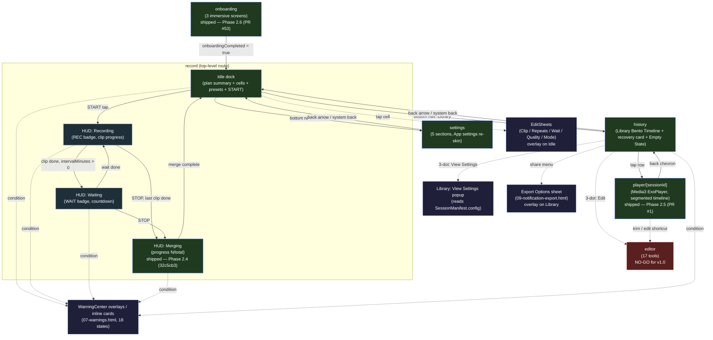

# Rova — UI Navigation Graph (post-redesign)

> **Status:** Phase 2 fully shipped (master `d54e051`). All routes listed as "New in Phase 2" are implemented: `onboarding` (PR #53 `12c12a9`, 3 immersive screens), `player/{sessionId}` (PR #1 `db25405`), and the HUD Merging end-states (Phase 2.4, `32c5cb3`). This document remains authoritative for the nav contract — it now describes the shipped state.
> **Source of truth for the prototype's nav order:** `mockups/new_uiux/10-interactive-prototype.html` (function `goScreen(id)`, screen ids `s-ob`, `s-rec`, `s-hud`, `s-lib`, `s-player`, `s-settings`, `s-editor`).
> **Source of truth for warning surfaces:** `mockups/new_uiux/07-warnings.html` (overlay-only — never owns a route).
> **Source of truth for export options surface:** `mockups/new_uiux/09-notification-export.html` (overlay-only — sheet on `s-lib`).
> **Branch:** `master`.
>
> **Route args amended — ADR-0037 playback identity (2026-07-07, PR #175):** the player route is now `player/{sessionId}?side={side}&secure={secure}&seg={seg}`. The optional args carry the full `PlaybackIdentity` (sessionId, side?, segmentIndex?) minted by the Library — "transported, never reconstructed". `seg` selects a kept-raw segment (MULTI_SEGMENT_KEPT) by index into the full interleaved `manifest.segments`; missing `seg` = merged playback (byte-identical pre-0037 path); a present-but-malformed `seg` parses to `-1` and is rejected fail-closed by the resolver's validity matrix. See `docs/adr/0037-playback-identity-contract.md`.
>
> **Nav model amended — Record-home redesign R1 (2026-05-12, branch `feat/record-home-redesign-r1`):** there is no longer an app-wide persistent `NavigationBar`. The `record` screen is the home and carries its OWN bottom nav (Library / center Start/Stop FAB / Settings). `history` and `settings` are now **drill-down** routes — pushed onto the back stack with `launchSingleTop = true`, each with a back arrow (`navController.popBackStack()`), like `player/{sessionId}` already was. The old `TOP_LEVEL_ROUTES` collapse mechanism is removed. Back-stack: `record` is the post-onboarding start destination; Library/Settings push onto it; system-back from Library/Settings → Record; system-back from Record → exits the app. See `docs/superpowers/specs/2026-05-12-record-home-redesign-r1-design.md` for the full R1 spec.

---

## 1. Scope

This document encodes the future production navigation contract derived from the new mockup direction. It supersedes `UI_ROADMAP.md` Sections 5–6 past Slice 4. Phase 2 of `NEW_UI_BACKEND_REPLAN.md` consumes this contract; phases past Phase 2 must reference back to this doc when proposing nav changes.

Non-goals of this document:
- No screen implementation.
- No deep-link / URI scheme design.
- No animation / transition specification (deferred to Phase 7).
- No `RovaSettings` schema changes.

---

## 2. Top-level route inventory

The Compose Navigation graph stays structurally close to the shipped `MainScreen.kt`: a single `NavHost` with a small set of top-level routes plus state-driven sub-views. Two routes are added; one is a NO-GO; warnings/export/edit-sheets/popups stay as overlays inside their owning route.

| Route id | Prototype screen | Status today | Owning ViewModel | Bottom nav visible? | New in Phase 2? |
|---|---|---|---|---|---|
| `onboarding` | `s-ob` | **shipped (PR #53, 3 immersive screens)** | `OnboardingViewModel` | **No** (full-screen flow) | Yes — Phase 2.6 |
| `record` | `s-rec` (idle) + `s-hud` (active state) | shipped | `RecordViewModel` (Slice 3 hoisted to MainScreen) | **Yes — Record owns its own bottom nav** (Library / Start-Stop FAB / Settings); gated by `sessionLocked` (**R1 redesign** — see note above) | No (re-skin — Record-home redesign R1) |
| `history` | `s-lib` | shipped | `HistoryViewModel` | **No** — drill-down from `record`; back arrow → `record` (**R1 redesign**) | No (re-skin — Phase 2.2, 2.3) |
| `player/{sessionId}` | `s-player` | **shipped (PR #1 `db25405`)** | `PlayerViewModel` | **No** (sub-screen, drill-down) | Yes — Phase 2.5 |
| `settings` | `s-settings` | shipped | `SettingsViewModel` | **No** — drill-down from `record`; back arrow → `record` (**R1 redesign**) | No (re-skin — Phase 2.1) |
| `editor` (`s-editor`) | `s-editor` | does not exist | n/a | n/a | **NO-GO for v1.0** (see §6.2) |

Route id naming follows the existing `record` / `history` / `settings` convention from `MainScreen.kt:184-209` — short, lowercase, slash-segmented for argumented routes. The prototype's `s-` prefix is a static-page convention that does **not** carry into Compose route names.

The HUD (`s-hud` in the prototype) is **not** a separate Compose route. It is a state of the `record` route driven by `RecordViewModel.serviceState.isPeriodicActive` plus `RecordHudState` (Recording / Waiting / Merging — see Phase 2.4 in the replan). This matches the shipped Slice 3 design and avoids back-stack churn during a recording session.

---

## 3. Navigation graph (Mermaid)

Legend:
- **Solid** = first-class navigation edge (`navController.navigate(...)` or top-level back-stack pop).
- **Dotted** = overlay open/close (no back-stack push; `ModalBottomSheet`, `Dialog`, or in-place card render).
- **Dotted to NO-GO node** = aspirational link from the prototype that does **not** ship in v1.0; the originating button is a `TODO` snackbar.

---

## 4. Per-route contract

### 4.1 `onboarding` (NEW)

- **Entry conditions.** First launch with `RovaSettings.onboardingCompleted == false`. Gating lives in `RovaApp` / `MainActivity` so the user never sees `record` until onboarding completes or skips.
- **Internal sub-flow.** Three walkthrough slides → Camera permission (required) → Mic permission (optional, soft-gates `audioMode = VIDEO_ONLY` per ADR 0006 B18) → Notifications permission (recommended) → Exact Alarm permission (required, OS-revocable per ADR 0001).
- **Bottom nav.** Hidden for the entire flow. Hiding requires a MainScreen shell change (see §5.1) — a route composable cannot suppress the bottom-nav by itself under the current single-Scaffold architecture.
- **Back-stack.** Skip button on slides → set `onboardingCompleted = true` → pop the entire onboarding stack and replace with `record`. Back gesture inside the flow walks slides backward; back gesture on slide 1 exits the flow only after a confirmation dialog (avoid accidental abandonment after permissions are granted).
- **Re-entry.** None automatic. If a permission is revoked later, the WarningCenter (see `WarningCenterContract.md`) surfaces a banner inside `record`/`history`; the user re-grants via system settings, not by re-running onboarding.
- **Phase owner.** Phase 2.6.

### 4.2 `record` (shipped — re-skin only)

- **Idle state.** `RecordIdleDock` — read-only plan summary line, four `TappablePlanCell`s in a 2×2 grid (Clip / Repeats / Wait / Quality), presets row, full-width Start button anchored inside dock flow. **Mode cell is NO-GO for v1.0** (orientation backend missing — see §6.4).
- **Active states (`s-hud` in the prototype).** Sub-state machine driven by `RecordViewModel.serviceState` + `RecordHudState`:
  - `Recording` — REC badge, clip progress bar, session timer (64 sp tabular-nums per `Type.kt` `NumericMonoLarge`).
  - `Waiting` — WAIT badge, countdown (32 sp `NumericMonoMedium`).
  - `Merging(progress)` — segment-by-segment progress text + spinner (Phase 2.4 — extends shipped HUD).
  - `Complete` — transient state; re-enters Idle once `RovaController` clears `serviceState.isPeriodicActive`.
- **Bottom nav.** **Record owns its own bottom nav** (Library / center Start-Stop FAB / Settings) per the R1 redesign. **Disabled** while `serviceState.isPeriodicActive` is true (`enabled = !sessionLocked`); the "Locked while recording" hint pill stays. There is no longer an app-wide `NavigationBar` — Library and Settings are drill-down destinations pushed from `record`.
- **Edit sheets.** `EditSheetShell` (Slice 1) opens as a `ModalBottomSheet` from each cell tap. Sheet is an overlay; not pushed onto the back-stack. Back gesture / scrim tap discards.
- **Recovery echo banner.** Already shipped (`RecoveryEchoBanner.kt`). Read-only; tapping the CTA navigates to `history`.
- **Phase owner.** Already shipped (Slice 2 idle + Slice 3 active HUD). Phase 2.4 extends with Merging end-states.

### 4.3 `history` (shipped — Adaptive Bento Timeline, ADR-0030 amendment 2026-07-04, PR #172)

- **List state.** Thumbnail-first Bento Timeline: one vertical scroll of day sections, each a 6-column bento grid of tap-to-play tiles (DualShot = diptych, Portrait left). Selection mode (long-press + top-bar) hosts info/rename/favorite/vault/delete; details replace the old per-card 3-dot menu. Date-scrub rail + ground-wash sticky day headers. NO autoplay.
- **Empty state.** New for Phase 2.3. Replaces the current "no header / empty list" with the mockup's empty state.
- **3-dot menu actions.**
  - `Open` → navigate to `player/{sessionId}` (Phase 2.5).
  - `Edit` → **NO-GO for v1.0** — button shows a `TODO` snackbar ("Editor coming in a future release"). See §6.2.
  - `View Settings` → opens `LibrarySessionConfigDialog` overlay (Phase 2.2). Reads `SessionManifest.config` for that session via existing `HistoryArtifactMapper`. Read-only.
- **Recovery card.** Stays in the existing softened treatment from Slice 4. Phase 4.3 adds the "Merge what was recorded" 3rd action — that change does **not** alter the route, only the card body.
- **Share menu.** Existing `safeShareUri` flow stays. Phase 5 (optional) adds the Export Options sheet as an overlay reachable from the share entry point.
- **Bottom nav.** **Hidden — drill-down** (R1 redesign). `history` is pushed from `record`'s own bottom nav; back arrow / system back pops to `record`. No app-wide `NavigationBar` is shown on this route.
- **Phase owner.** Already shipped (Slice 4). Phase 2.2 + 2.3 extend.

### 4.4 `player/{sessionId}` (NEW)

- **Argument.** `sessionId: String` — the existing manifest id, passed through `navController.navigate("player/$sessionId")`.
- **VM.** `PlayerViewModel(sessionId)` — resolves the merged MP4 path via `HistoryArtifactMapper`, instantiates `androidx.media3.exoplayer.ExoPlayer`, exposes a `StateFlow<PlayerUiState>`.
- **Composable.** `PlayerScreen` mounts `androidx.media3.ui.PlayerView` over the existing merged MP4. Layout per `04-video-player.html`: top-bar with back chevron + mode badge, segmented clip timeline driven by `SessionManifest.segments`, +/- 10 s controls, trim shortcut + edit shortcut.
- **Bottom nav.** Hidden — drill-down sub-screen, not a tab peer (matches the prototype: `04-video-player.html` has its own back chevron, no nav). Hiding requires a MainScreen shell change (see §5.1).
- **Back-stack.** Push from `history`. Back chevron / system back pops to `history`. **Never** push another `player/{...}` on top — `launchSingleTop = true` per the existing `MainScreen.kt:160-161` convention.
- **Trim / Edit shortcuts.** Both are `TODO` snackbars in v1.0 (editor is NO-GO). The buttons stay in the layout so the player visually matches the mockup; they show a snackbar instead of navigating.
- **Phase owner.** Phase 2.5.

### 4.5 `settings` (shipped — re-skin only)

- **Layout.** Five sections per `06-app-settings.html` — Recording behavior, Alerts, Storage, Reliability, About.
- **Bottom nav.** **Hidden — drill-down** (R1 redesign). `settings` is pushed from `record`'s own bottom nav; back arrow / system back pops to `record`. No app-wide `NavigationBar` is shown on this route.
- **Internal navigation.** Battery dialog, folder-name dialog, etc. stay as in-place dialogs / sheets; they are overlays and not pushed onto the back-stack.
- **No drawer.** The `ModalNavigationDrawer` from the legacy Record screen is gone (Slice 5 in the old UI_ROADMAP — not shipped under that numbering, replaced by Phase 2.1).
- **Phase owner.** Phase 2.1.

### 4.6 `editor` (NO-GO)

Not added to the Compose route graph. The `EDITOR` node in §3 exists only to record that the prototype's `goScreen('s-editor')` calls land on a screen that does not ship. See §6.2 for the substantive case.

The Library 3-dot `Edit` and the Player `trim` / `edit` shortcuts surface a `TODO` snackbar instead of navigating. Removing the buttons entirely is **not** an option — the layouts match the mockup and the snackbar is the lowest-cost placeholder.

---

## 5. Back-stack behavior

| Edge | Type | Back-stack effect |
|---|---|---|
| `onboarding` → `record` (complete or skip) | replace | `popUpTo(onboarding) { inclusive = true }` then `navigate(record)` |
| `record` → `history` (bottom nav: Library) | push | `navigate("history") { launchSingleTop = true }` — **R1 redesign**: `history` is now a drill-down, not a tab peer |
| `record` → `settings` (bottom nav: Settings) | push | `navigate("settings") { launchSingleTop = true }` — **R1 redesign**: `settings` is now a drill-down, not a tab peer |
| `history` → `record` (back arrow / system back) | pop | `navController.popBackStack()` |
| `settings` → `record` (back arrow / system back) | pop | `navController.popBackStack()` |
| `history` → `player/{sessionId}` | push | normal `navigate("player/$sessionId")`; back returns to `history` |
| `player/{sessionId}` → `history` (back chevron / system back) | pop | `navController.popBackStack()` |
| `record` → EditSheet (cell tap) | overlay | not pushed; sheet `onDismissRequest` discards |
| `record` → WarningSheet / WarningChip (condition — ADR 0007) | overlay | not pushed |
| `history` → View Settings popup | overlay | not pushed |
| `history` → Export Options sheet (Phase 5) | overlay | not pushed |
| Any route while `sessionLocked` is true | gated | bottom-nav `onClick` no-ops; system back is allowed (lifecycle, not nav) |

System back gesture mapping:
- On `record` (start destination): system back exits the app per Android convention.
- On `history` or `settings` (drill-down — **R1 redesign**): system back pops to `record`.
- On `player/{sessionId}`: system back pops to the originating `history`.
- On `onboarding`: system back walks slides backward; on slide 1, prompt before exit.
- During an active recording session (`sessionLocked`): system back continues to follow the lifecycle convention (exits the app to background; does not interrupt the FGS).

### 5.1 Bottom-nav shell — R1 redesign model (amended 2026-05-12)

**R1 redesign** (`feat/record-home-redesign-r1`) eliminates the app-wide `NavigationBar` and the `TOP_LEVEL_ROUTES` collapse mechanism. The `record` route owns its own bottom nav (Library / center Start-Stop FAB / Settings); `history` and `settings` are drill-down destinations with no `NavigationBar` of their own.

This resolves the pre-R1 shell question (previously Option A vs Option B below) in favor of **Option B** — Record's composable owns the bottom chrome; the outer `MainScreen` `Scaffold` no longer provides a shared `bottomBar` slot for `history`/`settings`. The `bottomBar` slot in `MainScreen`'s outer `Scaffold` is suppressed (or removed) for all routes except `onboarding` and `player/{sessionId}` (which were already hidden); `record`'s Scaffold provides the actual bottom nav.

**Pre-R1 option analysis (archived — kept for context):**

| Option | Sketch | Trade-off |
|---|---|---|
| **A. Conditional bottom-bar inside one Scaffold** | Keep one `MainScreen` `Scaffold`. Read `currentRoute` from `currentBackStackEntryAsState()`. Wrap the `bottomBar = { ... }` in a guard — `if (currentRoute in topLevelRoutes) { … }` | Smallest diff; preserves single-Scaffold. No longer applicable — `history`/`settings` are not top-level peers in R1. |
| **B. Split shell — top-level vs drill-down** | Drop the `bottomBar` from `MainScreen`'s outer `Scaffold`. Record's Scaffold provides its own bottom nav. Drill-down/fullscreen routes own their own `Scaffold` with no `bottomBar`. | Cleaner; each route fully owns its chrome. **This is the R1 model.** |

The `player/{sessionId}` and `onboarding` shell requirement (hide bottom-nav) is unchanged; both are drill-down / fullscreen and own their own `Scaffold` with no `bottomBar`.

These are not Phase 1 design choices — they are non-negotiable until the listed condition is met. Anything in this list must come back as a Phase 1 doc revision before it ships.

### 6.1 Sub-route under `record` for the active HUD

The HUD does **not** become a separate Compose route. Reasons:
1. Back-stack semantics break: pushing `record/hud` and popping on STOP would leave the user one back-press away from "exit app" mid-session, which is the opposite of the safe, locked-while-recording behavior shipped in Slice 3.
2. ViewModel scoping breaks: `RecordViewModel` is hoisted to `MainScreen` per `MainScreen.kt:60`. Splitting `record` into `record/idle` + `record/hud` either duplicates the VM (state divergence) or requires a `ViewModelStoreOwner` override that contradicts the shipped Slice 3 lifecycle.
3. The prototype's `s-rec` and `s-hud` are **rendering states**, not navigation states. The HTML uses `goScreen` because it's a static prototype with no state machine; Compose with a real VM does not need to emulate that.

The HUD will continue to be a state of the `record` route, gated by `RecordViewModel.serviceState.isPeriodicActive` and `RecordHudState`.

### 6.2 In-app `editor` route

NO-GO for v1.0 on codebase scope/risk grounds (also enumerated in `NEW_UI_BACKEND_REPLAN.md` §7 #2). In nav terms this means:
- No `composable("editor")` block added to the `NavHost`.
- No `navController.navigate("editor")` call site anywhere in production code.
- The `Edit` 3-dot menu item on Library and the `trim` / `edit` shortcuts on Player resolve to a `TODO` snackbar.

ROADMAP_v6 has a `## Out of Scope for v1.0` heading whose body is empty in the current file, so the editor cannot be cited as "explicitly named there." The deferral stands on codebase scope evidence (today the project ships only `MediaMuxer`-concat in `utils/VideoMerger.kt`; frame-accurate cuts, OpenGL filter pipelines, audio mixing, and overlay rendering for the 17 tools are a multi-month module larger than the current `service/` + `data/` source trees combined).

### 6.3 Standalone warning route (`s-warn`)

NO-GO. WarningCenter does **not** own a route. Reasons:
1. The prototype confirms: it never adds `s-warn` to `goScreen`. Warnings live on the screens that own the underlying signal — Record, History, in-place — never as a destination the user walks to.
2. A standalone warning hub fragments the model: a warning shown on Record while recording is intentionally **in-place** (as a `WarningSheet` / `WarningChip` per **ADR 0007** — Record-home redesign R1) so the user never has to leave the screen to acknowledge it. Pushing them to a hub defeats that.
3. WarningCenter is a **VM aggregator** (`WarningCenterViewModel` per Phase 4.1) consumed by the same screens that already exist; not a route.

If a future "see all current warnings" surface is required, it lives as a sheet (overlay) on `settings`, not as its own route.

### 6.4 `Mode` (Portrait / Landscape / P+L) cell on Record idle

NO-GO for v1.0 on backend grounds (see `NEW_UI_BACKEND_REPLAN.md` §3.5):
- `SessionConfig` has no `orientationMode` field.
- `SessionManifest` schema bump from v3 → v4 is required.
- `RovaRecordingService` does not pin `targetRotation` per segment.
- P+L specifically is hardware-gated (CameraX 1.x / 1.4 concurrent-camera limits) and cannot be implemented for the v1.0 minimum-supported device fleet.

In nav terms: the Mode cell is **not rendered** in the Phase 2.1 idle dock re-skin, even though the mockup shows it. Phase 6 (conditional) revisits Portrait / Landscape; P+L stays NO-GO.

### 6.5 Sub-minute wait chips

NO-GO. UI_ROADMAP §8 holds. Wait chips remain `None · 1m · 5m · 10m · 30m · 1h`. No `10s` / `30s` chips.

### 6.6 Removing bottom navigation from `record` / `history` / `settings`

NO-GO. UI_ROADMAP §8 holds. Bottom nav is preserved on top-level tabs; it is hidden only on drill-down sub-screens (`onboarding`, `player`).

### 6.7 Pushing routes onto the back-stack via deep links

Not in scope. v1.0 has no deep-link contract. Adding one is a separate ADR.

---

## 7. Existing-vs-new route summary

| Today (`MainScreen.kt`) | After Phase 2 | Delta |
|---|---|---|
| `record` | `record` | re-skin only (Phase 2.1, 2.4) |
| `history` | `history` | re-skin (Phase 2.2, 2.3); `LibrarySessionConfigDialog` added as overlay |
| `settings` | `settings` | re-skin (Phase 2.1) |
| n/a | `onboarding` | **Shipped** (Phase 2.6, PR #53); gates first launch |
| n/a | `player/{sessionId}` | **Shipped** (Phase 2.5, PR #1 `db25405`); drill-down from `history` |
| n/a | `editor` | **NO-GO for v1.0** — never added |

Net new routes in production: **2** (`onboarding`, `player/{sessionId}`).
Net new overlays in production: **3** (`LibrarySessionConfigDialog`, `ExportOptionsSheet` if Phase 5 lands, plus the WarningCenter banners — which are composables, not navigation entries).

---

## 8. Open questions

These are not blockers for Phase 1 but should be resolved before the corresponding Phase 2 slice opens:

1. **Onboarding `Skip` semantics.** Does `Skip` write `onboardingCompleted = true` (the prototype's behavior — `goScreen('s-rec')` after a skip), or does it leave the flag false so the user is re-prompted on next launch? Recommendation: write `true` (matches the prototype) and rely on the WarningCenter to surface any still-missing permissions once the user reaches `record`. Decide before Phase 2.6.
2. **`player/{sessionId}` session-id encoding.** Today `SessionManifest` ids are filesystem-safe. Confirm before Phase 2.5 that no escaping is needed in the route arg. If the id format ever changes, encode at the call site, not in the route definition.
3. **Player rotation behavior.** When the user rotates the device on `player/{sessionId}`, does the player switch to landscape full-bleed (Media3 default) or stay portrait? The mockup shows both phones; the contract is unspecified. Recommendation: defer to Media3 default (full-bleed landscape) and revisit if a user complaint surfaces.
4. **Export Options sheet entry point.** `09-notification-export.html` shows it but the prototype does not include `s-export`. Recommend wiring it from the share menu on `history` (Phase 5). Confirm before Phase 5 opens.
5. **Recovery card "Merge what was recorded" routing.** Phase 4.3 adds the third action; the action is **not** a navigation — it kicks off `RovaController.recoverAndMerge(sessionId)` and updates the card in-place. Confirm in the Phase 4.3 review-gate that no new route is needed.

---

## 9. References

- Prototype: `mockups/new_uiux/10-interactive-prototype.html` (`goScreen`, `goBack`, `obNext`, `openSheet`, `closeSheet`, `openCtxMenu`, `closeCtxMenu`, `openDelConfirm`, `closeDelConfirm`, `doDelete`).
- Static screens: `01-record-home.html`, `02-settings-sheet.html`, `03-history-library.html`, `04-video-player.html`, `06-app-settings.html`, `08-onboarding.html`. Editor (`05-video-editor.html`), warnings (`07-warnings.html`), notification/export (`09-notification-export.html`) are documented but not navigable from the prototype.
- Production navigation today: `app/src/main/java/com/aritr/rova/ui/MainScreen.kt:50-211`.
- Replan source: `NEW_UI_BACKEND_REPLAN.md` §2 (UI Inventory), §5 Phase 1.A, §7 (NO-GO List), Appendix A.1.
- Upstream design context: `mockups/new_uiux/PROJECT_CONTEXT.md` §"Navigation Structure (App)".

---

*End of document. Phase 2 is fully shipped (master `d54e051`). This document describes the shipped nav contract.*
