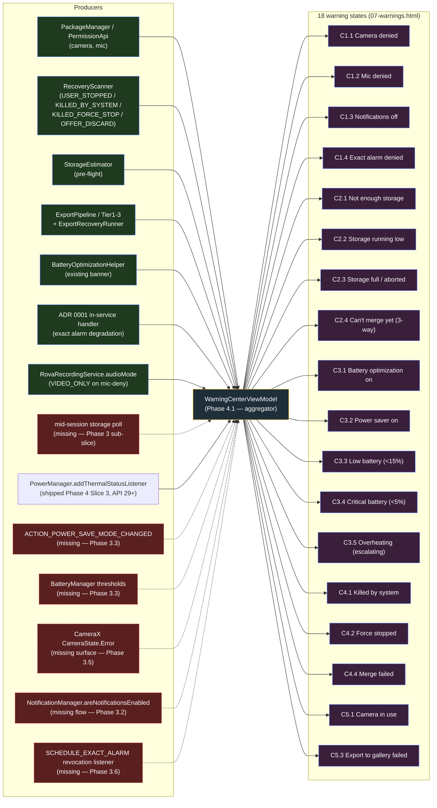

# Rova — WarningCenter Contract

> **Status:** Phase 1.D authored. Planning artifact. No production code modified by this doc.
> **Source of truth for warning layouts and severities:** `mockups/new_uiux/07-warnings.html` (4 severity classes — `sev-r`, `sev-y`, `sev-b`, `sev-o` — applied across 18 distinct states grouped into 5 categories).
> **Source of truth for backend signal availability:** `NEW_UI_BACKEND_REPLAN.md` §3.3, §3.6 + Appendix A.3.
> **Phase 4 is not yet started.** Phase 2 + Phase 3 land first; this contract is what Phase 4 implements against.

---

## Revision — Phase 1.D (2026-05-11, amended 2026-05-13 R2): precedence model superseded

The precedence model below (the per-category urgency ordering in §3 and §6.1) is **superseded** by the flat "Banner precedence" table owner-signed in `NEW_UI_BACKEND_REPLAN.md` (the "Phase 4" section) and shipped as the `WarningId` enum's declaration order. Treat this revision as authoritative for ordering; the rest of this contract (categories, the 18 warning states, the NO-GO list, acceptance tests) still stands.

**The 17 rows, in precedence order (highest first) — `WarningId` value · tier · summary:**

1. `CAMERA_PERMISSION_DENIED` · HARD_BLOCK · CAMERA not granted — recording can't run. **Gates Start.**
2. `EXACT_ALARM_DENIED` · HARD_BLOCK · exact alarms not allowed — loop falls back to inexact and drifts. Flat banner, **does NOT gate Start.**
3. `STORAGE_INSUFFICIENT` · HARD_BLOCK · estimated peak bytes for the current clip settings exceed free space (mirrors the service's start-time preflight). **Gates Start.**
4. `THERMAL_SHUTDOWN` · CRITICAL · thermal status SHUTDOWN.
5. `THERMAL_EMERGENCY` · CRITICAL · thermal status EMERGENCY.
6. `THERMAL_CRITICAL` · CRITICAL · thermal status CRITICAL.
7. `BATTERY_CRITICAL` · CRITICAL · battery < 5% and not charging (known percent only).
8. `CAMERA_IN_USE` · CRITICAL · another app holds the camera / concurrent-camera limit.
9. `CAMERA_DISABLED` · CRITICAL · camera disabled by device policy / DnD.
10. `BATTERY_LOW` · ADVISORY · battery < 15% and not charging (known percent only).
11. `STORAGE_LOW_MID_REC` · ADVISORY · false | Mid-rec only; top-banner surface. Polls StatFs vs. 3 × bytes-per-clip while host is in active HUD state (R2 — ADR 0007 amendment 2026-05-13).
12. `THERMAL_SEVERE` · ADVISORY · thermal status SEVERE.
13. `MICROPHONE_DENIED` · ADVISORY · RECORD_AUDIO not granted — clips are video-only.
14. `BATTERY_OPTIMIZATION_ON` · ADVISORY · app not exempt from battery optimization.
15. `POWER_SAVE_MODE` · ADVISORY · power-save mode on.
16. `THERMAL_MODERATE` · ADVISORY · thermal status MODERATE.
17. `NOTIFICATIONS_DENIED` · ADVISORY · POST_NOTIFICATIONS not granted.

**Outcome notes:** the camera-state signal's `OTHER_ERROR` routes to the Library recovery card (not a Record banner); its `UNKNOWN` (no session) raises nothing. Battery rows fire only when the percent is known, below threshold, and not charging.

**Resolved divergences from the original contract** (owner-signed, Phases 4.1 / 4.1b):
- Precedence is one flat interleaved order, not category urgency.
- The only hard-block warnings that *gate Start* (disable the Record Start button) are `CAMERA_PERMISSION_DENIED` and `STORAGE_INSUFFICIENT` — not every `HARD_BLOCK`-tier row. `EXACT_ALARM_DENIED` is a flat non-gating banner.
- The Start-gate UX is "inline banner + disabled Start button", not a `FullCardOverlay` (NO-GO #3 — no `Modifier.blur` — still stands). **Superseded by ADR 0007** — the Record-screen presentation is the `WarningSheet` / `WarningChip` model (a per-tier modal sheet that collapses to a chip on dismiss), not an inline `Surface` strip. The precedence model described elsewhere in this contract is otherwise unchanged.
- `WarningCenterViewModel`'s output is `StateFlow<WarningId?>` (not `StateFlow<WarningCenterUiState>`).
- A resolution error logs and degrades to `null` (NO-GO #6).

**Snooze / hysteresis (§5): deferred.** The per-warning in-memory 24 h snooze (ADVISORY-tier only, not persisted across process death) and the thermal/storage hysteresis described in §5 are **not built in Phase 4.1 or 4.1b** — they are Phase 4.1c.

**Signal producers (§7):** the camera-permission producer is `CameraPermissionSignal`; the storage producer is `StorageSignal` (mirrors `RovaRecordingService`'s preflight); the microphone producer is `MicrophonePermissionSignal` — all `RovaApp` lazy props added in Phase 4.1b. The battery-optimization producer is `BatteryOptimizationSignal` (Phase 4.1) — the old `BatteryOptimizationBanner.kt` was removed in PR #12.
- **`StorageLowMidRecSignal`** (R2, 2026-05-13) — UI-side leaf signal. Polled by RecordScreen every ~30 s while HUD state ∈ {Recording, Waiting, Merging}. Fires when `freeBytes < 3 × bytesPerSecondForResolution(resolution) × durationSeconds`. Cleared on Idle transitions. No service or data-layer involvement.

---

## 1. Scope

This document defines the warning model that `WarningCenter` (Phase 4) will aggregate and present. It enumerates every warning state shown in `07-warnings.html`, classifies each by category and severity, identifies its producer (existing or missing), specifies its surface placement and persistence rules, and maps the missing producers to the Phase 3 slice that will land them.

The model has three independent axes — **severity**, **persistence**, and **dismissibility**. These are intentionally orthogonal: a `sev-r` (red) hard-block warning may be non-dismissible (camera denied), while a `sev-r` recovery card may be one-tap-discardable. Conflating "severity = red ⇒ sticky" would force wrong UX.

Non-goals:
- No code in this phase. Phase 4.1 implements `WarningCenterViewModel`; Phase 4.2 implements the routing; this doc is their contract.
- No new `SessionManifest` schema fields (per Phase 4 NO-GO in `NEW_UI_BACKEND_REPLAN.md` §5).
- No 19th warning state. `WarningCenter`'s VM is sized to the 18 enumerated below; growing the model mid-implementation invalidates Phase 1.D — additions come back as a Phase 1.D revision.

---

## 2. Categories

Five categories, derived from `07-warnings.html`:

| # | Category | What's in it | Owning screens | Routing rule (high-level) |
|---|---|---|---|---|
| C1 | **Permissions** | Camera, Mic, Notifications, Exact Alarm | Onboarding (gate) + Record (post-launch) + WarningCenter banner | Pre-launch on `record`; full-screen on `onboarding` if relevant |
| C2 | **Storage** | Not enough, low banner, full / aborted, can't-merge 3-way | Record (pre-flight) + Record HUD (mid-session) + History (recovery card) | Pre-flight blocks Start; mid-session is a non-blocking banner; abort writes a recovery card |
| C3 | **Battery & Thermal** | Battery optimization, power saver, low, critical, overheating | Record (pre-flight + during) + WarningCenter banner | Banners only — never gate Start unless explicitly hard-block (none in this category) |
| C4 | **Recovery** | Killed by system, Force stopped, Stopped before merge, Merge failed | History (cards) + Record (echo banner) | Already shipped surfaces; Phase 4 only re-skins under the WarningCenter umbrella |
| C5 | **Hardware** | Camera in use, SD ejected, Export-to-gallery failed | Record (pre-flight + during) + History (export-failed inline card) | Pre-flight blocks Start; mid-session aborts and writes a recovery state; export failure is a History inline card |

---

## 3. Severity model

> **Superseded by the Phase 1.D revision at the top of this document — ordering is now the flat 17-row table (amended 2026-05-13, R2).** The severity-token mapping (`sev-r/y/b/o`) below still stands.

The mockup's `sev-r` / `sev-y` / `sev-b` / `sev-o` classes map directly to the four `RovaWarnings.*` tokens defined in `UI_DESIGN_TOKENS.md` §2.10:

| Severity token | Mockup class | Hex | Semantic | Typical persistence | Typical dismissibility |
|---|---|---|---|---|---|
| `Hard` | `sev-r` | `#ef4444` | Hard block — recording cannot start or must abort; or final-step error | Until the underlying condition is resolved (permission granted, storage freed, etc.) | **Non-dismissible** for hard blocks; **dismissible** for recovery cards in the same color |
| `Soft` | `sev-y` | `#fbbf24` | Soft warning, caution, non-blocking banner | Lifetime of the session or until snoozed (24 h cooldown for advisory) | **Dismissible** with snooze |
| `Advisory` | `sev-b` | `#5b7fff` | Informational nudge (e.g. "Stay in the Loop" — notifications off) | Until permission state changes or user dismisses (24 h snooze) | **Dismissible** with snooze |
| `Escalating` | `sev-o` | `#f97316` | Multi-step state machine (thermal: warm → hot → severe → emergency) or 3-way choice | Until the underlying signal de-escalates (or user picks one of three options) | **State-driven** — clears on de-escalation; user choice in 3-way commits a path |

**Severity ≠ priority order.** When two warnings are active simultaneously, the WarningCenter sorts by **category urgency** (Permissions > Storage > Hardware > Battery/Thermal > Recovery), not by severity color. Camera denied (Hard) outranks Critical Battery (Hard) because Camera blocks the loop entirely while Critical Battery only nudges the user.

---

## 4. The 18 warning states

Each row maps the mockup's title to a category, severity, surface, persistence, dismissibility, and the backend signal that produces it. "Producer status" is `shipped`, `partial` (signal exists, surface missing), or `missing` (backend signal is itself absent — Phase 3 owns it).

### 4.1 C1 — Permissions (4 states)

| State | Mockup title (`07-warnings.html`) | Severity | Producer status | Producer source | Surface | Persistence | Dismissibility | Phase 3 owner |
|---|---|---|---|---|---|---|---|---|
| C1.1 Camera denied | "Camera Access Required" | `Hard` | shipped | Permission API + ADR 0006 INIT_FAILED path on bind failure | Pre-launch screen on `record` (full-card overlay) — blocks Start. Re-prompt CTA opens system app settings | until granted | **non-dismissible** — Start stays disabled | n/a |
| C1.2 Mic denied | "No Microphone Access" | `Soft` | shipped | Permission API; service falls back to `audioMode = VIDEO_ONLY` per ADR 0006 B18 | Pre-launch banner on `record` — does **not** block Start. Recording proceeds video-only; banner explains the consequence | until granted or 24 h snooze | dismissible | n/a |
| C1.3 Notifications off | "Stay in the Loop" | `Advisory` | partial | `notificationManager.areNotificationsEnabled()` is callable today; no flow surface | Banner on `record` — non-blocking. Recording proceeds; banner notes "you may not see what's happening if Rova works in the background" | until granted or 24 h snooze | dismissible | **Phase 3.2** — `NotificationPermissionSignal` |
| C1.4 Exact alarm denied | "Alarm Permission Required" | `Hard` | partial | `SCHEDULE_EXACT_ALARM` per ADR 0001 — degradation handler exists; no UI surface | Pre-launch screen on `record` — blocks Start. Re-prompt CTA opens system "Alarms & reminders" page | until granted | **non-dismissible** for Start; banner persists if revoked mid-session (ADR 0001 §3 says the service degrades but keeps running — banner reflects that) | **Phase 3.6** — `ACTION_SCHEDULE_EXACT_ALARM_PERMISSION_STATE_CHANGED` listener |

### 4.2 C2 — Storage (4 states)

| State | Mockup title | Severity | Producer status | Producer source | Surface | Persistence | Dismissibility | Phase 3 owner |
|---|---|---|---|---|---|---|---|---|
| C2.1 Not enough storage (pre-flight) | "Not Enough Storage" | `Hard` | shipped | `StorageEstimator.kt` pre-flight check | Pre-launch screen on `record` — blocks Start. CTA: "Free up space" → opens device storage settings | until pre-flight estimate clears | **non-dismissible** while estimate fails | n/a |
| C2.2 Storage running low (mid-session banner) | "Storage Running Low" | `Soft` | **missing** | mid-session storage poll does not exist today | Inline banner on `record` HUD — non-blocking. Recording continues; banner appears when free space drops below threshold | until session ends or threshold clears | dismissible | **Phase 3 sub-slice** (new — mid-session storage poll) |
| C2.3 Storage full / aborted | "Recording Stopped" (storage-full variant) | `Hard` (recovery card) / `Advisory` (echo) | shipped | `StopReason.LOW_STORAGE` per ADR 0006 row 9 — service writes terminal manifest with reason | Recovery card on `history` (matches Killed-by-system layout but with storage-full body); read-only echo on `record` via `WarningId.STORAGE_FULL_AUTOSTOPPED` (ADR-0015, Phase 4 Slice 2) | card until user discards; echo until "Don't show again" tap (per-session-id persistent dismiss) | dismissible (both) | n/a |
| C2.4 Can't merge yet (3-way) | "Can't Merge Yet" | `Escalating` (3-way choice) | **shipped Phase 4.3 (ADR-0017)** | `RovaRecordingService.startRecoveryMerge(context, sessionId)` → `ExportPipeline.exportRecovered(...)` runs eager pre-flight; on `ExportResult.InsufficientStorage`, `RecoveryMerger` emits `RecoveryMergeOutcomeSignal.RecoveryMergeOutcome.InsufficientStorage` carrying `(requiredBytes, availableBytes)`. `WarningCenterViewModel` lifts the signal into `WarningId.CANT_MERGE` and exposes `pendingCantMergeSessionId`. Sheet auto-presents on next Idle. | `WarningSheetV3` (ADVISORY severity) with tertiary destructive-link CTA. Three CTAs: `STORAGE_SETTINGS` (intent), `KEEP_SEGMENTS_ONLY` (VM-only), `DISCARD_RECOVERY_SESSION` (VM-only) | until user picks one | dismissible only after a choice; clears on action | Phase 4.3 (ADR-0017) |

### 4.3 C3 — Battery & Thermal (5 states)

| State | Mockup title | Severity | Producer status | Producer source | Surface | Persistence | Dismissibility | Phase 3 owner |
|---|---|---|---|---|---|---|---|---|
| C3.1 Battery optimization on | "Battery Optimization On" | `Soft` | shipped | `BatteryOptimizationHelper.buildRequestIntent` + `BatteryOptimizationSignal` (Phase 4.1; the standalone `BatteryOptimizationBanner.kt` was removed in PR #12) | **ADR 0007 supersedes the Record-screen surface** — rendered as `WarningSheet`/`WarningChip` (per-tier modal sheet, not an inline banner) per the Record-home redesign R1. Settings → Reliability section presentation is unchanged. CTA: "Disable" opens system settings | until user disables battery optimization or 24 h snooze | dismissible (snooze) | n/a — Phase 4 only re-homes under WarningCenter |
| C3.2 Power saver on | "Power Saving Mode Is On" | `Soft` | **missing** | `ACTION_POWER_SAVE_MODE_CHANGED` BroadcastReceiver does not exist | Banner on `record` (pre-flight + mid-session). CTA: "Open battery settings" | until power saver disabled or 24 h snooze | dismissible (snooze) | **Phase 3.3** — `PowerSignal` |
| C3.3 Low battery (<15%) | "Battery at 12%" | `Soft` | **missing** | BatteryManager polling at session start + threshold not in code | Banner on `record` (pre-flight) — non-blocking. CTA: "Plug in to keep recording" | until battery > 15% or charging | dismissible (snooze ends if level keeps dropping) | **Phase 3.3** — `PowerSignal` |
| C3.4 Critical battery (<5%) | "Critical Battery — 4%" | `Hard` | **missing** | BatteryManager polling — no thresholds | Pre-launch screen on `record` — blocks Start. Mid-session: forced stop with terminal `StopReason.LOW_BATTERY` (new reason needed — see §7 open question) | until charging | **non-dismissible** for Start; mid-session emits a terminal recovery card | **Phase 3.3** — `PowerSignal` |
| C3.5 Overheating (escalating) | "Device Getting Hot" | `Escalating` | **shipped Phase 4 Slice 3 (ADR-0016)** | `PowerManager.getThermalStatus()` + `addThermalStatusListener` (API 29+) | Banner on `record` (mid-session). State machine: warm → hot → severe → emergency. **Auto-stop fires at CRITICAL (revised from SEVERE — see ADR-0016)** with reason `THERMAL`. Echo banner `THERMAL_AUTOSTOPPED` surfaces on next Idle with "Tips to cool down" CTA. | state-driven on push-listener emissions; persistent banner at SEVERE with manual-Stop affordance | **state-driven** — auto-clears on de-escalation | **Phase 4 Slice 3** — `ThermalStatusSignal.start()` push listener + `SegmentGateThermal` Layer-4 gate |

### 4.4 C4 — Recovery (3 states)

These are the existing recovery cards from Slice 4. Phase 4 does not move them; it only normalizes them under the WarningCenter umbrella so they share the same dismissibility / persistence semantics as the rest.

| State | Mockup title | Severity | Producer status | Producer source | Surface | Persistence | Dismissibility | Phase 3 owner |
|---|---|---|---|---|---|---|---|---|
| C4.1 Killed by system | "Session interrupted" | `Hard` (recovery card) | shipped | `RecoveryScanner` writes `Terminated.KILLED_BY_SYSTEM`; vendor-help intents in `VendorGuidanceIntents` | Recovery card on `history` + read-only echo banner on `record` | until user discards | dismissible | n/a |
| C4.2 Force stopped | "Session ended early" | `Soft` (recovery card) | shipped | `RecoveryScanner` writes `Terminated.KILLED_FORCE_STOP` | Recovery card on `history` + read-only echo on `record` | until user discards | dismissible | n/a |
| C4.4 Merge failed | "Couldn't create final video" | `Hard` (error card) | **shipped Phase 4.3 (ADR-0017)** | `RecoveryMergeOutcomeSignal.RecoveryMergeOutcome.MuxFailed` — underlying signal for the merge-failed variant. Implemented via transient `RecoveryCardState.mergeFailedReason: String?` field; no new `RecoveryCardKind` or `MERGE_FAILED` manifest enum value added (ADR 0006 §3.3 / NO-GO #5 preserved). | Recovery card on `history` (no `MERGE_FAILED` enum value — ADR 0006 §3.3 confirms no manifest schema change needed) | until user discards | dismissible | Phase 4.3 (ADR-0017) |

> Note: row id `C4.3` is intentionally vacant. The mockup's "Stop Recording?" 3-way confirmation (mockup state #16) is **not** modeled as a WarningCenter state — see §4.6.

### 4.5 C5 — Hardware (2 states)

| State | Mockup title | Severity | Producer status | Producer source | Surface | Persistence | Dismissibility | Phase 3 owner |
|---|---|---|---|---|---|---|---|---|
| C5.1 Camera in use by another app | "Camera is in Use" | `Hard` | **missing** | CameraX `CameraState.Error` flow not exposed; today camera-bind failure is `INIT_FAILED` per ADR 0006 row 7 — disambiguating "in use" from "init failure" requires `CameraAccessException.CAMERA_IN_USE` | Pre-launch screen on `record` — blocks Start. CTA: "Close other camera apps" + "Try again" | until camera bind succeeds | **non-dismissible** for Start | **Phase 3.5** — `CameraStateSignal` |
| C5.3 Export to gallery failed | (mockup: non-blocking inline card) | `Soft` | partial | Phase 1.7 export pipeline surfaces failures; UI mapper missing | Inline card on `history` row for the affected session | until user dismisses or successful re-export | dismissible | n/a — Phase 4 owns the UI mapper only |

> Note: row id `C5.2` is intentionally vacant. The mockup's "SD Card Removed" (mockup state #18b) is **not** modeled as a WarningCenter state in v1.0 — see §4.6.

### 4.6 Outside the WarningCenter VM (intentionally non-state)

`07-warnings.html` numbers warning groups 1–18 (group 18 splits into 18a/18b/18c for hardware variants). The WarningCenter contract enumerates **18 logical states across 5 categories** — 4 (C1) + 4 (C2) + 5 (C3) + 3 (C4) + 2 (C5) — by demoting two mockup entries that are not "observed signals the aggregator owns." Both stay in the design system; neither flows through `WarningCenterViewModel`.

| Demoted entry | Mockup state # | Why it is not a WarningCenter state | Where it lives instead |
|---|---|---|---|
| **"Stop Recording?" 3-way confirmation** (the candidate row that would have been C4.3) | #16 | One-shot user interaction triggered by a Stop tap, not a state observed from a signal source. There is no flow to subscribe to — the dialog opens because the user pressed STOP, and closes when the user picks Discard / Save / Continue. The aggregator pattern (`StateFlow<WarningCenterUiState>`) does not fit. | Owned by `RecordViewModel` as a one-shot UI event in Phase 4.3, alongside the `recoverAndMerge` entry. The dialog body re-uses the same M3 `AlertDialog` styling as other Phase 2 destructive confirmations. |
| **"SD Card Removed" mid-session** (the candidate row that would have been C5.2) | #18b | Scope is unclear: default install lives in private app dir on internal storage, and `installLocation = auto` move-to-SD is a niche case (see §10.2 open question and `NEW_UI_BACKEND_REPLAN.md` §3.3). Adding a producer for a state that may never fire on the v1.0 device fleet is bloat. | Deferred entirely. If telemetry post-v1.0 shows non-trivial users on SD, a Phase 1.D revision adds the row back as `C5.2` and a Phase 3 sub-slice ships the producer. |

The demotion keeps the mockup count consistent (18 numbered groups → 18 logical WarningCenter states) without forcing the aggregator to model an interaction (#16) or a potentially-dead state (#18b).

---

## 5. Persistence rules — formal model

> **Snooze + hysteresis: deferred to Phase 4.1c — not in 4.1 or 4.1b.**

Each warning has a **lifetime** governed by three axes:

```
Lifetime = (Surface, Trigger, Termination)

Surface       ∈ { Banner, FullCardOverlay, RecoveryCard, ConfirmDialog, InlineRow }
Trigger       ∈ { PreLaunch, MidSession, OnLaunch (recovery scan), OnExportFinish }
Termination   ∈ { ConditionResolved, UserDismissed, Snooze24h, ChoiceCommitted, AutoOnDeescalate }
```

| Surface | Renders inside | Blocks Start? | Survives process restart? |
|---|---|---|---|
| `Banner` | record / history / settings (top of content) | No | No (re-evaluated on relaunch from current signal state) |
| `FullCardOverlay` | record (full-screen modal pre-launch) | Yes | No |
| `RecoveryCard` | history list (top of grid) | No (recording can resume; the card is the artifact of a previous session) | Yes — written in manifest |
| `ConfirmDialog` | record HUD | No (transient) | No |
| `InlineRow` | history list (per-row decoration) | No | Yes — manifest carries the failure state |

**Snooze contract.** *Superseded by ADR-0014 (Phase 4.1c, 2026-05-24).* "Don't
show again" snoozes are now persisted across cold start, system reclaim,
force-stop, device reboot, and in-place APK update. They reset on uninstall
+ reinstall (the backing file `rova_runtime_prefs.xml` is `<exclude>`d from
Android Auto Backup) and on explicit reset via Settings → "Reset snoozed
warnings". The original "in-memory only" intent stated here was the Phase
4.1 / 4.1b shipping decision; the Phase 4.1c implementation durably honors
the user's choice. The 24-h TTL clause is also rescinded: snoozes are
forever until reset.

**Hysteresis on Escalating.** Thermal status uses a two-level hysteresis to prevent flapping: enter banner at `MODERATE`, leave banner only when status is `LIGHT` or below. Same rule applies to "Storage running low" → "Storage full" transitions (different threshold each direction).

---

## 6. Routing (per-screen)

For each screen, the ordered set of warnings it can render. The order is fixed: when multiple are active the higher-priority warning displaces the lower (no stacking — one banner at a time per screen, except the recovery card list which can show multiple cards stacked).

### 6.1 `record` (Idle)

> **Ordering superseded — see the Phase 1.D revision.**

Pre-launch sequence (top-to-bottom on first violation):
1. C1.1 Camera denied → full-card overlay, Start disabled.
2. C1.4 Exact alarm denied → full-card overlay, Start disabled.
3. C2.1 Not enough storage → full-card overlay, Start disabled.
4. C5.1 Camera in use → full-card overlay, Start disabled.
5. C3.4 Critical battery → full-card overlay, Start disabled.

If any of 1–5 is active, lower-severity banners are **suppressed** (no point reminding the user about Soft warnings while a Hard block is active).

If 1–5 all clear, banner stack (one at a time, top of dock):
- C2.2 Storage running low (rare for pre-flight; usually mid-session)
- C3.3 Low battery
- C3.1 Battery optimization on
- C3.2 Power saver on
- C1.2 Mic denied (advisory only — does not block)
- C1.3 Notifications off (advisory)
- Recovery echo (read-only — already shipped)

### 6.2 `record` (HUD active — Recording / Waiting / Merging)

Mid-session warnings (banner above HUD, never replacing the HUD):
- C2.2 Storage running low — non-blocking, dismissible
- C3.5 Overheating (escalating) — auto-stops at `severe`+
- C3.2 Power saver on — non-blocking, snooze-able

If any of these escalates to a Hard severity (storage drops past full → C2.3, thermal hits emergency → forced stop), the service writes a terminal manifest and the WarningCenter on next launch shows the corresponding recovery card on `history`.

`record` never shows a `FullCardOverlay` while `serviceState.isPeriodicActive` is true — that would obscure the camera preview during a session.

### 6.3 `history`

Recovery cards (stacked, top of grid):
- C4.1 Killed by system
- C4.2 Force stopped
- C4.4 Merge failed
- C2.3 Storage full / aborted
- C2.4 Can't merge yet (3-way)

Inline-row decorations (per affected session):
- C5.3 Export to gallery failed

> Mockup states #16 ("Stop Recording?" confirmation) and #18b ("SD Card Removed") are intentionally absent — see §4.6.

### 6.4 `settings`

Section anchor — Reliability:
- C3.1 Battery optimization on (existing — re-homed under WarningCenter)
- C1.4 Exact alarm denied (link to system settings)

### 6.5 `onboarding`

Permission-step warnings inline:
- C1.1 Camera denied — re-prompt
- C1.2 Mic denied — soft skip
- C1.3 Notifications off — soft skip
- C1.4 Exact alarm denied — re-prompt

---

## 7. Signal ownership graph (Mermaid)

> Phase 4.1b: camera-permission → `CameraPermissionSignal`; storage → `StorageSignal`; microphone → `MicrophonePermissionSignal`; battery-optimization → `BatteryOptimizationSignal` (`BatteryOptimizationBanner.kt` removed in PR #12).

Solid arrows = signal already in code. Dashed arrows = producer missing (Phase 3 owns).



Mockup states #16 ("Stop Recording?" confirmation) and #18b ("SD Card Removed") are intentionally absent from this graph — see §4.6.

The aggregator is **one** ViewModel exposing a single `StateFlow<WarningCenterUiState>` consumed by every screen that renders banners. It does **not** own the underlying signals; it observes them. This keeps the model testable: each Phase 3 producer has its own unit test against fakes, and the aggregator is tested in isolation against its inputs.

---

## 8. NO-GO conditions (Phase-wide)

These are the non-negotiables for the WarningCenter contract. Anything in this list must come back as a Phase 1.D revision before it ships.

1. **No 19th warning state.** The model is sized to 18. New warnings come back as a Phase 1.D revision and update §4 accordingly.
2. **No banner that gates Start without being a `Hard` severity full-card overlay.** Banners advise; full-cards block. The two are not interchangeable.
3. **No `Modifier.blur` for the banner background.** Tonal elevation + alpha per `UI_DESIGN_TOKENS.md` §2.5. Pre-API-31 fallback is mandatory; no inconsistency permitted.
4. **No new `SessionManifest` field for warning state.** The model derives every state from existing manifest fields + live signals. If a state truly cannot be derived, that's an ADR question, not a Phase 4 patch.
5. **No new `Terminated` enum value** for warning categories that overlap an existing terminal (e.g. `MERGE_FAILED` is **not** added — C4.4 derives from `(USER_STOPPED + exportState = FAILED)` per ADR 0006 §B9).
6. **No warning that recurses onto the WarningCenter itself.** A failure to render a banner cannot itself become a banner state. Errors in `WarningCenterViewModel` log silently and degrade to an empty state.
7. **No backend slice landing without a paired Phase 4 mapping update.** When Phase 3.X ships a producer, the corresponding row in §4 above must show `shipped`; if it doesn't, the slice is not done.
8. **No splitting the WarningCenter into per-category VMs.** One aggregator. Multiple VMs invite contradictory state (battery banner says "low", thermal banner says "critical" — which one wins?). The aggregator owns the priority resolution.
9. **No "all current warnings" hub screen.** Per `UI_NAV_GRAPH.md` §6.3 — WarningCenter has no route. Banners live where the signal lives.
10. **No mid-session full-card overlay on `record`.** During a session, the camera is sacred; banners only. Hard-severity escalations (thermal emergency, storage full) must auto-stop the service, not paint a card over the preview.

---

## 9. Acceptance test plan (for Phase 4)

When Phase 4 lands, every row in §4 above is provoked at least once on a real device. The smoke checklist:

| Provoke | Expected banner / card | Where it should appear |
|---|---|---|
| Revoke camera permission | C1.1 Camera denied | full-card overlay on `record` |
| Revoke mic permission | C1.2 Mic denied | banner on `record` (Start still enabled, recording is video-only) |
| Disable notifications via system settings | C1.3 Stay in the Loop | banner on `record` |
| Revoke `SCHEDULE_EXACT_ALARM` via Settings → Alarms & reminders | C1.4 Alarm permission required | full-card overlay on `record` |
| Fill device storage below threshold | C2.1 Not enough storage | full-card overlay on `record` |
| Drop free space mid-session | C2.2 Storage running low | banner on `record` HUD |
| Drop further to threshold | service auto-stops with `LOW_STORAGE`; C2.3 on next launch | recovery card on `history` |
| Force a merge failure (e.g. corrupt segment) | C4.4 Merge failed | recovery card on `history` |
| Kill the app via `adb shell am kill com.aritr.rova` mid-recording | C4.1 Killed by system | recovery card + echo banner |
| Force-stop in Settings | C4.2 Force stopped | recovery card |
| Toggle battery saver on | C3.2 Power saver on | banner on `record` |
| Drop battery to 12 % | C3.3 Low battery | banner on `record` |
| Drop battery to 4 % | C3.4 Critical battery | full-card overlay on `record` |
| Heat the device past `MODERATE` thermal | C3.5 Device getting hot | banner on `record` HUD; auto-stops at `severe` |
| Open Camera app then attempt Rova Start | C5.1 Camera in use | full-card overlay on `record` |
| Inject Tier-export failure | C5.3 Export to gallery failed | inline row on `history` |

Each row in this table maps 1:1 to a row in §4. If a §4 row has no smoke proof, that row is not green. The "Stop Recording?" confirmation (mockup #16) and "SD Card Removed" (mockup #18b) are intentionally **not** in this list — see §4.6.

---

## 10. Open questions

Resolve before Phase 3 / Phase 4 opens. Listed here so Phase 1 stays clean of speculation.

1. **`StopReason.LOW_BATTERY` and `StopReason.THERMAL`.** C3.4 (Critical battery) and C3.5 (Overheating emergency) auto-stop the service. The current `StopReason` enum (per ADR 0006) covers `USER`, `INIT_FAILED`, `LOW_STORAGE`, etc. Decide whether to add new values or reuse existing ones (e.g. lump thermal into `LOW_STORAGE`'s "auto-stop with reason" pattern). New values trigger an ADR revision; reuse risks losing information. Recommendation: add two new values + ADR 0006 amendment. Do **not** treat this as a Phase 4 surprise.
2. **SD card scope (mockup #18b).** `installLocation = auto` may move the app to SD on devices that support it. Default install on internal storage is the common case. The contract currently demotes this entry to §4.6 (not a numbered WarningCenter state). Re-evaluate post-v1.0 if telemetry shows non-trivial users moving the app — at which point a Phase 1.D revision adds it back as `C5.2` and a Phase 3 sub-slice ships the producer. Until then it is **not** in the aggregator and not in the smoke plan.
3. **Thermal hysteresis exact thresholds.** `MODERATE` to enter, `LIGHT` to leave is the proposed pattern. Confirm against `PowerManager.THERMAL_STATUS_*` and the device's typical climbing curve before Phase 3.4 ships.
**Update 2026-05-24 (Phase 4 Slice 3, ADR-0016):** the `THERMAL` `StopReason` shipped. Two-level hysteresis is **not** implemented — `MutableStateFlow.distinctUntilChanged` dedupe is judged sufficient for the slow thermal physics. The "exact thresholds" item stays parked as a future tightening if field data shows flap.
4. **Snooze duration.** 24 h is the proposed default for soft / advisory dismissals. Is there a UX argument for a shorter or longer cooldown (e.g. battery optimization snooze should be longer because the user has to walk to system settings)? Decide before Phase 4.1 codifies the timer constant.
5. **Per-warning analytics.** Do we instrument banner appearances to learn which warnings the user dismisses most? Recommendation: defer past v1.0; analytics-without-purpose is bloat.
6. **"Stop Recording?" confirmation ownership (mockup #16).** The contract demotes this entry to §4.6 because it is a one-shot interaction, not an observed signal. The dialog body still ships in Phase 4.3 — but inside `RecordViewModel`'s one-shot UI event channel, **not** through `WarningCenterViewModel`. Confirm this assignment in the Phase 4.3 review-gate before implementation.

---

## 11. References

- Source mockup: `mockups/new_uiux/07-warnings.html` (severity classes lines 32-35; 18+ banner cards through line 770).
- Replan source: `NEW_UI_BACKEND_REPLAN.md` §3.3 (warning surface dependencies), §3.6 (export / notification states), §6 (Dependency Matrix), Appendix A.3 (signal ownership graph).
- Severity tokens: `UI_DESIGN_TOKENS.md` §2.10.
- Routing rules: `UI_NAV_GRAPH.md` §6.3 (no `s-warn` route — overlay-only).
- Existing producers: `RecoveryScanner.kt`, `StorageEstimator.kt`, `BatteryOptimizationHelper.kt`, `RovaRecordingService.kt`, `ExportPipeline.kt`, ADR 0001, ADR 0006.

---

*End of document. Phase 4 implements this contract; modifications come back as Phase 1.D revisions, not in-flight patches.*
