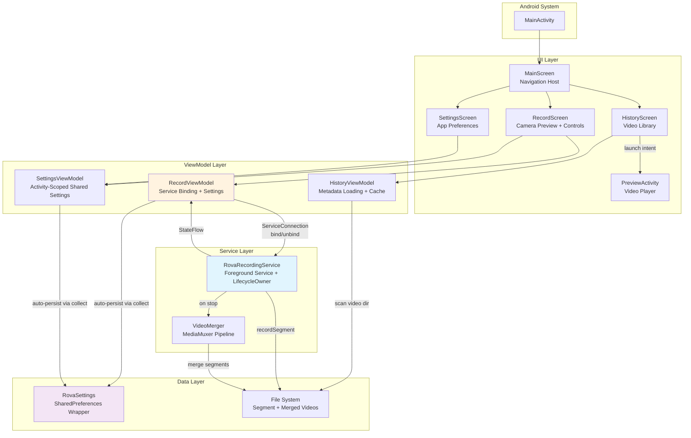
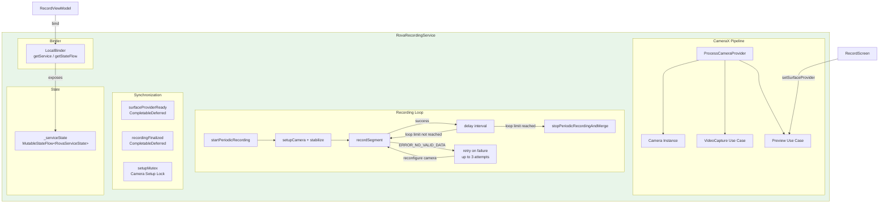
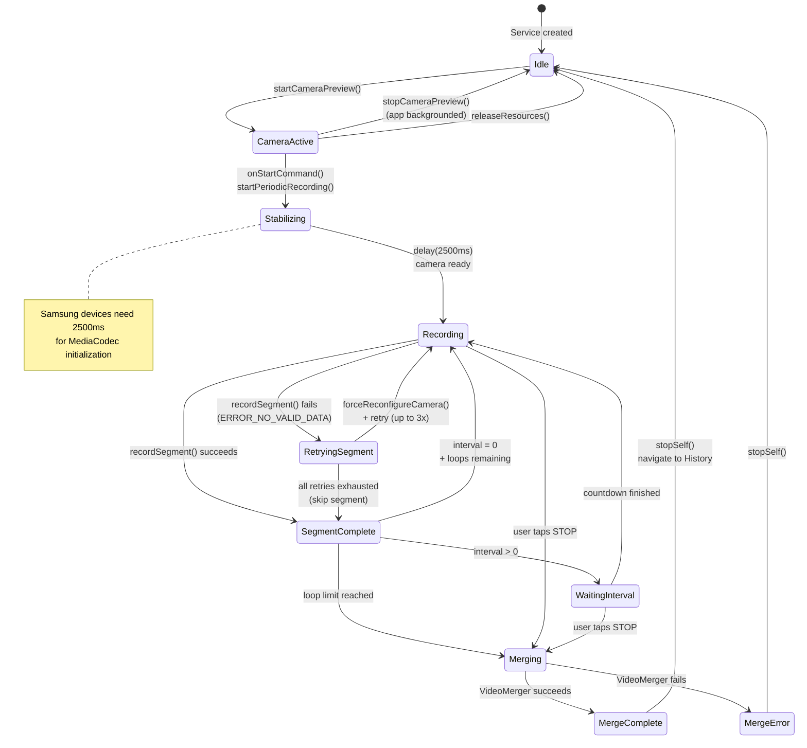
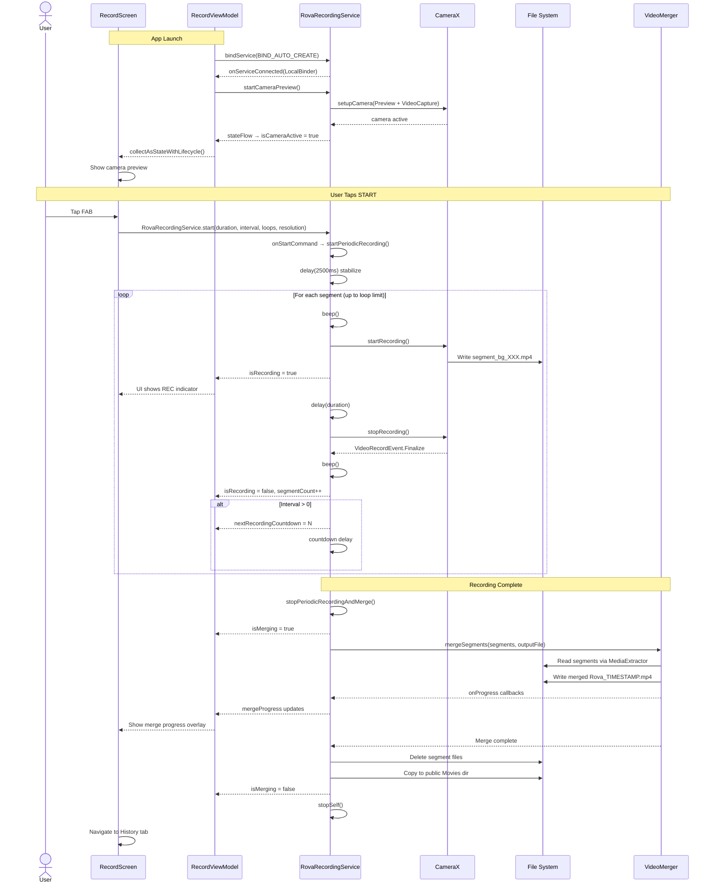
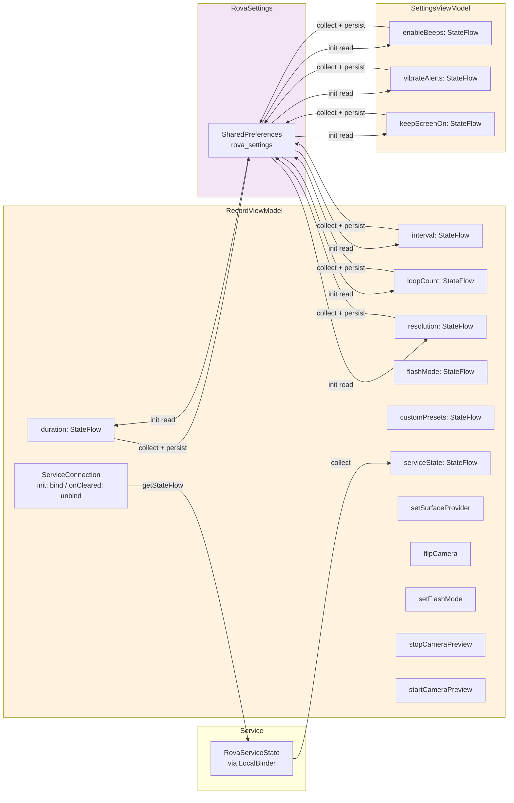
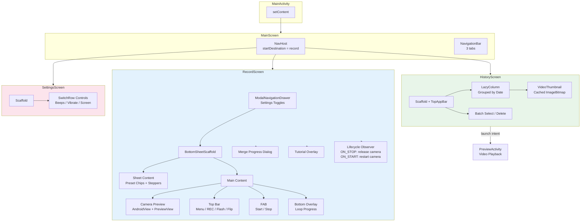
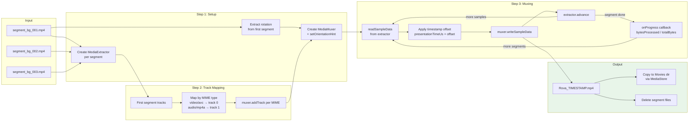
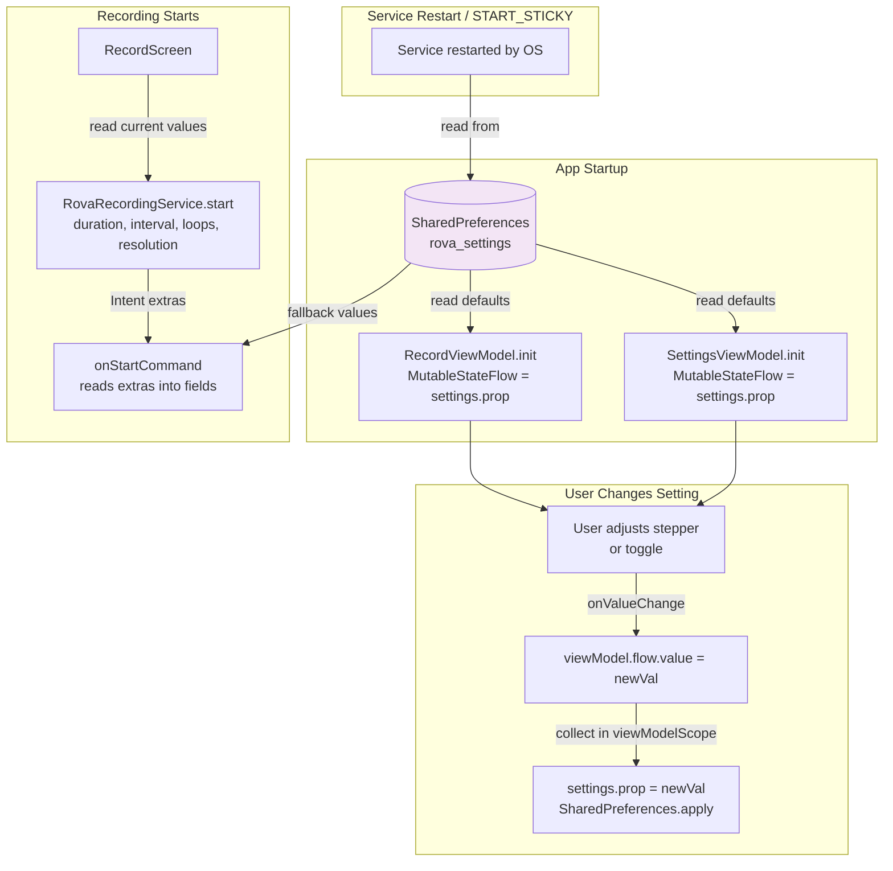

# Architecture & Technical Overview

## 1. Tech Stack

| Layer | Technology |
|-------|-----------|
| Language | Kotlin |
| Min SDK | 24 (Android 7.0) |
| Target SDK | 36 |
| UI | Jetpack Compose (Material3) |
| Camera | AndroidX CameraX (Core, Video, View, Lifecycle) |
| Concurrency | Kotlin Coroutines & StateFlow |
| Permissions | Accompanist Permissions |
| Navigation | Navigation Compose |
| State | AndroidViewModel + MutableStateFlow |
| Persistence | SharedPreferences (via RovaSettings) |
| Video Merge | Android MediaMuxer + MediaExtractor |

---

## 2. Project Structure

```
app/src/main/java/com/aritr/rova/
├── MainActivity.kt                  # Entry point, renders MainScreen
├── data/
│   └── RovaSettings.kt             # SharedPreferences wrapper + RovaPreset data class
├── service/
│   └── RovaRecordingService.kt     # Foreground service: CameraX, recording loops, merge
├── ui/
│   ├── MainScreen.kt               # Navigation shell (3 tabs: Record, History, Settings)
│   ├── PreviewActivity.kt          # In-app video player
│   ├── components/
│   │   ├── RovaAnimations.kt       # Pulsing opacity, slide animations
│   │   ├── RovaCardComponents.kt   # SwitchRow and other shared UI components
│   │   ├── RovaComponents.kt       # StepperControl
│   │   ├── RovaDialogs.kt          # Shared dialog components
│   │   ├── BackgroundRecordingBanner.kt
│   │   └── BatteryOptimizationBanner.kt
│   ├── screens/
│   │   ├── RecordScreen.kt         # Camera preview + recording controls
│   │   ├── RecordViewModel.kt      # ViewModel: service binding, recording settings, presets
│   │   ├── HistoryScreen.kt        # Video library with thumbnails and batch operations
│   │   ├── HistoryViewModel.kt     # Off-thread metadata loading for HistoryScreen
│   │   ├── SettingsScreen.kt       # App preferences
│   │   ├── SettingsViewModel.kt    # Activity-scoped: single source of truth for app settings
│   │   ├── BatteryOptimizationHelper.kt
│   │   └── VideoMetadataUtils.kt   # Thumbnail + resolution extraction helpers
│   └── theme/
│       ├── Color.kt
│       ├── Theme.kt
│       └── Type.kt
└── utils/
    └── VideoMerger.kt              # MediaMuxer-based segment concatenation

app/src/main/res/
├── raw/
│   └── rova_beep.mp3               # Custom beep sound for recording start/stop
└── ...
```

---

## 3. System Overview

The app follows an MVVM architecture with a foreground service that owns the camera lifecycle independently of the UI.



---

## 4. Recording Service Internals

The service is the heart of the app. It manages CameraX, the recording loop, segment storage, and merging — all independently of the UI lifecycle.



### RovaServiceState Fields

| Field | Type | Purpose |
|-------|------|---------|
| `isRecording` | Boolean | Currently capturing a segment |
| `isPeriodicActive` | Boolean | Recording loop is running |
| `isCameraActive` | Boolean | CameraX pipeline is bound |
| `isMerging` | Boolean | VideoMerger is running |
| `mergeProgress` | Float | 0.0–1.0 merge completion |
| `currentLoop` | Int | Current segment number |
| `totalLoops` | Int | Configured loop limit (-1 = infinite) |
| `nextRecordingCountdown` | Long | Seconds until next segment |
| `recordingError` | String? | Last segment error description |
| `mergeError` | String? | Merge failure description |

### Key Design Decisions

- **Instance-scoped state** — `_serviceState` is an instance field, not a companion object. Prevents state leakage between service restarts.
- **CompletableDeferred for sync** — `surfaceProviderReady` signals when the UI has provided a preview surface. `recordingFinalized` signals when CameraX has finished writing a segment file.
- **Mutex-protected camera setup** — `setupMutex` prevents concurrent `setupCamera()` calls from racing.
- **Lifecycle-aware camera release** — Camera is unbound when app backgrounds (if not recording) to prevent CPU drain.
- **Segment retry** — Failed segments are retried up to 3 times with camera reconfigure between attempts.

---

## 5. Recording Lifecycle State Machine



---

## 6. Recording User Journey

End-to-end sequence from user tap to merged video appearing in the library.



---

## 7. ViewModel Architecture



**RecordViewModel** is NavGraph-scoped (survives tab switches, dies on Activity destroy). It owns the `ServiceConnection` and all recording-related settings.

**SettingsViewModel** is Activity-scoped (instantiated in `MainScreen`, outside the `NavHost`). Shared between `RecordScreen` and `SettingsScreen` so that toggling a setting in one screen is immediately reflected in the other.

**Auto-persistence pattern:** Each `MutableStateFlow` is initialized from `RovaSettings` and a `viewModelScope.launch { flow.collect { settings.prop = it } }` collector writes changes back automatically.

---

## 8. UI Composition & Navigation



---

## 9. Video Merge Pipeline



### Merge Safety

- **Muxer state tracking** — A `muxerStarted` flag prevents calling `muxer.stop()` on an un-started muxer in error paths.
- **Single extractor release** — Extractors are released only in the `finally` block, preventing double-release.
- **Cancellation support** — Checks `coroutineContext.isActive` between segments.
- **Byte-weighted progress** — Large segments report proportionally more progress than small ones.

---

## 10. Settings Data Flow



**Preset Flow:** Custom presets are serialized as JSON in `customPresetsJson`. RecordViewModel parses them on init and persists changes via `JSONArray` serialization.

---

## 11. Key Technical Decisions

| Decision | Choice | Rationale |
|----------|--------|-----------|
| Video merging | MediaMuxer (not ffmpeg-kit) | Zero dependencies, small APK, fast, sufficient for concatenation |
| State management | StateFlow (not LiveData) | Better coroutine integration, null-safe, thread-safe |
| Camera framework | CameraX (not Camera2) | Higher-level API, handles lifecycle automatically |
| UI framework | Compose (not Views) | Modern, declarative, less boilerplate |
| Persistence | SharedPreferences (not Room/DataStore) | Simple key-value settings, no relational data yet |
| Service type | Foreground (not WorkManager) | Continuous real-time camera access required |
| ViewModel scope | AndroidViewModel | Needs Application context for service binding |
| Camera lifecycle | Release on background | Prevents CPU drain when app not visible and not recording |
| Segment retry | 3 attempts + camera reconfigure | Samsung devices have transient encoder failures |

---

## 12. Known Limitations

- **No database** — Video metadata (duration, resolution, thumbnails) is cached in-memory by HistoryViewModel but not persisted. Will need Room or DataStore if the library grows large.
- **No unit tests** — `VideoMerger` and `RovaSettings` have no test coverage. Core logic changes risk silent regressions.
- **SharedPreferences on main thread** — Reads are synchronous. Not a problem at current scale but would need DataStore migration for complex settings.
- **No ProGuard/R8** — `isMinifyEnabled = false` in release build. Larger APK, no obfuscation.
- **Single recorder instance** — The service assumes one active recording session. No support for multiple concurrent sessions.
- **SimpleDateFormat not thread-safe** — File-level instances in HistoryScreen are used from the main thread only, but would need synchronization if accessed from background threads.
