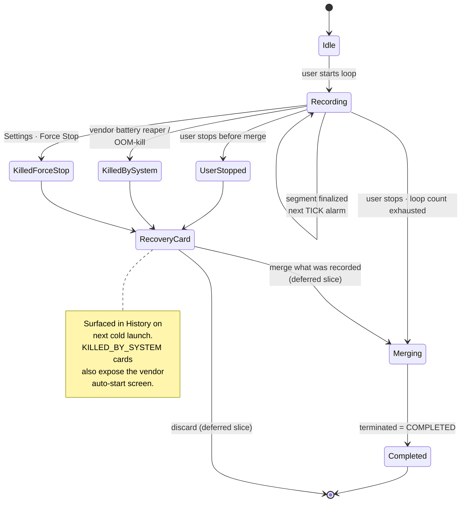

# Rova — Periodic Background Video Recorder

An Android app for **automated, hands-free periodic video recording**.

Set a duration, interval, and loop count — Rova records in the background, then merges all segments into a single video when done. Designed for athletes, creators, and anyone who needs unattended recording.

| | |
|---|---|
| Package | `com.aritr.rova` |
| Version | `0.9.0` |
| `minSdk` | 24 (Android 7.0) |
| `targetSdk` | 37 |
| UI | Jetpack Compose (Material 3) |
| Capture | CameraX |
| Status | Active development — see [`ROADMAP_v6.md`](ROADMAP_v6.md) |

---

## Quick Start

**Prerequisites:** Android Studio Ladybug+, physical Android device (emulators often fail with CameraX video recording).

```bash
# Clone, open in Android Studio, then:
./gradlew installDebug
```

1. Grant Camera and Microphone permissions on first launch.
2. Select a preset or configure Duration / Interval / Loops in the bottom sheet.
3. Tap **START RECORDING** and walk away.
4. Tap **STOP** (in-app or in the notification) when done.
5. The merged video appears in the **History** tab.

Videos are saved to `Android/data/com.aritr.rova/files/videos/`.

---

## Features

- **Periodic loop recording** — record N seconds, wait M minutes, repeat K times (or continuous).
- **Background recording** — continues with screen off via a foreground service typed for camera + microphone.
- **Auto-merge** — segments stitched into a single MP4 when the loop ends.
- **Video library** — real thumbnails, resolution badges, multi-select share/delete.
- **In-app player** (Phase 2.5) — manifest-driven Media3 surface routed from the Library list via `player/{sessionId}`. Tier 1 plays the `MediaStore` content URI; Tier 2/3 play a `file://` URI. Segmented timeline shows clip boundaries; play/pause + ±10s seek + auto-pause on background. Trim/Edit are placeholders (editor scope deferred per `NEW_UI_BACKEND_REPLAN.md` §6.2). Mockup: [`mockups/new_uiux/04-video-player.html`](mockups/new_uiux/04-video-player.html).
- **Quick presets** — one-tap configs (Drill, Vlog) plus custom user-saved presets.
- **Resolution selection** — SD / HD / FHD / 4K with `QualitySelector` fallback.
- **Tiered public export** — finalized merges land in the public Movies directory using the right API for the device (Tier 1 API 29+ MediaStore, Tier 2 API 26–28, Tier 3 API 24–25).
- **Crash- and kill-resilient recovery** — sessions terminated by force-stop, OOM, or vendor battery management surface as recovery cards in History on the next cold launch.
- **Vendor guidance** — `KILLED_BY_SYSTEM` recovery cards open the device's auto-start / battery-optimization screen (MIUI, Samsung, OnePlus, Vivo, Oppo) with a graceful fallback to App Settings.
- **Battery optimization prompt** — detects Doze mode and guides the user to exempt the app.
- **Storage safety** — estimates required space before recording; aborts if insufficient.

---

## Architecture

```mermaid
graph TB
    subgraph UI["UI · Jetpack Compose"]
        MS[MainScreen<br/>NavHost]
        RS[RecordScreen]
        HS[HistoryScreen]
        SS[SettingsScreen]
        RC[RecoveryCard]
        PL[PlayerScreen<br/>player/{sessionId}]
    end

    subgraph VM["ViewModels"]
        RVM[RecordViewModel]
        HVM[HistoryViewModel]
        SVM[SettingsViewModel]
        RecVM[RecoveryViewModel]
        PVM[PlayerViewModel<br/>ExoPlayer + manifest]
    end

    subgraph APP["Process singleton"]
        APPK[RovaApp<br/>recoveryReport: StateFlow]
    end

    subgraph SVC["Foreground service"]
        REC[RovaRecordingService<br/>CameraX bind · segment loop]
        TICK[RovaTickReceiver<br/>segment boundary]
        STOP[RovaStopReceiver<br/>loop-count exhaust]
    end

    subgraph DATA["Data layer"]
        STORE[SessionStore<br/>atomic manifest write]
        MERGE[VideoMerger]
    end

    subgraph RECOVER["Recovery + Export"]
        SCAN[RecoveryScanner<br/>classifyAll]
        EXPRUN[ExportRecoveryRunner]
        T1[Tier1Exporter · API 29+]
        T2[Tier2Exporter · 26-28]
        T3[Tier3Exporter · 24-25]
    end

    MS --> RS & HS & SS & PL
    HS --> RC
    HS --> PL
    RS --> RVM
    HS --> HVM
    SS --> SVM
    HS --> RecVM
    PL --> PVM
    PVM --> STORE
    RVM --> REC
    RecVM --> APPK
    APPK -- triggerRecoveryScanIfNeeded --> SCAN
    APPK --> EXPRUN
    SCAN --> STORE
    EXPRUN --> T1 & T2 & T3
    REC --> STORE
    REC --> MERGE
    REC -. AlarmManager .-> TICK
    REC -. AlarmManager .-> STOP
    TICK --> REC
    STOP --> REC
    HS --> STORE
```

The recovery scan is triggered **only** from `MainActivity.onCreate` via
`RovaApp.triggerRecoveryScanIfNeeded()` (ADR 0005 §"Scan Trigger Boundary").
A static `checkScanTriggerSingleSite` task in `app/build.gradle.kts`
enforces the single-site contract.

---

## Session lifecycle



`Terminated` is the persisted manifest field that drives recovery; the
classifier in `RecoveryScanner` cross-references on-disk segments against
the manifest to decide between `OFFER_DISCARD`, `AUTO_DISCARD_ELIGIBLE`,
and `BLOCKED`.

---

## Permissions

| Permission | Purpose |
|---|---|
| `CAMERA` | Mandatory — required to start. |
| `RECORD_AUDIO` | Optional — absence locks the session into VIDEO_ONLY (ADR 0006 B18). |
| `FOREGROUND_SERVICE` | Service host. |
| `FOREGROUND_SERVICE_CAMERA` | API 30+ FGS type for the camera pipeline. |
| `FOREGROUND_SERVICE_MICROPHONE` | API 30+ FGS type when audio is on. |
| `POST_NOTIFICATIONS` | Mandatory at session start on API 33+. |
| `WAKE_LOCK` | Bounded acquire/release across segment boundaries (ADR 0006). |
| `SCHEDULE_EXACT_ALARM` | Segment boundary TICK + loop-count STOP alarms (ADR 0001). |
| `REQUEST_IGNORE_BATTERY_OPTIMIZATIONS` | User-driven prompt; soft-fail tolerated. |
| `WRITE_EXTERNAL_STORAGE` | Tier 3 only (`maxSdkVersion=28`). |

---

## Tech Stack

| | |
|--|--|
| Language | Kotlin |
| UI | Jetpack Compose (Material 3) |
| Camera | AndroidX CameraX |
| Concurrency | Kotlin Coroutines + StateFlow |
| State | `ViewModel` + `MutableStateFlow` |
| Video Merge | `MediaMuxer` + `MediaExtractor` |
| Public Export | `MediaStore` (Tier 1) / scoped temp + `MediaScannerConnection` (Tier 2) / direct path (Tier 3) |
| Playback | AndroidX Media3 (ExoPlayer + PlayerView) — pinned to 1.4.1 |
| Min SDK | 24 (Android 7.0) |
| Target SDK | 37 |

---

## Build

```bash
./gradlew :app:lintDebug
./gradlew :app:testDebugUnitTest
./gradlew :app:assembleDebug

# install
adb install -r app/build/outputs/apk/debug/app-debug.apk
```

The `lintDebug` task runs both Android Lint and the project's static-check
suite — every `check*` task in `app/build.gradle.kts` is wired into the
debug verification chain. Each check cites the ADR clause it enforces.

---

## Project layout

```
app/src/main/java/com/aritr/rova/
├── RovaApp.kt                       # Application + recoveryReport StateFlow + scan trigger
├── MainActivity.kt                  # Single Activity; triggers recovery scan
├── data/
│   ├── SessionStore.kt              # Atomic manifest write + session dirs
│   ├── SessionManifest.kt
│   └── ...
├── service/
│   ├── RovaRecordingService.kt      # FGS · CameraX bind · segment loop
│   ├── RovaTickReceiver.kt          # Segment boundary
│   ├── RovaStopReceiver.kt          # Loop-count exhaustion
│   ├── audio/                       # BeepPolicy
│   ├── dualrecord/                  # P+L dual-encode (CameraEffect + EGL14 fan-out; ADRs 0008/0009/0010)
│   ├── export/
│   │   ├── Tier1Exporter.kt         # API 29+ MediaStore
│   │   ├── Tier2Exporter.kt         # API 26-28
│   │   ├── Tier3Exporter.kt         # API 24-25
│   │   ├── ExportRecoveryRunner.kt  # Phase 1.7 cold-boot reconciliation
│   │   └── ExportCleanupPredicate.kt
│   ├── notification/                # NotificationCopy
│   ├── recovery/
│   │   └── RecoveryScanner.kt       # Phase 1.5 classifier
│   ├── scheduler/                   # AlarmScheduler — exact alarms only (ADR 0001)
│   ├── surface/                     # Headless preview surface variants (ADR 0002)
│   └── wakelock/
│       └── WakeLockPolicy.kt        # Bounded acquire (ADR 0006)
├── ui/
│   ├── MainScreen.kt                # Bottom nav scaffold
│   ├── screens/
│   │   ├── RecordScreen.kt
│   │   ├── HistoryScreen.kt         # Hosts recovery cards
│   │   ├── SettingsScreen.kt
│   │   ├── onboarding/              # 3-screen immersive onboarding (M4 — PR #53)
│   │   └── player/                  # In-app player (PR #1)
│   │       ├── PlayerScreen.kt      # Compose surface + segmented timeline
│   │       ├── PlayerViewModel.kt   # ExoPlayer + 250ms position poll
│   │       ├── PlayerUriResolver.kt # Pure manifest → URI dispatch
│   │       ├── PlayerUiState.kt     # Loading | Ready | Unavailable
│   │       ├── SegmentedTimeline.kt
│   │       └── SegmentedTimelineMath.kt # Pure boundary math
│   ├── recovery/
│   │   ├── RecoveryCard.kt          # Display surface
│   │   ├── RecoveryUiState.kt       # Pure mapper
│   │   ├── RecoveryViewSource.kt    # Adapter
│   │   ├── RecoveryViewModel.kt
│   │   └── VendorGuidanceIntents.kt # OEM auto-start screen resolver
│   ├── permissions/                 # Permission-request composables
│   ├── share/                       # Share-sheet helpers
│   └── components/                  # Shared cards + controls (refreshed palette)
└── utils/
    ├── VideoMerger.kt               # MediaMuxer concat
    └── ...

app/src/test/java/com/aritr/rova/    # JVM unit tests (JUnit + json only — no Robolectric)
docs/adr/                            # Architecture Decision Records
```

---

## Documentation

| Document | Description |
|----------|-------------|
| [docs/product_vision.md](docs/product_vision.md) | Product overview, target users, feature roadmap, UX principles |
| [docs/architecture.md](docs/architecture.md) | Code structure, data flow, key technical decisions |
| [docs/WarningCenterContract.md](docs/WarningCenterContract.md) | WarningCenter warning model, precedence, routing, and signal ownership |
| [docs/UI_DESIGN_TOKENS.md](docs/UI_DESIGN_TOKENS.md) | Design token system: color, typography, shape, spacing, chrome constants |
| [docs/UI_NAV_GRAPH.md](docs/UI_NAV_GRAPH.md) | Navigation graph contract: routes, back-stack, shell model |
| [docs/release_checklist.md](docs/release_checklist.md) | Release cut checklist: verification gates, smoke tests, keystore backup |
| [docs/archive/development_log.md](docs/archive/development_log.md) | Chronological record of early implementation phases (frozen at Phase 4) |
| [docs/archive/naming.md](docs/archive/naming.md) | App name candidates and branding analysis (decision record — Rova chosen) |

### Architecture Decision Records

ADRs are the source of truth for behavioral invariants and live under [`docs/adr/`](docs/adr/):

- **[0001](docs/adr/0001-exact-alarm-policy.md)** — Exact alarm policy.
- **[0002](docs/adr/0002-headless-surface.md)** — Headless surface (dummy preview when UI absent).
- **[0003](docs/adr/0003-storage-export-tiered.md)** — Tiered storage / public export (FD Mode amendment 2026-04-30).
- **[0005](docs/adr/0005-recovery-scan.md)** — Recovery scan.
- **[0006](docs/adr/0006-recording-lifecycle-robustness.md)** — Recording lifecycle robustness (Phase 1.4 / 1.5 / 1.7 contracts).
- **[0007](docs/adr/0007-record-warning-sheets.md)** — Record-screen warning surfaces (WarningSheet / WarningChip model).
- **[0008](docs/adr/0008-dual-recording-architecture.md)** — Dual-recording architecture (CameraEffect fan-out).
- **[0009](docs/adr/0009-dualshot-4-3-source-aspect.md)** — DualShot 4:3 source aspect + 27/64 side-crop matrices.
- **[0010a](docs/adr/0010-canonical-uv-frame-and-first-principles-render.md)** — Canonical UV frame and first-principles render.
- **[0010b](docs/adr/0010-dualshot-preview-crop-divergence.md)** — DualShot preview crop divergence.
- **[0011](docs/adr/0011-edge-to-edge-record-home.md)** — Edge-to-edge record-home layout.
- **[0012](docs/adr/0012-gradient-scrim-dock.md)** — Gradient scrim dock.
- **[0013](docs/adr/0013-phase4-warning-reskin-v3.md)** — Phase 4 warning re-skin v3 chrome.
- **[0014](docs/adr/0014-snooze-persistence.md)** — Snooze persistence (forever, backed by `rova_runtime_prefs.xml`).
- **[0015](docs/adr/0015-storage-full-autostopped-echo.md)** — Storage-full autostopped echo signal.
- **[0016](docs/adr/0016-thermal-autostop.md)** — Thermal auto-stop (auto-stops at CRITICAL; echo banner on Idle).
- **[0017](docs/adr/0017-recovery-merge-architecture.md)** — Recovery merge architecture.
- **[0018](docs/adr/0018-recovery-merge-retry-classifier-preflight.md)** — Recovery merge retry classifier preflight.
- **[0019](docs/adr/0019-thermal-hysteresis.md)** — Asymmetric thermal hysteresis (instant rise, 3 s dwell-gated fall).

Each of the 25 `check*` tasks in `app/build.gradle.kts` cites the ADR clause it enforces. They are wired into `preBuild` so the static-check gate runs on every build.
